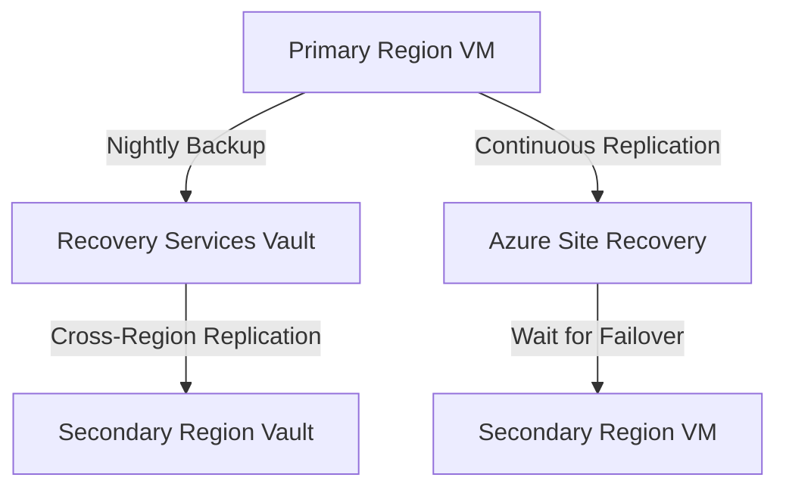

# Backup and DR Best Practices

Protecting your data against loss or regional disasters is critical for business continuity. Azure provides built-in capabilities for local backups and cross-region disaster recovery (DR).

## Recovery Tiers and Solutions

The choice of solution depends on the Recovery Point Objective (RPO) and Recovery Time Objective (RTO) for each workload.

| Tier | RPO | RTO | Solution | Cost |
| :--- | :--- | :--- | :--- | :--- |
| **Development** | 24 Hours | 48 Hours | Azure Backup (LRS) | Low |
| **Production** | 1 Hour | 4 Hours | Azure Backup (GRS/ZRS) | Medium |
| **Mission Critical** | Seconds | Minutes | Azure Site Recovery (ASR) | High |

## Backup and DR Architecture

The following diagram shows the relationship between the primary region and the recovery infrastructure.

!!! note
    RPO refers to the maximum amount of data loss allowed. RTO refers to the time it takes to restore service after a failure.

!!! warning
    Regularly test your backups. A backup is only valuable if it can be restored. Schedule quarterly restore drills for all production workloads.

## Sources
- [Azure Backup documentation](https://learn.microsoft.com/en-us/azure/backup/backup-overview)
- [Azure Site Recovery documentation](https://learn.microsoft.com/en-us/azure/site-recovery/site-recovery-overview)
- [Business continuity and disaster recovery (BCDR) for Azure VMs](https://learn.microsoft.com/en-us/azure/virtual-machines/business-continuity-disaster-recovery)
