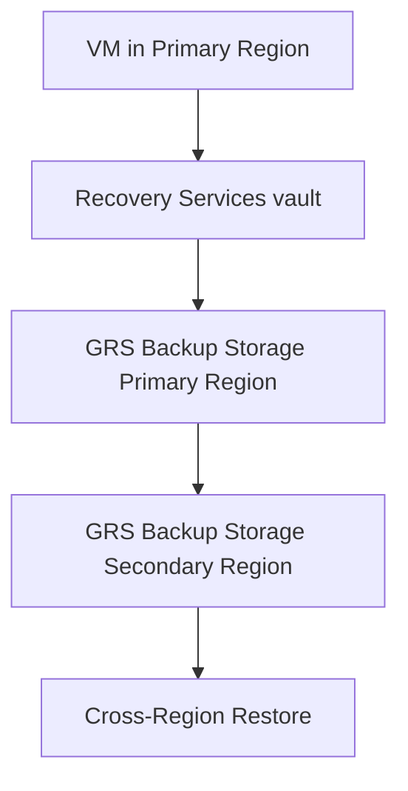

# Backup and DR Best Practices

Protecting your data against loss or regional disasters is critical for business continuity. Azure provides built-in capabilities for local backups and cross-region disaster recovery (DR).

## Recovery Tiers and Solutions

The choice of solution depends on the Recovery Point Objective (RPO) and Recovery Time Objective (RTO) for each workload.

| Tier | Typical RPO Target | Typical RTO Target | Primary Solution | Cost |
| :--- | :--- | :--- | :--- | :--- |
| **Development** | Hours to 1 day | Hours to 1+ day | Azure Backup (LRS/ZRS) | Low |
| **Production** | Depends on schedule (often hours) | Depends on restore size/method | Azure Backup (GRS/ZRS) | Medium |
| **Mission Critical** | Near-zero to minutes (replication-based) | Minutes to low hours | Azure Site Recovery (ASR) | High |

!!! note
    RPO and RTO are operational targets, not fixed guarantees. RPO depends on backup/replication frequency (for backup schedules often measured in hours; for continuous replication near-zero). RTO depends on restore scope, data size, and readiness of target infrastructure.

## Backup and DR Architecture

The following diagram shows the relationship between the primary region and the recovery infrastructure.

## DR Method Comparison

| Method | Primary Goal | RPO Characteristics | RTO Characteristics | Best Use |
| :--- | :--- | :--- | :--- | :--- |
| Azure Backup | Data protection and retention | Based on backup schedule | Restore-time dependent | Accidental deletion/corruption, compliance retention |
| Azure Site Recovery | Service continuity | Continuous replication (near-zero to minutes) | Planned/unplanned failover timing | Regional outage and business continuity |
| VM Snapshot | Fast point-in-time rollback | Point-in-time at snapshot | Fast for single-VM rollback | Pre-change safety (patches/config changes) |

!!! note
    RPO refers to the maximum amount of data loss allowed. RTO refers to the time it takes to restore service after a failure.

!!! warning
    Regularly test your backups. A backup is only valuable if it can be restored. Schedule quarterly restore drills for all production workloads.

## Sources
- [Azure Backup documentation](https://learn.microsoft.com/en-us/azure/backup/backup-overview)
- [Azure Site Recovery documentation](https://learn.microsoft.com/en-us/azure/site-recovery/site-recovery-overview)
- [Business continuity and disaster recovery (BCDR) for Azure VMs](https://learn.microsoft.com/en-us/azure/virtual-machines/availability)
