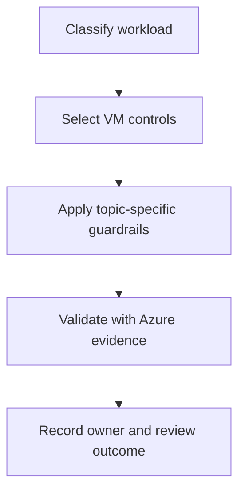

---
content_sources:
  diagrams:
  - id: best-practices-backup-and-dr-best-practices-practice-flow
    type: flowchart
    source: mslearn-adapted
    description: Recoverability
    based_on:
    - https://learn.microsoft.com/en-us/azure/backup/backup-azure-vms-introduction
    - https://learn.microsoft.com/en-us/azure/site-recovery/azure-to-azure-architecture
    - https://learn.microsoft.com/en-us/azure/backup/backup-azure-vms-automation
content_validation:
  status: pending_review
  last_reviewed: '2026-05-22'
  reviewer: ai-agent
  core_claims:
  - claim: This document has source metadata and is queued for text-level Microsoft
      Learn verification.
    source: https://learn.microsoft.com/en-us/azure/backup/backup-azure-vms-introduction
    verified: false
  - claim: Core Azure VM guidance on this page should remain traceable to the listed
      sources before it is marked verified.
    source: https://learn.microsoft.com/en-us/azure/backup/backup-azure-vms-introduction
    verified: false
---

# Backup and DR Best Practices

Backup and disaster recovery plans must be restore-tested, scoped to the right data, and aligned with application recovery objectives.

## Why This Matters

A stateful VM must prove it can recover from accidental deletion, disk corruption, and regional disruption scenarios.

<!-- diagram-id: best-practices-backup-and-dr-best-practices-practice-flow -->

```mermaid
flowchart TD
    A[Classify workload] --> B[Select VM controls]
    B --> C[Apply topic-specific guardrails]
    C --> D[Validate with Azure evidence]
    D --> E[Record owner and review outcome]
```

## Recommended Practices

### 1. Define RPO and RTO before selecting tooling

**Why:** Backup, snapshots, and Site Recovery solve different recovery problems.

**How:** Use Azure Backup for retained restore points and Site Recovery for replication/failover where workload requirements justify it.

**Validation:** The chosen tool maps directly to the documented recovery scenario.

### 2. Test restore paths

**Why:** A green backup job does not prove the VM can be restored correctly.

**How:** Schedule file-level, disk-level, and full-VM restore tests according to workload criticality.

**Validation:** Restore evidence includes elapsed time, selected restore point, and application validation.

### 3. Protect backup configuration itself

**Why:** Vault deletion, soft-delete settings, and overly broad permissions can undermine recovery.

**How:** Restrict vault permissions, review soft delete, and alert on failed jobs or policy changes.

**Validation:** Backup alerts and access review evidence are available to responders.

### CLI review example

```bash
az vm show \
    --resource-group $RG \
    --name $VM_NAME \
    --query "{name:name,size:hardwareProfile.vmSize,zone:zones,security:securityProfile.securityType}" \
    --output json

az vm list-sizes \
    --location $LOCATION \
    --query "[?name=='Standard_D4s_v5' || name=='Standard_E4s_v5'].{name:name,cores:numberOfCores,memory:memoryInMb,maxDataDiskCount:maxDataDiskCount}" \
    --output table

az vm update \
    --resource-group $RG \
    --name $VM_NAME \
    --set tags.reviewArea=backup-and-dr-best-practices tags.owner=platform-team \
    --output json
```

| Element | Purpose |
|---|---|
| `$RG` | Resource group containing the VM resources. |
| `$VM_NAME` | Target virtual machine name. |
| `$LOCATION` | Azure region for regional resource discovery or creation. |
| `--resource-group` | Scopes the command to the intended resource group. |
| `--name` | Identifies the resource being created, read, updated, or deleted. |
| `--query` | Filters the response so operators capture only the needed evidence. |
| `--output` | Controls the output format for logs, scripts, or human review. |
| `--location` | Selects the Azure region for regional resources or SKU lookup. |
| `--set` | Updates one or more resource properties or tags. |
| Expected result | Command succeeds and returns the requested Azure resource state or operation result. |

## Common Mistakes / Anti-Patterns

- Treating a VM as only a compute resource while ignoring disk, network, identity, and recovery controls.
- Reusing a proof-of-concept SKU, image, or public access path in production without a fresh review.
- Marking the design complete without captured Azure evidence and an owner for follow-up changes.

## Validation Checklist

- [ ] Workload owner, criticality, and support model are recorded.
- [ ] VM size, disk tier, network path, access model, and recovery controls match the workload objective.
- [ ] Azure CLI or portal evidence is captured after the change.
- [ ] Exceptions are documented with an expiration date or follow-up issue.

## See Also

- [Production Baseline](production-baseline.md)
- [Operations](../operations/index.md)
- [Troubleshooting](../troubleshooting/index.md)

## Sources

- [Backup Azure Vms Introduction](https://learn.microsoft.com/en-us/azure/backup/backup-azure-vms-introduction)
- [Azure To Azure Architecture](https://learn.microsoft.com/en-us/azure/site-recovery/azure-to-azure-architecture)
- [Backup Azure Vms Automation](https://learn.microsoft.com/en-us/azure/backup/backup-azure-vms-automation)
