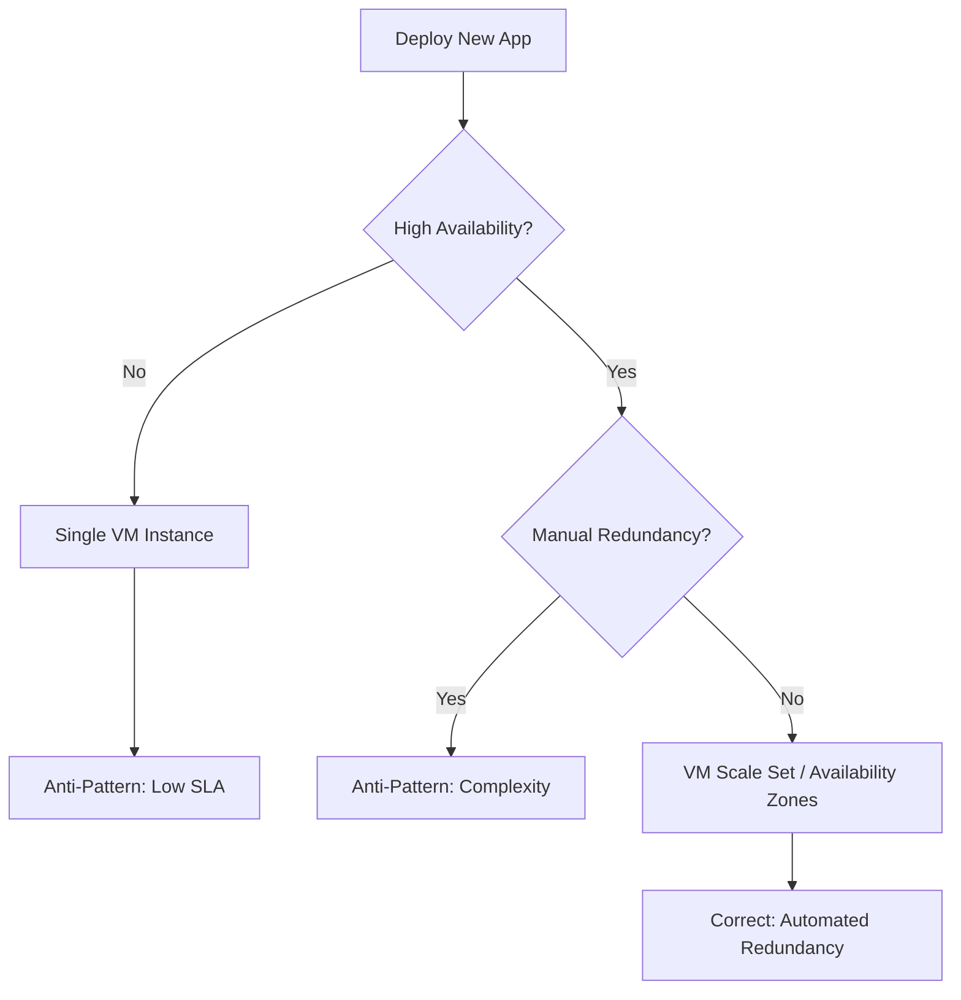

# Common Anti-Patterns

Recognizing and avoiding common mistakes during deployment will improve the security, performance, and reliability of your Azure Virtual Machines. Many common errors stem from treating cloud infrastructure like a traditional on-premises data center.

## Anti-Pattern Comparison

The following table highlights frequent misconfigurations and provides the correct Azure-native alternatives.

| Anti-Pattern | Why it is wrong | Correct Approach |
| :--- | :--- | :--- |
| **Single VM Availability** | Azure only offers SLA for multi-VM sets or Premium SSD. | Use Availability Sets or Zones. |
| **Ephemeral Storage** | Data on the temporary disk is lost after a VM move. | Store persistent data on Managed Disks. |
| **Open NSG Rules** | Allowing 0.0.0.0/0 on port 22 or 3389 is insecure. | Use Just-In-Time access or Azure Bastion. |
| **Oversized VMs** | Wastes budget on unneeded capacity. | Resize based on Azure Advisor metrics. |

## Decision Tree: Right vs Wrong Path

This diagram illustrates how a common design decision can lead to either an anti-pattern or a robust architecture.

!!! note
    Temporary storage (D: drive on Windows, /dev/sdb1 on Linux) is intended only for page files or swap files. Never use it for database logs or application data.

!!! warning
    Public IP addresses assigned directly to VMs increase the attack surface. Use a Load Balancer or Application Gateway to mediate traffic.

## See Also

- [Production Baseline](production-baseline.md)
- [Networking Best Practices](networking-best-practices.md)
- [Sizing and Image Selection](sizing-and-image-selection.md)

## Sources
- [Azure Virtual Machines availability options](https://learn.microsoft.com/en-us/azure/virtual-machines/availability)
- [Manage network security groups](https://learn.microsoft.com/en-us/azure/virtual-network/manage-network-security-group)
- [Managed Disks overview](https://learn.microsoft.com/en-us/azure/virtual-machines/managed-disks-overview)
