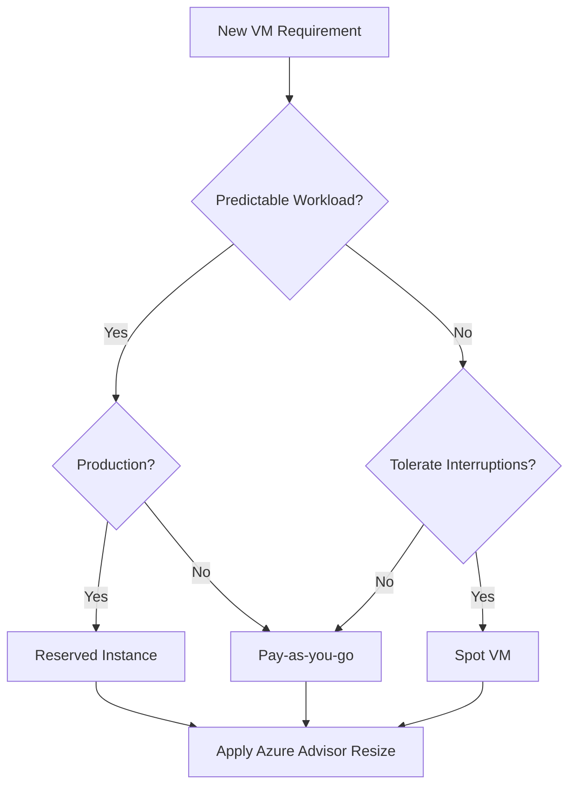

# Cost Optimization Best Practices

Managing cloud spend requires continuous monitoring and rightsizing of resources. Azure offers multiple strategies to reduce VM costs based on workload predictability and sensitivity to interruptions.

## Cost Saving Strategies

Compare different pricing models and operational strategies to maximize your return on investment.

| Strategy | Savings Potential | Trade-off |
| :--- | :--- | :--- |
| **Reserved Instances** | Up to 72% | 1-3 year commitment required. |
| **Spot Virtual Machines** | Up to 90% | VMs can be evicted at any time. |
| **Rightsizing** | 20-50% | Requires downtime for resizing. |
| **Schedules (Deallocation)** | 30% | Manual or automated start/stop management. |

## Optimization Decision Flow

Use the following logic to determine the most cost-effective way to deploy your VM.

!!! tip
    Azure Advisor provides automated recommendations for rightsizing or shutting down underutilized virtual machines. Check these recommendations weekly.

!!! note
    Deallocating a VM stops compute charges, but storage costs for disks continue to accrue. Delete orphaned disks to avoid unnecessary expenses.

## See Also

- [VM Lifecycle](../platform/vm-lifecycle.md)
- [Sizing and Image Selection](sizing-and-image-selection.md)
- [VM Size Families](../reference/vm-size-families.md)

## Sources
- [Cost optimization for Azure Virtual Machines](https://learn.microsoft.com/en-us/azure/cost-management-billing/costs/cost-management-best-practices)
- [Azure Advisor recommendations](https://learn.microsoft.com/en-us/azure/advisor/advisor-overview)
- [Reserved Virtual Machine Instances](https://learn.microsoft.com/en-us/azure/virtual-machines/prepay-reserved-vm-instances)
