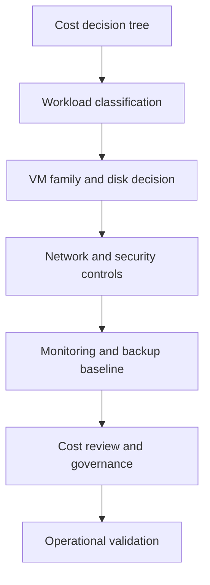

---
content_sources:
  diagrams:
  - id: best-practices-cost-optimization-best-practices-why-this-matters
    type: flowchart
    source: mslearn-adapted
    description: Why This Matters
    based_on:
    - https://learn.microsoft.com/en-us/azure/virtual-machines/overview
    - https://learn.microsoft.com/en-us/azure/virtual-machines/sizes
    - https://learn.microsoft.com/en-us/azure/virtual-machines/disks-performance
    - https://learn.microsoft.com/en-us/azure/virtual-machines/windows/disks-enable-ultra-ssd
    - https://learn.microsoft.com/en-us/azure/virtual-network/accelerated-networking-overview
    - https://learn.microsoft.com/en-us/azure/virtual-machines/co-location
    - https://learn.microsoft.com/en-us/azure/defender-for-cloud/just-in-time-access-overview
    - https://learn.microsoft.com/en-us/azure/virtual-machines/auto-shutdown-vm
    - https://learn.microsoft.com/en-us/azure/virtual-machines/availability
    - https://learn.microsoft.com/en-us/azure/virtual-machines/monitor-vm
    - https://learn.microsoft.com/en-us/azure/virtual-machines/disks-performance
---

# Cost Optimization Best Practices

VM cost optimization works best when it is connected to sizing, scheduling, disk choices, and workload criticality rather than treated as a one-time Reserved Instance purchase.

## Why This Matters

Rightsizing, purchase options, stop schedules, disk spend, and waste identification. The real risk is that teams usually notice weak VM design only after a deployment freeze, region capacity issue, security review, or performance incident.

**Real-world scenario**: A cloud center of excellence wants lower VM spend without forcing risky downsizing on business-critical systems.

Three themes show up repeatedly in Azure VM reviews:

1. Compute, storage, and network limits interact more than teams expect.
2. Security controls must be built into the management path, not added after an audit.
3. Cost optimization should preserve recovery and performance objectives instead of undermining them.

<!-- diagram-id: best-practices-cost-optimization-best-practices-why-this-matters -->

```mermaid
flowchart TD
    A[Cost decision tree] --> B[Workload classification]
    B --> C[VM family and disk decision]
    C --> D[Network and security controls]
    D --> E[Monitoring and backup baseline]
    E --> F[Cost review and governance]
    F --> G[Operational validation]
```

!!! info "Design principle"
    Optimize Azure VMs as a full stack: guest workload, VM SKU, disks, network path, and operational controls. Improving only one layer rarely fixes recurring incidents.

## Prerequisites

- Azure subscription with permission to read and change compute, network, and monitoring resources
- Existing resource group and virtual network for the workload
- Azure CLI signed in with variables prepared:
    - `RG`
    - `VM_NAME`
    - `LOCATION`
    - `NIC_NAME`
    - `NSG_NAME`
    - `DISK_NAME`
- Team agreement on workload criticality, recovery target, and approved maintenance window

## Recommended Practices

### Practice 1: Establish workload-specific sizing guardrails

Why: Matching the VM family to concurrency, memory footprint, and IOPS profile prevents the mismatched-envelope incidents that dominate VM reviews.
How: Treat memory-to-core ratio, expected IOPS, and aggregate network bandwidth as first-class inputs when standardizing the deployment pattern.
Validation: Confirm the chosen family against guest telemetry and Azure Monitor metrics rather than a single signal.

#### Workload sizing recommendations

| Workload type | Recommended VM families | Guidance |
|---|---|---|
| Stateless web/API tier | Dsv5 or Dasv5 | Balanced CPU and memory for general web/API loads; pair with accelerated networking and Premium SSD. |
| Memory-heavy middleware | Esv5 or Easv5 | Higher RAM per core for Java, caching, and analytics middleware where paging is expensive. |
| High-performance database relay | M-series or Edsv5 | Use only where licensing and memory footprint justify large-memory SKUs; validate disk and network caps carefully. |
| Batch and interruptible workers | Spot-capable Dsv5 / Fsv2 | Suitable for queues and render jobs that tolerate eviction and checkpoint often. |
| Virtual desktop / jump host | B-series or Dsv5 | Burstable for low-duty admin hosts; use D-series when consistent remote responsiveness matters. |

Use memory-to-core ratio, expected IOPS, and aggregate network bandwidth as first-class inputs.

### Practice 2: Separate OS, data, and recovery concerns

Why: Co-locating the OS and write-heavy data paths on one disk hides latency behind the VM SKU's aggregate throughput limits.
How: Put the OS on its own managed disk, isolate high-write paths on dedicated data disks, and match the disk tier to VM throughput caps.
Validation: Check host-caching mode and disk queue depth against the workload's actual write pattern.

#### Disk performance optimization

- Put the OS on its own managed disk and keep high-write or data-intensive paths on dedicated data disks.
- Use **Premium SSD** for predictable production latency and **Ultra Disk** when the workload needs tunable high IOPS and throughput with low latency.
- Validate whether host caching helps or harms the workload; transaction log and write-heavy data paths often need `None`.
- Align disk choices with VM-level throughput limits so expensive storage is not bottlenecked by the VM SKU.

| Disk option | Best fit | Operations note |
|---|---|---|
| Premium SSD | General production OS and data disks | Good default for stable latency and broad regional support. |
| Premium SSD v2 | Elastic IOPS and throughput tuning | Useful when performance requirements vary and you want finer-grained tuning. |
| Ultra Disk | High-end database and latency-sensitive data tiers | Review availability, no host caching support, and application write pattern before adoption. |

### Practice 3: Design network boundaries before deployment

Why: Retrofitting segmentation after cutover turns every internet scanning event into an operations problem.
How: Enable accelerated networking on supported sizes, keep management access private, and validate effective routes and NSG intent before the window.
Validation: Confirm DNS, effective routes, and proximity-placement needs before the cutover.

#### Network acceleration and placement

- Enable **accelerated networking** on supported sizes to reduce jitter and host CPU overhead for packet processing.
- Use **proximity placement groups** when low-latency communication between tightly coupled tiers matters more than flexible placement.
- Keep management access private through Bastion, VPN, or ExpressRoute instead of internet-exposed management ports.
- Validate effective routes, NSG intent, and DNS before the cutover window.

### Practice 4: Harden privileged access paths with JIT

Why: Standing RDP/SSH exposure and embedded credentials are the access paths incidents exploit first.
How: Apply least-privilege NSGs with Application Security Groups, enable Just-In-Time access, prefer managed identity, and use Trusted Launch on Gen2 sizes.
Validation: Review the administrative path against JIT policy and identity assignments.

#### Security hardening controls

- Apply least-privilege NSGs and use **Application Security Groups** to express workload intent instead of IP sprawl.
- Enable **Just-In-Time access** for RDP and SSH where Defender for Cloud is in use.
- Prefer managed identity over embedded credentials for workload-to-Azure access.
- Use Trusted Launch, Secure Boot, and vTPM on supported images and Gen2 sizes.

### Practice 5: Instrument capacity and recovery from day one

Why: Untested backup and recovery paths reveal their gaps only during the incident that needs them.
How: Collect platform, guest, boot-diagnostic, and activity signals into one view, and test restore and serial-console access before go-live.
Validation: Alert on sustained disk latency, heartbeat gaps, and failed backups.

#### Monitoring, recovery, and proof

- Collect platform metrics, guest metrics, boot diagnostics, and activity logs into a common operational view.
- Test backup restore, serial console access, and extension recovery before calling the platform ready.
- Alert on sustained symptoms such as disk latency, heartbeat gaps, failed backups, and denied management access.

### Practice 6: Use cost controls that match workload criticality

Why: Committing spend before rightsizing locks in waste and can undercut recovery objectives.
How: Rightsize first, then apply Reservations or Savings Plans for stable fleets, Spot for interruptible workers, and auto-shutdown for dev and test.
Validation: Re-review unattached disks and idle jump hosts monthly.

#### Cost optimization without self-sabotage

- Use **Reserved Instances** or **Savings Plans** for stable 24x7 production fleets only after rightsizing.
- Use **Spot VMs** for interruptible batch, CI, or non-critical workers with checkpointing.
- Apply **auto-shutdown** to development, training, and break-glass environments where deallocation is acceptable.
- Review unattached disks, oversized NIC-enabled gateways, and forgotten jump hosts monthly.

### Verify the configuration

Run the same read-back after any material change (resize, disk migration, subnet move, image or patch-policy update) and capture before/after evidence so responders can separate regressions from steady state.

```bash
az vm show     --resource-group $RG     --name $VM_NAME     --query "{name:name,size:hardwareProfile.vmSize,zone:zones,security:securityProfile.securityType}"     --output json

az vm list-sizes     --location $LOCATION     --query "[?name=='Standard_D4s_v5' || name=='Standard_E4s_v5'].{name:name,numberOfCores:numberOfCores,memoryInMb:memoryInMb,maxDataDiskCount:maxDataDiskCount}"     --output table

az vm update     --resource-group $RG     --name $VM_NAME     --set tags.reviewArea=cost-optimization tags.owner=platform-team     --output json
```

| Command | Purpose |
| --- | --- |
| `az vm show` | Retrieve the current configuration of a virtual machine. |
| `--resource-group` | Resource group that contains the virtual machine. |
| `--name` | Name of the virtual machine to inspect. |
| `--query` | JMESPath expression selecting name, size, zone, and security type. |
| `--output` | Output format for the response (JSON here). |
| `az vm list-sizes` | List the VM sizes available in a region. |
| `--location` | Azure region to list available VM sizes for. |
| `--query` | JMESPath filter selecting matching sizes with core, memory, and data-disk limits. |
| `--output` | Output format for the response (table here). |
| `az vm update` | Update properties of an existing virtual machine. |
| `--resource-group` | Resource group that contains the virtual machine. |
| `--name` | Name of the virtual machine to update. |
| `--set` | Set the review-area and owner tags (reviewArea=cost-optimization, owner=platform-team). |
| `--output` | Output format for the response (JSON here). |

Sample output:

```json
{
  "name": "vm-app-001",
  "size": "Standard_D4s_v5",
  "zone": [
    "1"
  ],
  "security": "TrustedLaunch"
}
```

Operational note:

- Re-run the same validation after major changes such as resizing, disk migration, subnet moves, image changes, or patching policy updates.
- Capture before and after evidence so future responders can distinguish regressions from steady-state behavior.

## Common Mistakes / Anti-Patterns

### Anti-Pattern 1: Sizing by vCPU count alone

**What happens**: Teams compare only CPU and ignore memory-to-core ratio, premium storage needs, and aggregate disk or network caps.

**Why it is wrong**: It masks the real constraint—memory-to-core ratio and disk or network caps—so the fix only arrives after the incident.

**Correct approach**: Choose VM families based on workload profile and validate with guest plus Azure Monitor metrics.

### Anti-Pattern 2: Public management ports as the default

**What happens**: Opening 3389 or 22 on internet-facing NICs turns every scanning event into an operations problem.

**Why it is wrong**: It converts routine internet scanning into a standing intrusion surface that is expensive to close mid-incident.

**Correct approach**: Route administration through Azure Bastion, VPN, or ExpressRoute and pair with JIT policies.

### Anti-Pattern 3: Treating Premium SSD as a universal fix

**What happens**: Latency incidents continue because the VM SKU or caching mode is the bottleneck, not the disk label.

**Why it is wrong**: It leaves the true bottleneck—the VM SKU cap or host-caching mode—in place while adding storage spend.

**Correct approach**: Review disk SKU, host caching, queue depth, and VM aggregate throughput together.

### Anti-Pattern 4: Buying reservations before rightsizing

**What happens**: Teams commit to waste by reserving oversized machines that should have been redesigned or deallocated.

**Why it is wrong**: It commits budget to oversized capacity that should have been redesigned or deallocated first.

**Correct approach**: Rightsize first, then commit reserved capacity only for stable, always-on workloads.

## Validation Checklist

- [ ] Workload type is documented and mapped to an approved VM family
- [ ] Disk tier, caching mode, and VM aggregate limits were reviewed together
- [ ] Accelerated networking and proximity placement needs were evaluated
- [ ] NSG, ASG, JIT, and identity controls were validated against the admin path
- [ ] Reserved, Spot, and auto-shutdown decisions align to workload criticality
- [ ] Backup, restore, and monitoring evidence exists for the current deployment

## Cost Impact

Good VM practice usually lowers cost by reducing overprovisioning and unnecessary public exposure, but some controls intentionally add spend. Bastion, Premium SSD, backup retention, and Azure Monitor are justified when they reduce outage and recovery cost. The right optimization target is **cost per reliable service outcome**, not the lowest compute bill.

Practical cost review questions:

- Does this workload truly need 24x7 uptime or can it deallocate outside business hours?
- Are Premium SSD or Ultra Disk sized for peak demand, or are they hiding poor query patterns?
- Are reserved purchases aligned to stable demand, or would a Savings Plan preserve more flexibility?
- Did security or operations teams create long-lived jump hosts that should now be replaced with Bastion or ephemeral access patterns?

## See Also

- [Sizing and Image Selection](sizing-and-image-selection.md)
- [Common Anti-Patterns](common-anti-patterns.md)
- [Create and Configure VM](../operations/create-and-configure-vm.md)

## Sources

- [Azure VM overview](https://learn.microsoft.com/en-us/azure/virtual-machines/overview)
- [Azure VM sizes](https://learn.microsoft.com/en-us/azure/virtual-machines/sizes)
- [Azure Managed Disks performance](https://learn.microsoft.com/en-us/azure/virtual-machines/disks-performance)
- [Enable Ultra Disk](https://learn.microsoft.com/en-us/azure/virtual-machines/windows/disks-enable-ultra-ssd)
- [Accelerated networking overview](https://learn.microsoft.com/en-us/azure/virtual-network/accelerated-networking-overview)
- [Proximity placement groups overview](https://learn.microsoft.com/en-us/azure/virtual-machines/co-location)
- [Just-In-Time access](https://learn.microsoft.com/en-us/azure/defender-for-cloud/just-in-time-access-overview)
- [Automate VM shutdown](https://learn.microsoft.com/en-us/azure/virtual-machines/auto-shutdown-vm)
- [Availability options](https://learn.microsoft.com/en-us/azure/virtual-machines/availability)
- [Monitor virtual machines](https://learn.microsoft.com/en-us/azure/virtual-machines/monitor-vm)
- [Host caching guidance](https://learn.microsoft.com/en-us/azure/virtual-machines/disks-performance)
