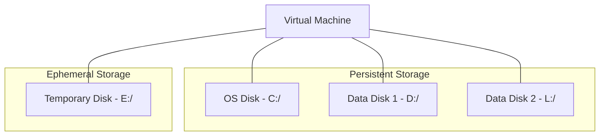

# Disk and Storage Best Practices

Storage performance and data integrity depend on the selection of the correct disk tier and caching strategy. Separating operating system data from application data is a core architectural requirement.

| Workload Type | Recommended Disk Tier | Caching Setting |
| :--- | :--- | :--- |
| OS Disk | Premium SSD (P6+) | ReadWrite |
| Database Data | Ultra Disk or Premium SSD v2 | ReadOnly |
| Database Logs | Premium SSD | None (Disabled) |
| Dev/Test Workloads | Standard SSD | ReadWrite |

## Disk Layout Best Practices

Structuring your storage with multiple disks prevents data loss during OS re-imaging and optimizes I/O performance.

!!! note
    The temporary disk is for ephemeral data only and is located on the physical host server. Data on this disk is lost during VM deallocation or maintenance events.

## Sources

- [Select a disk type for Azure IaaS VMs](https://learn.microsoft.com/en-us/azure/virtual-machines/disks-types)
- [Performance best practices for Azure Managed Disks](https://learn.microsoft.com/en-us/azure/virtual-machines/disks-performance)
- [Azure Disk Encryption for VMs and virtual machine scale sets](https://learn.microsoft.com/en-us/azure/virtual-machines/disk-encryption-overview)
