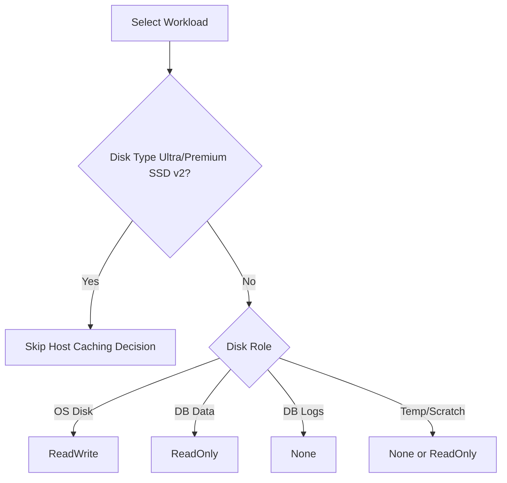

# Disk and Storage Best Practices

Storage performance and data integrity depend on matching disk type and caching behavior to workload patterns. Separate OS, data, logs, and temporary storage so each can be tuned independently.

| Workload Type | Recommended Disk Tier | Caching Setting |
| :--- | :--- | :--- |
| OS Disk | Premium SSD (P6+) | ReadWrite |
| Database Data | Premium SSD (or higher) | ReadOnly (when read-heavy) |
| Database Logs | Premium SSD | None (Disabled) |
| Temp / Scratch | Temporary Disk or Data Disk | None or ReadOnly (workload dependent) |

!!! warning
    Do **not** apply host caching recommendations to **Ultra Disk** or **Premium SSD v2**. These disk types do not support host caching (`ReadOnly`/`ReadWrite`).

!!! tip
    Match disk type to workload. Ultra Disk and Premium SSD v2 provide high performance through their own performance architecture, without host caching settings.

## Disk Layout Best Practices

Structuring your storage with multiple disks prevents data loss during OS re-imaging and optimizes I/O performance.

!!! note
    The temporary disk is for ephemeral data only and is located on the physical host server. Data on this disk is lost during VM deallocation or maintenance events.

## See Also

- [Manage Disks](../operations/manage-disks.md)
- [Managed Disk Types](../reference/managed-disk-types.md)
- [Disk Performance Issues](../troubleshooting/playbooks/performance/disk-performance-issues.md)

## Sources

- [Select a disk type for Azure IaaS VMs](https://learn.microsoft.com/en-us/azure/virtual-machines/disks-types)
- [Performance best practices for Azure Managed Disks](https://learn.microsoft.com/en-us/azure/virtual-machines/disks-performance)
- [Azure Disk Encryption for VMs and virtual machine scale sets](https://learn.microsoft.com/en-us/azure/virtual-machines/disk-encryption-overview)
