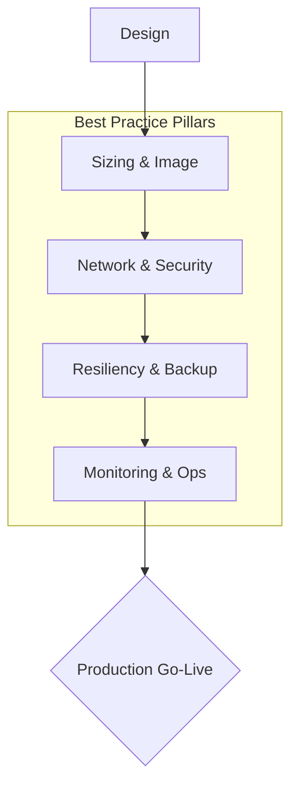

# Best Practices

This section covers production-ready guidance and the operational logic required for high-quality Azure VM deployments. Instead of just theoretical concepts, we focus on the practical decision-making criteria used by experienced engineers.

## Section Contents

| Page | Description |
|------|-------------|
| [Production Baseline](production-baseline.md) | A mandatory checklist of minimum standards for production-grade VMs. |
| [Sizing and Image Selection](sizing-and-image-selection.md) | Workload-based sizing and choosing between Marketplace vs. Custom images. |
| [Networking](networking-best-practices.md) | Reducing attack surfaces via Bastion, NSG least privilege, and minimizing Public IPs. |
| [Disk and Storage](disk-and-storage-best-practices.md) | OS/Data disk separation, tier selection, and temporary disk usage guidelines. |
| [Security](security-best-practices.md) | Implementing least privilege, managed identities, and Just-In-Time (JIT) access. |
| [Patching and Maintenance](patching-and-maintenance-best-practices.md) | Managing patch windows, environment separation, and platform maintenance events. |
| [Monitoring](monitoring-best-practices.md) | Leveraging Guest/Azure metrics, boot diagnostics, and effective alerting. |
| [Backup and DR](backup-and-dr-best-practices.md) | Designing backup policies, restore drills, and meeting RPO/RTO targets. |
| [Cost Optimization](cost-optimization-best-practices.md) | Utilizing deallocation, Reserved Instances, and identifying orphaned resources. |
| [Common Anti-Patterns](common-anti-patterns.md) | Recognizing and avoiding frequent mistakes in VM deployments. |

## Production Readiness Workflow

!!! tip
    Always separate your OS and Data disks. Keeping data on separate managed disks simplifies backups, migrations, and resizing operations.

## See Also

- [Production Baseline](production-baseline.md)
- [Networking Best Practices](networking-best-practices.md)
- [Backup and DR Best Practices](backup-and-dr-best-practices.md)

## Sources
- [Azure Virtual Machine Security Baseline](https://learn.microsoft.com/en-us/security/benchmark/azure/baselines/virtual-machines-linux-security-baseline)
- [Well-Architected Framework: Virtual Machines](https://learn.microsoft.com/en-us/azure/well-architected/service-guides/virtual-machines)
- [Backup for Azure VMs](https://learn.microsoft.com/en-us/azure/backup/backup-azure-vms-introduction)
