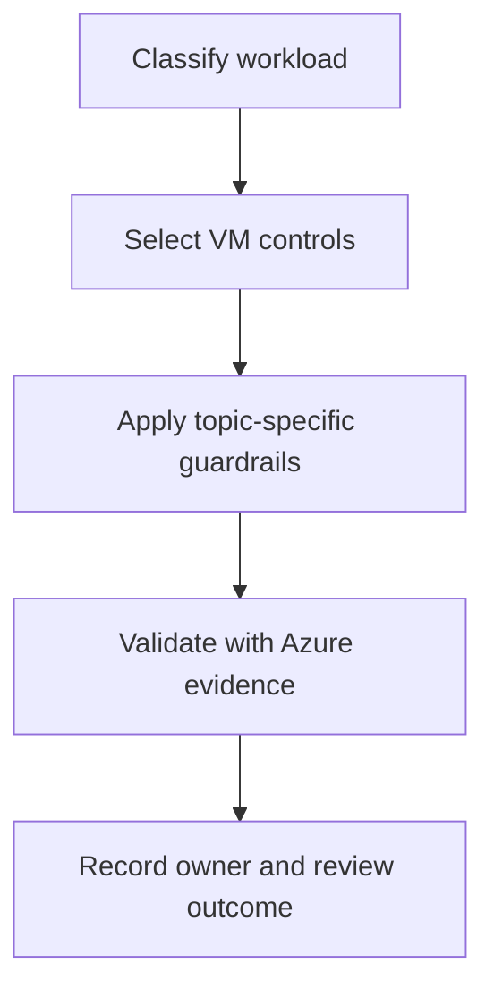

---
content_sources:
  diagrams:
  - id: best-practices-index-practice-flow
    type: flowchart
    source: mslearn-adapted
    description: Production review map
    based_on:
    - https://learn.microsoft.com/en-us/azure/virtual-machines/overview
    - https://learn.microsoft.com/en-us/azure/virtual-machines/sizes
    - https://learn.microsoft.com/en-us/azure/virtual-machines/availability
content_validation:
  status: pending_review
  last_reviewed: '2026-05-22'
  reviewer: ai-agent
  core_claims:
  - claim: This document has source metadata and is queued for text-level Microsoft
      Learn verification.
    source: https://learn.microsoft.com/en-us/azure/virtual-machines/overview
    verified: false
  - claim: Core Azure VM guidance on this page should remain traceable to the listed
      sources before it is marked verified.
    source: https://learn.microsoft.com/en-us/azure/virtual-machines/overview
    verified: false
---

# Best Practices

Use this section as the production checklist for Azure VM design reviews. Each page owns one decision area so shared baseline guidance stays separate from topic-specific controls.

## Why This Matters

A platform team needs a consistent way to review VM workloads before they are promoted to production.

<!-- diagram-id: best-practices-index-practice-flow -->

```mermaid
flowchart TD
    A[Classify workload] --> B[Select VM controls]
    B --> C[Apply topic-specific guardrails]
    C --> D[Validate with Azure evidence]
    D --> E[Record owner and review outcome]
```

## Recommended Practices

### 1. Start from the production baseline

**Why:** Confirm identity, network, disk, availability, backup, monitoring, and cost controls before workload-specific tuning.

**How:** Use the linked pages to record the owner and evidence for each control.

**Validation:** Every production VM has a review record with links to Azure resource evidence.

### 2. Keep decisions in the owning page

**Why:** Avoid copying the same sizing or disk guidance into every topic.

**How:** Put general standards in the baseline page and only repeat a control when it changes that topic's decision.

**Validation:** A reader can tell why a security page differs from a monitoring page.

### 3. Review changes after deployment

**Why:** VM risk changes when disks, size, image, network, identity, or backup policy changes.

**How:** Use tags and Azure Monitor evidence to connect changes to operational review.

**Validation:** Change records show what was reviewed after each major VM change.

### CLI review example

```bash
az vm show \
    --resource-group $RG \
    --name $VM_NAME \
    --query "{name:name,size:hardwareProfile.vmSize,zone:zones,security:securityProfile.securityType}" \
    --output json

az vm list-sizes \
    --location $LOCATION \
    --query "[?name=='Standard_D4s_v5' || name=='Standard_E4s_v5'].{name:name,cores:numberOfCores,memory:memoryInMb,maxDataDiskCount:maxDataDiskCount}" \
    --output table

az vm update \
    --resource-group $RG \
    --name $VM_NAME \
    --set tags.reviewArea=index tags.owner=platform-team \
    --output json
```

| Element | Purpose |
|---|---|
| `$RG` | Resource group containing the VM resources. |
| `$VM_NAME` | Target virtual machine name. |
| `$LOCATION` | Azure region for regional resource discovery or creation. |
| `--resource-group` | Scopes the command to the intended resource group. |
| `--name` | Identifies the resource being created, read, updated, or deleted. |
| `--query` | Filters the response so operators capture only the needed evidence. |
| `--output` | Controls the output format for logs, scripts, or human review. |
| `--location` | Selects the Azure region for regional resources or SKU lookup. |
| `--set` | Updates one or more resource properties or tags. |
| Expected result | Command succeeds and returns the requested Azure resource state or operation result. |

## Common Mistakes / Anti-Patterns

- Treating a VM as only a compute resource while ignoring disk, network, identity, and recovery controls.
- Reusing a proof-of-concept SKU, image, or public access path in production without a fresh review.
- Marking the design complete without captured Azure evidence and an owner for follow-up changes.

## Validation Checklist

- [ ] Workload owner, criticality, and support model are recorded.
- [ ] VM size, disk tier, network path, access model, and recovery controls match the workload objective.
- [ ] Azure CLI or portal evidence is captured after the change.
- [ ] Exceptions are documented with an expiration date or follow-up issue.

## See Also

- [Production Baseline](production-baseline.md)
- [Operations](../operations/index.md)
- [Troubleshooting](../troubleshooting/index.md)

## Sources

- [Overview](https://learn.microsoft.com/en-us/azure/virtual-machines/overview)
- [Sizes](https://learn.microsoft.com/en-us/azure/virtual-machines/sizes)
- [Availability](https://learn.microsoft.com/en-us/azure/virtual-machines/availability)
