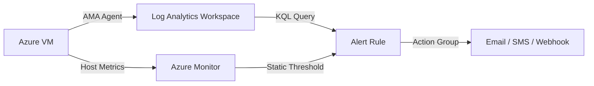

# Monitoring Best Practices

Effective monitoring ensures your Azure Virtual Machines operate reliably. Using Azure Monitor and VM Insights provides visibility into performance bottlenecks and health issues before they impact users.

## Monitoring Layers and Tools

Azure provides various tools to capture data at different layers of the infrastructure and application stack.

| Layer | Tool | Captured Data |
| :--- | :--- | :--- |
| **Platform** | Azure Monitor Metrics | CPU percentage, Disk IOPS, Network In/Out. |
| **Guest OS** | Azure Monitor Agent | System logs, Application logs, performance counters. |
| **Diagnostic** | Boot Diagnostics | Serial console output and VM screenshots for troubleshooting. |
| **Analysis** | VM Insights | Dependency maps and detailed health performance metrics. |

## Data Flow and Alerting

The following diagram represents the end-to-end data flow from the source to the final alert mechanism.

!!! tip
    Always enable Boot Diagnostics during VM creation. It's the most powerful tool for diagnosing VMs that fail to start.

!!! warning
    Consolidate logs into a single Log Analytics workspace where possible. This simplifies querying and reduces the management overhead of multiple storage destinations.

## See Also

- [Monitoring and Alerting Operations](../operations/monitoring-and-alerting.md)
- [Slow Performance Troubleshooting](../troubleshooting/slow-performance.md)

## Sources
- [Azure Monitor overview](https://learn.microsoft.com/en-us/azure/azure-monitor/fundamentals/overview)
- [Monitor Azure virtual machines](https://learn.microsoft.com/en-us/azure/azure-monitor/vm/monitor-vm)
- [Enable VM insights](https://learn.microsoft.com/en-us/azure/azure-monitor/vm/vm-enable-monitoring)
