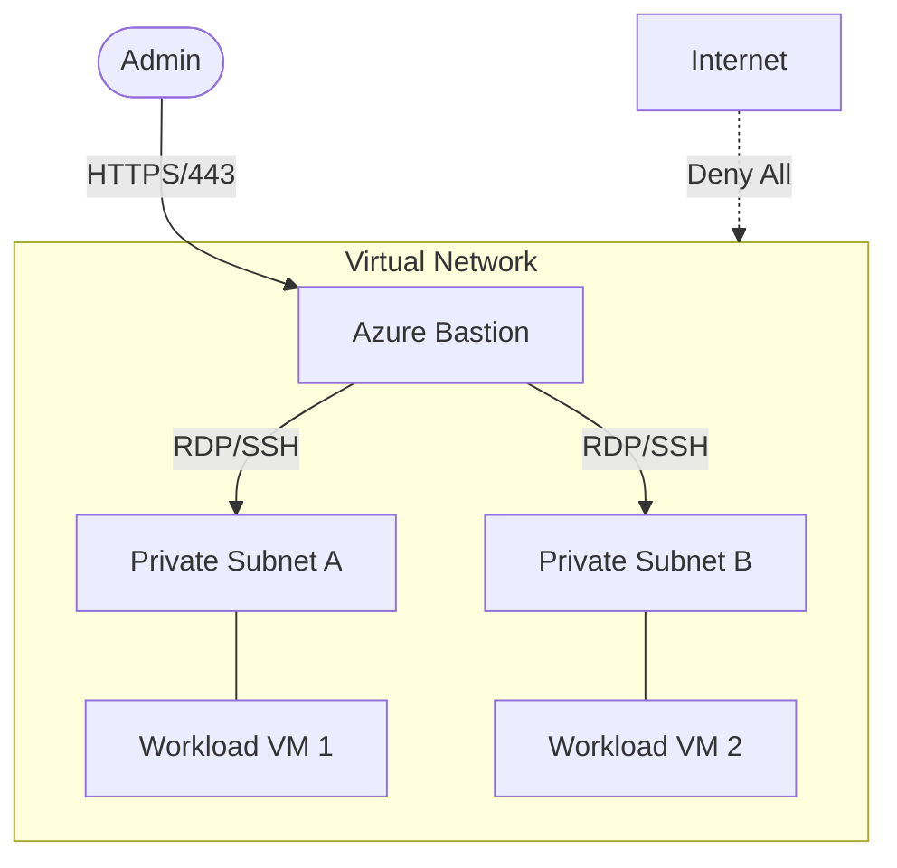

# Networking Best Practices

Secure and efficient network configuration is the first line of defense for Azure Virtual Machines. These practices focus on minimizing exposure and maximizing performance through native Azure services.

| Practice | Recommendation | Risk if Ignored |
| :--- | :--- | :--- |
| Public IP Exposure | Use Azure Bastion or VPN Gateway for administration. | Increased attack surface and risk of brute-force attacks on management ports. |
| NSG Rules | Implement least-privilege rules with explicit deny by default. | Lateral movement and unauthorized access within the virtual network. |
| Accelerated Networking | Enable on supported VM sizes for high throughput. | Increased network latency and higher CPU overhead for network processing. |
| Network Diagnostics | Utilize Network Watcher for traffic analysis and connectivity checks. | Delayed troubleshooting and inability to detect routing issues. |

## Secure Network Architecture

The following diagram shows a secure approach for VM administration without exposing VMs to the public internet.

!!! warning
    Never open RDP (3389) or SSH (22) directly to the internet via Network Security Groups (NSGs).

## Sources

- [Azure Virtual Network security overview](https://learn.microsoft.com/en-us/azure/virtual-network/network-security-groups-overview)
- [What is Azure Bastion?](https://learn.microsoft.com/en-us/azure/bastion/bastion-overview)
- [Accelerated Networking for Windows and Linux](https://learn.microsoft.com/en-us/azure/virtual-network/accelerated-networking-overview)
