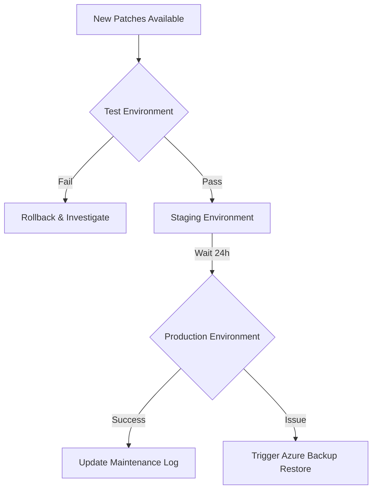

# Patching and Maintenance Best Practices

Azure Virtual Machines require regular updates to maintain security and stability. Using Azure Update Manager simplifies compliance across environments by automating patch schedules and monitoring health.

## Patching Strategy Overview

Choosing the right approach depends on your workload's tolerance for downtime and risk.

| Strategy | Approach | Risk |
| :--- | :--- | :--- |
| **Manual** | Admin installs updates during maintenance windows. | High: Human error or missed critical updates. |
| **Automatic (Orchestrated)** | Azure Update Manager schedules and triggers reboots. | Low: Consistent and tracked across all VMs. |
| **Image-based** | Replace VMs with new patched images (Immutable). | Very Low: Zero drift, but requires CI/CD maturity. |

## Maintenance Workflow

The following diagram illustrates the recommended flow for testing and deploying patches across environments.

!!! note
    Azure Update Manager provides a single dashboard to manage update compliance for Windows and Linux VMs across Azure, on-premises, and other clouds.

!!! tip
    Use Scheduled Events to receive notifications about upcoming maintenance, allowing your application to gracefully shut down or failover.

## Sources
- [Azure Update Manager documentation](https://learn.microsoft.com/en-us/azure/update-manager/overview)
- [Maintenance and updates for virtual machines in Azure](https://learn.microsoft.com/en-us/azure/virtual-machines/maintenance-and-updates)
- [Azure Virtual Machines backup and update management](https://learn.microsoft.com/en-us/azure/virtual-machines/backup-and-update-management)
