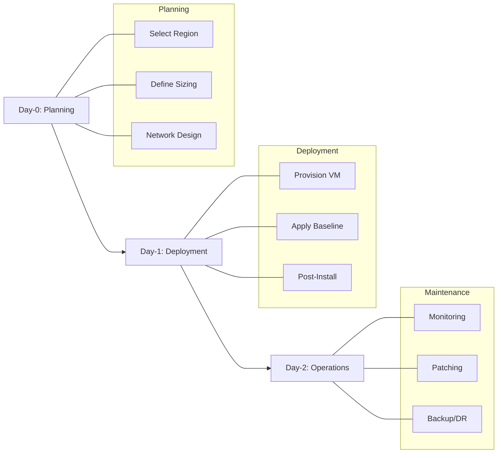

# Production Baseline

A robust production environment requires a foundational set of configurations to ensure availability, security, and recoverability. These core components form the minimum baseline for any Azure Virtual Machine deployment.

## Baseline Checklist

| Checklist Item | Why Required | Default Risk if Skipped |
| :--- | :--- | :--- |
| Availability Zones or Availability Sets | Use zones where supported; otherwise use Availability Sets or VMSS to distribute VMs across fault domains. | Single point of failure if an entire datacenter or rack goes offline. |
| Managed Disks | Simplifies disk management and provides better reliability than unmanaged disks. | Limited scalability and higher risk of storage account throttling. |
| Network Security Group | Controls inbound and outbound traffic to the VM at the network level. | VM exposed to unauthorized traffic and potential external attacks. |
| Azure Monitor | Provides visibility into VM health, performance, and log data. | Inability to detect or troubleshoot performance bottlenecks or outages. |
| Azure Backup | Ensures data recoverability in case of corruption, deletion, or ransomware. | Irreversible data loss if the VM or its disks are compromised. |
| Tagging | Enables cost tracking, resource organization, and automated management. | Difficulty in identifying resource ownership and managing cloud spend. |

## Operations Timeline

The lifecycle of a production VM is divided into distinct phases from initial setup to ongoing maintenance.

!!! tip
    Use Azure Policy to enforce the production baseline automatically across your subscriptions and resource groups.

## Sources

- [Azure Virtual Machines best practices](https://learn.microsoft.com/en-us/azure/virtual-machines/overview)
- [Availability options for Azure Virtual Machines](https://learn.microsoft.com/en-us/azure/virtual-machines/availability)
- [Azure Managed Disks overview](https://learn.microsoft.com/en-us/azure/virtual-machines/managed-disks-overview)
