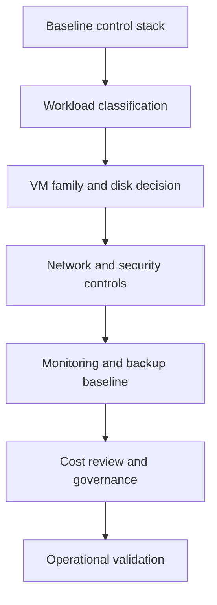

# Production Baseline

A production baseline for Azure VMs is the minimum set of controls that reduces avoidable outages, security drift, and cost surprises before application-specific tuning starts.

## Why This Matters

Mandatory controls, ownership boundaries, and default standards for every production VM. The real risk is that teams usually notice weak VM design only after a deployment freeze, region capacity issue, security review, or performance incident.

**Real-world scenario**: A team migrates a line-of-business app from on-premises to Azure and needs a repeatable baseline that works for Windows and Linux estates.

Three themes show up repeatedly in Azure VM reviews:

1. Compute, storage, and network limits interact more than teams expect.
2. Security controls must be built into the management path, not added after an audit.
3. Cost optimization should preserve recovery and performance objectives instead of undermining them.



!!! info "Design principle"
    Optimize Azure VMs as a full stack: guest workload, VM SKU, disks, network path, and operational controls. Improving only one layer rarely fixes recurring incidents.

## Prerequisites

- Azure subscription with permission to read and change compute, network, and monitoring resources
- Existing resource group and virtual network for the workload
- Azure CLI signed in with variables prepared:
    - `RG`
    - `VM_NAME`
    - `LOCATION`
    - `NIC_NAME`
    - `NSG_NAME`
    - `DISK_NAME`
- Team agreement on workload criticality, recovery target, and approved maintenance window

## Recommended Practices

### Practice 1: Establish workload-specific sizing guardrails

Why: Azure VM incidents often start with mismatched expectations between the workload profile and the infrastructure envelope.
How: Document expected concurrency, memory footprint, disk behavior, failover design, and operator access before standardizing the deployment pattern.
Validation: Review Azure Monitor metrics, guest telemetry, and change records together rather than relying on one signal source.

#### Workload sizing recommendations

| Workload type | Recommended VM families | Guidance |
|---|---|---|
| Stateless web/API tier | Dsv5 or Dasv5 | Balanced CPU and memory for general web/API loads; pair with accelerated networking and Premium SSD. |
| Memory-heavy middleware | Esv5 or Easv5 | Higher RAM per core for Java, caching, and analytics middleware where paging is expensive. |
| High-performance database relay | M-series or Edsv5 | Use only where licensing and memory footprint justify large-memory SKUs; validate disk and network caps carefully. |
| Batch and interruptible workers | Spot-capable Dsv5 / Fsv2 | Suitable for queues and render jobs that tolerate eviction and checkpoint often. |
| Virtual desktop / jump host | B-series or Dsv5 | Burstable for low-duty admin hosts; use D-series when consistent remote responsiveness matters. |

Use memory-to-core ratio, expected IOPS, and aggregate network bandwidth as first-class inputs.

### CLI example: production baseline review

```bash
az vm show     --resource-group $RG     --name $VM_NAME     --query "{name:name,size:hardwareProfile.vmSize,zone:zones,security:securityProfile.securityType}"     --output json

az vm list-sizes     --location $LOCATION     --query "[?name=='Standard_D4s_v5' || name=='Standard_E4s_v5'].{name:name,numberOfCores:numberOfCores,memoryInMb:memoryInMb,maxDataDiskCount:maxDataDiskCount}"     --output table

az vm update     --resource-group $RG     --name $VM_NAME     --set tags.reviewArea=baseline-validation tags.owner=platform-team     --output json
```

Sample output:

```json
{
  "name": "vm-app-001",
  "size": "Standard_D4s_v5",
  "zone": [
    "1"
  ],
  "security": "TrustedLaunch"
}
```

Operational note:

- Re-run the same validation after major changes such as resizing, disk migration, subnet moves, image changes, or patching policy updates.
- Capture before and after evidence so future responders can distinguish regressions from steady-state behavior.

### Practice 2: Separate OS, data, and recovery concerns

Why: Azure VM incidents often start with mismatched expectations between the workload profile and the infrastructure envelope.
How: Document expected concurrency, memory footprint, disk behavior, failover design, and operator access before standardizing the deployment pattern.
Validation: Review Azure Monitor metrics, guest telemetry, and change records together rather than relying on one signal source.

#### Disk performance optimization

- Put the OS on its own managed disk and keep high-write or data-intensive paths on dedicated data disks.
- Use **Premium SSD** for predictable production latency and **Ultra Disk** when the workload needs tunable high IOPS and throughput with low latency.
- Validate whether host caching helps or harms the workload; transaction log and write-heavy data paths often need `None`.
- Align disk choices with VM-level throughput limits so expensive storage is not bottlenecked by the VM SKU.

| Disk option | Best fit | Operations note |
|---|---|---|
| Premium SSD | General production OS and data disks | Good default for stable latency and broad regional support. |
| Premium SSD v2 | Elastic IOPS and throughput tuning | Useful when performance requirements vary and you want finer-grained tuning. |
| Ultra Disk | High-end database and latency-sensitive data tiers | Review availability, no host caching support, and application write pattern before adoption. |

### CLI example: production baseline review

```bash
az vm show     --resource-group $RG     --name $VM_NAME     --query "{name:name,size:hardwareProfile.vmSize,zone:zones,security:securityProfile.securityType}"     --output json

az vm list-sizes     --location $LOCATION     --query "[?name=='Standard_D4s_v5' || name=='Standard_E4s_v5'].{name:name,numberOfCores:numberOfCores,memoryInMb:memoryInMb,maxDataDiskCount:maxDataDiskCount}"     --output table

az vm update     --resource-group $RG     --name $VM_NAME     --set tags.reviewArea=baseline-validation tags.owner=platform-team     --output json
```

Sample output:

```json
{
  "name": "vm-app-001",
  "size": "Standard_D4s_v5",
  "zone": [
    "1"
  ],
  "security": "TrustedLaunch"
}
```

Operational note:

- Re-run the same validation after major changes such as resizing, disk migration, subnet moves, image changes, or patching policy updates.
- Capture before and after evidence so future responders can distinguish regressions from steady-state behavior.

### Practice 3: Design network boundaries before deployment

Why: Azure VM incidents often start with mismatched expectations between the workload profile and the infrastructure envelope.
How: Document expected concurrency, memory footprint, disk behavior, failover design, and operator access before standardizing the deployment pattern.
Validation: Review Azure Monitor metrics, guest telemetry, and change records together rather than relying on one signal source.

#### Network acceleration and placement

- Enable **accelerated networking** on supported sizes to reduce jitter and host CPU overhead for packet processing.
- Use **proximity placement groups** when low-latency communication between tightly coupled tiers matters more than flexible placement.
- Keep management access private through Bastion, VPN, or ExpressRoute instead of internet-exposed management ports.
- Validate effective routes, NSG intent, and DNS before the cutover window.

### CLI example: production baseline review

```bash
az vm show     --resource-group $RG     --name $VM_NAME     --query "{name:name,size:hardwareProfile.vmSize,zone:zones,security:securityProfile.securityType}"     --output json

az vm list-sizes     --location $LOCATION     --query "[?name=='Standard_D4s_v5' || name=='Standard_E4s_v5'].{name:name,numberOfCores:numberOfCores,memoryInMb:memoryInMb,maxDataDiskCount:maxDataDiskCount}"     --output table

az vm update     --resource-group $RG     --name $VM_NAME     --set tags.reviewArea=baseline-validation tags.owner=platform-team     --output json
```

Sample output:

```json
{
  "name": "vm-app-001",
  "size": "Standard_D4s_v5",
  "zone": [
    "1"
  ],
  "security": "TrustedLaunch"
}
```

Operational note:

- Re-run the same validation after major changes such as resizing, disk migration, subnet moves, image changes, or patching policy updates.
- Capture before and after evidence so future responders can distinguish regressions from steady-state behavior.

### Practice 4: Harden privileged access paths with JIT

Why: Azure VM incidents often start with mismatched expectations between the workload profile and the infrastructure envelope.
How: Document expected concurrency, memory footprint, disk behavior, failover design, and operator access before standardizing the deployment pattern.
Validation: Review Azure Monitor metrics, guest telemetry, and change records together rather than relying on one signal source.

#### Security hardening controls

- Apply least-privilege NSGs and use **Application Security Groups** to express workload intent instead of IP sprawl.
- Enable **Just-In-Time access** for RDP and SSH where Defender for Cloud is in use.
- Prefer managed identity over embedded credentials for workload-to-Azure access.
- Use Trusted Launch, Secure Boot, and vTPM on supported images and Gen2 sizes.

### CLI example: production baseline review

```bash
az vm show     --resource-group $RG     --name $VM_NAME     --query "{name:name,size:hardwareProfile.vmSize,zone:zones,security:securityProfile.securityType}"     --output json

az vm list-sizes     --location $LOCATION     --query "[?name=='Standard_D4s_v5' || name=='Standard_E4s_v5'].{name:name,numberOfCores:numberOfCores,memoryInMb:memoryInMb,maxDataDiskCount:maxDataDiskCount}"     --output table

az vm update     --resource-group $RG     --name $VM_NAME     --set tags.reviewArea=baseline-validation tags.owner=platform-team     --output json
```

Sample output:

```json
{
  "name": "vm-app-001",
  "size": "Standard_D4s_v5",
  "zone": [
    "1"
  ],
  "security": "TrustedLaunch"
}
```

Operational note:

- Re-run the same validation after major changes such as resizing, disk migration, subnet moves, image changes, or patching policy updates.
- Capture before and after evidence so future responders can distinguish regressions from steady-state behavior.

### Practice 5: Instrument capacity and recovery from day one

Why: Azure VM incidents often start with mismatched expectations between the workload profile and the infrastructure envelope.
How: Document expected concurrency, memory footprint, disk behavior, failover design, and operator access before standardizing the deployment pattern.
Validation: Review Azure Monitor metrics, guest telemetry, and change records together rather than relying on one signal source.

#### Monitoring, recovery, and proof

- Collect platform metrics, guest metrics, boot diagnostics, and activity logs into a common operational view.
- Test backup restore, serial console access, and extension recovery before calling the platform ready.
- Alert on sustained symptoms such as disk latency, heartbeat gaps, failed backups, and denied management access.

### CLI example: production baseline review

```bash
az vm show     --resource-group $RG     --name $VM_NAME     --query "{name:name,size:hardwareProfile.vmSize,zone:zones,security:securityProfile.securityType}"     --output json

az vm list-sizes     --location $LOCATION     --query "[?name=='Standard_D4s_v5' || name=='Standard_E4s_v5'].{name:name,numberOfCores:numberOfCores,memoryInMb:memoryInMb,maxDataDiskCount:maxDataDiskCount}"     --output table

az vm update     --resource-group $RG     --name $VM_NAME     --set tags.reviewArea=baseline-validation tags.owner=platform-team     --output json
```

Sample output:

```json
{
  "name": "vm-app-001",
  "size": "Standard_D4s_v5",
  "zone": [
    "1"
  ],
  "security": "TrustedLaunch"
}
```

Operational note:

- Re-run the same validation after major changes such as resizing, disk migration, subnet moves, image changes, or patching policy updates.
- Capture before and after evidence so future responders can distinguish regressions from steady-state behavior.

### Practice 6: Use cost controls that match workload criticality

Why: Azure VM incidents often start with mismatched expectations between the workload profile and the infrastructure envelope.
How: Document expected concurrency, memory footprint, disk behavior, failover design, and operator access before standardizing the deployment pattern.
Validation: Review Azure Monitor metrics, guest telemetry, and change records together rather than relying on one signal source.

#### Cost optimization without self-sabotage

- Use **Reserved Instances** or **Savings Plans** for stable 24x7 production fleets only after rightsizing.
- Use **Spot VMs** for interruptible batch, CI, or non-critical workers with checkpointing.
- Apply **auto-shutdown** to development, training, and break-glass environments where deallocation is acceptable.
- Review unattached disks, oversized NIC-enabled gateways, and forgotten jump hosts monthly.

### CLI example: production baseline review

```bash
az vm show     --resource-group $RG     --name $VM_NAME     --query "{name:name,size:hardwareProfile.vmSize,zone:zones,security:securityProfile.securityType}"     --output json

az vm list-sizes     --location $LOCATION     --query "[?name=='Standard_D4s_v5' || name=='Standard_E4s_v5'].{name:name,numberOfCores:numberOfCores,memoryInMb:memoryInMb,maxDataDiskCount:maxDataDiskCount}"     --output table

az vm update     --resource-group $RG     --name $VM_NAME     --set tags.reviewArea=baseline-validation tags.owner=platform-team     --output json
```

Sample output:

```json
{
  "name": "vm-app-001",
  "size": "Standard_D4s_v5",
  "zone": [
    "1"
  ],
  "security": "TrustedLaunch"
}
```

Operational note:

- Re-run the same validation after major changes such as resizing, disk migration, subnet moves, image changes, or patching policy updates.
- Capture before and after evidence so future responders can distinguish regressions from steady-state behavior.

## Common Mistakes / Anti-Patterns

### Anti-Pattern 1: Sizing by vCPU count alone

**What happens**: Teams compare only CPU and ignore memory-to-core ratio, premium storage needs, and aggregate disk or network caps.

**Why it is wrong**: It hides the real bottleneck or expands risk in a way that is expensive to reverse during an incident.

**Correct approach**: Choose VM families based on workload profile and validate with guest plus Azure Monitor metrics.

```bash
az vm show \
    --resource-group $RG \
    --name $VM_NAME \
    --query "{size:hardwareProfile.vmSize,priority:priority,evictionPolicy:evictionPolicy,provisioningState:provisioningState}" \
    --output json
```

### Anti-Pattern 2: Public management ports as the default

**What happens**: Opening 3389 or 22 on internet-facing NICs turns every scanning event into an operations problem.

**Why it is wrong**: It hides the real bottleneck or expands risk in a way that is expensive to reverse during an incident.

**Correct approach**: Route administration through Azure Bastion, VPN, or ExpressRoute and pair with JIT policies.

```bash
az vm show \
    --resource-group $RG \
    --name $VM_NAME \
    --query "{size:hardwareProfile.vmSize,priority:priority,evictionPolicy:evictionPolicy,provisioningState:provisioningState}" \
    --output json
```

### Anti-Pattern 3: Treating Premium SSD as a universal fix

**What happens**: Latency incidents continue because the VM SKU or caching mode is the bottleneck, not the disk label.

**Why it is wrong**: It hides the real bottleneck or expands risk in a way that is expensive to reverse during an incident.

**Correct approach**: Review disk SKU, host caching, queue depth, and VM aggregate throughput together.

```bash
az vm show \
    --resource-group $RG \
    --name $VM_NAME \
    --query "{size:hardwareProfile.vmSize,priority:priority,evictionPolicy:evictionPolicy,provisioningState:provisioningState}" \
    --output json
```

### Anti-Pattern 4: Buying reservations before rightsizing

**What happens**: Teams commit to waste by reserving oversized machines that should have been redesigned or deallocated.

**Why it is wrong**: It hides the real bottleneck or expands risk in a way that is expensive to reverse during an incident.

**Correct approach**: Rightsize first, then commit reserved capacity only for stable, always-on workloads.

```bash
az vm show \
    --resource-group $RG \
    --name $VM_NAME \
    --query "{size:hardwareProfile.vmSize,priority:priority,evictionPolicy:evictionPolicy,provisioningState:provisioningState}" \
    --output json
```

## Validation Checklist

- [ ] Workload type is documented and mapped to an approved VM family
- [ ] Disk tier, caching mode, and VM aggregate limits were reviewed together
- [ ] Accelerated networking and proximity placement needs were evaluated
- [ ] NSG, ASG, JIT, and identity controls were validated against the admin path
- [ ] Reserved, Spot, and auto-shutdown decisions align to workload criticality
- [ ] Backup, restore, and monitoring evidence exists for the current deployment

## Cost Impact

Good VM practice usually lowers cost by reducing overprovisioning and unnecessary public exposure, but some controls intentionally add spend. Bastion, Premium SSD, backup retention, and Azure Monitor are justified when they reduce outage and recovery cost. The right optimization target is **cost per reliable service outcome**, not the lowest compute bill.

Practical cost review questions:

- Does this workload truly need 24x7 uptime or can it deallocate outside business hours?
- Are Premium SSD or Ultra Disk sized for peak demand, or are they hiding poor query patterns?
- Are reserved purchases aligned to stable demand, or would a Savings Plan preserve more flexibility?
- Did security or operations teams create long-lived jump hosts that should now be replaced with Bastion or ephemeral access patterns?

## See Also

- [Networking Best Practices](networking-best-practices.md)
- [Security Best Practices](security-best-practices.md)
- [Backup and DR Best Practices](backup-and-dr-best-practices.md)

## Sources

- [Azure VM overview](https://learn.microsoft.com/en-us/azure/virtual-machines/overview)
- [Azure VM sizes](https://learn.microsoft.com/en-us/azure/virtual-machines/sizes)
- [Azure Managed Disks performance](https://learn.microsoft.com/en-us/azure/virtual-machines/disks-performance)
- [Enable Ultra Disk](https://learn.microsoft.com/en-us/azure/virtual-machines/windows/disks-enable-ultra-ssd)
- [Accelerated networking overview](https://learn.microsoft.com/en-us/azure/virtual-network/accelerated-networking-overview)
- [Proximity placement groups overview](https://learn.microsoft.com/en-us/azure/virtual-network/proximity-placement-groups-overview)
- [Just-In-Time access](https://learn.microsoft.com/en-us/azure/defender-for-cloud/just-in-time-access-overview)
- [Automate VM shutdown](https://learn.microsoft.com/en-us/azure/virtual-machines/linux/tutorial-automate-vm-shutdown)
- [Availability options](https://learn.microsoft.com/en-us/azure/virtual-machines/availability)
- [Monitor virtual machines](https://learn.microsoft.com/en-us/azure/virtual-machines/monitor-vm)
- [Host caching guidance](https://learn.microsoft.com/en-us/azure/virtual-machines/linux/disks-enable-host-cache)
