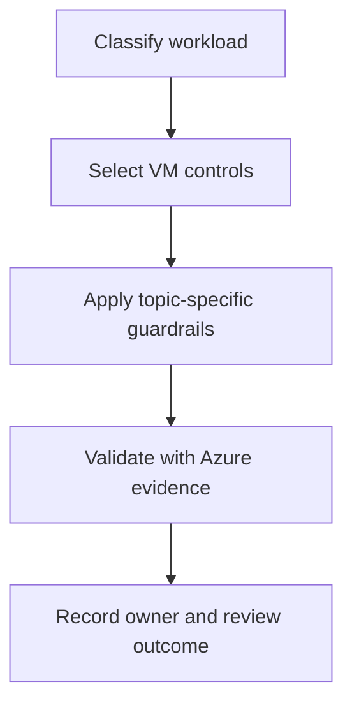

---
content_sources:
  diagrams:
  - id: best-practices-production-baseline-practice-flow
    type: flowchart
    source: mslearn-adapted
    description: Baseline control set
    based_on:
    - https://learn.microsoft.com/en-us/azure/virtual-machines/overview
    - https://learn.microsoft.com/en-us/azure/virtual-machines/sizes
    - https://learn.microsoft.com/en-us/azure/virtual-machines/availability
    - https://learn.microsoft.com/en-us/azure/virtual-machines/monitor-vm
content_validation:
  status: pending_review
  last_reviewed: '2026-05-22'
  reviewer: ai-agent
  core_claims:
  - claim: This document has source metadata and is queued for text-level Microsoft
      Learn verification.
    source: https://learn.microsoft.com/en-us/azure/virtual-machines/overview
    verified: false
  - claim: Core Azure VM guidance on this page should remain traceable to the listed
      sources before it is marked verified.
    source: https://learn.microsoft.com/en-us/azure/virtual-machines/overview
    verified: false
---

# Production Baseline

A VM production baseline defines the minimum controls that must exist before a workload can be considered supportable.

## Why This Matters

A new application VM is ready for launch, but support ownership, access path, backup, and alerting evidence must be verified first.

<!-- diagram-id: best-practices-production-baseline-practice-flow -->

```mermaid
flowchart TD
    A[Classify workload] --> B[Select VM controls]
    B --> C[Apply topic-specific guardrails]
    C --> D[Validate with Azure evidence]
    D --> E[Record owner and review outcome]
```

## Recommended Practices

### 1. Classify the workload before choosing controls

**Why:** Availability, recovery, and access controls depend on business criticality.

**How:** Record the workload tier, RTO, RPO, data sensitivity, and support owner in tags or a design record.

**Validation:** Tags and runbooks identify the accountable team and recovery target.

### 2. Set a minimum platform envelope

**Why:** Unsupported VM sizes, weak disks, missing NSGs, and no backup policy create avoidable incidents.

**How:** Require managed disks, explicit NSG rules, monitored access paths, backup where state exists, and SKU choices that meet expected load.

**Validation:** Azure Resource Graph or CLI queries can prove each baseline control.

### 3. Make drift visible

**Why:** VMs are frequently changed outside the original deployment pipeline.

**How:** Alert on guest health, availability, backup failures, and critical control-plane changes.

**Validation:** Activity Log and Azure Monitor alerts show when the baseline changed.

### CLI review example

```bash
az vm show \
    --resource-group $RG \
    --name $VM_NAME \
    --query "{name:name,size:hardwareProfile.vmSize,zone:zones,security:securityProfile.securityType}" \
    --output json

az vm list-sizes \
    --location $LOCATION \
    --query "[?name=='Standard_D4s_v5' || name=='Standard_E4s_v5'].{name:name,cores:numberOfCores,memory:memoryInMb,maxDataDiskCount:maxDataDiskCount}" \
    --output table

az vm update \
    --resource-group $RG \
    --name $VM_NAME \
    --set tags.reviewArea=production-baseline tags.owner=platform-team \
    --output json
```

| Element | Purpose |
|---|---|
| `$RG` | Resource group containing the VM resources. |
| `$VM_NAME` | Target virtual machine name. |
| `$LOCATION` | Azure region for regional resource discovery or creation. |
| `--resource-group` | Scopes the command to the intended resource group. |
| `--name` | Identifies the resource being created, read, updated, or deleted. |
| `--query` | Filters the response so operators capture only the needed evidence. |
| `--output` | Controls the output format for logs, scripts, or human review. |
| `--location` | Selects the Azure region for regional resources or SKU lookup. |
| `--set` | Updates one or more resource properties or tags. |
| Expected result | Command succeeds and returns the requested Azure resource state or operation result. |

## Common Mistakes / Anti-Patterns

- Treating a VM as only a compute resource while ignoring disk, network, identity, and recovery controls.
- Reusing a proof-of-concept SKU, image, or public access path in production without a fresh review.
- Marking the design complete without captured Azure evidence and an owner for follow-up changes.

## Validation Checklist

- [ ] Workload owner, criticality, and support model are recorded.
- [ ] VM size, disk tier, network path, access model, and recovery controls match the workload objective.
- [ ] Azure CLI or portal evidence is captured after the change.
- [ ] Exceptions are documented with an expiration date or follow-up issue.

## See Also

- [Production Baseline](production-baseline.md)
- [Operations](../operations/index.md)
- [Troubleshooting](../troubleshooting/index.md)

## Sources

- [Overview](https://learn.microsoft.com/en-us/azure/virtual-machines/overview)
- [Sizes](https://learn.microsoft.com/en-us/azure/virtual-machines/sizes)
- [Availability](https://learn.microsoft.com/en-us/azure/virtual-machines/availability)
- [Monitor Vm](https://learn.microsoft.com/en-us/azure/virtual-machines/monitor-vm)
