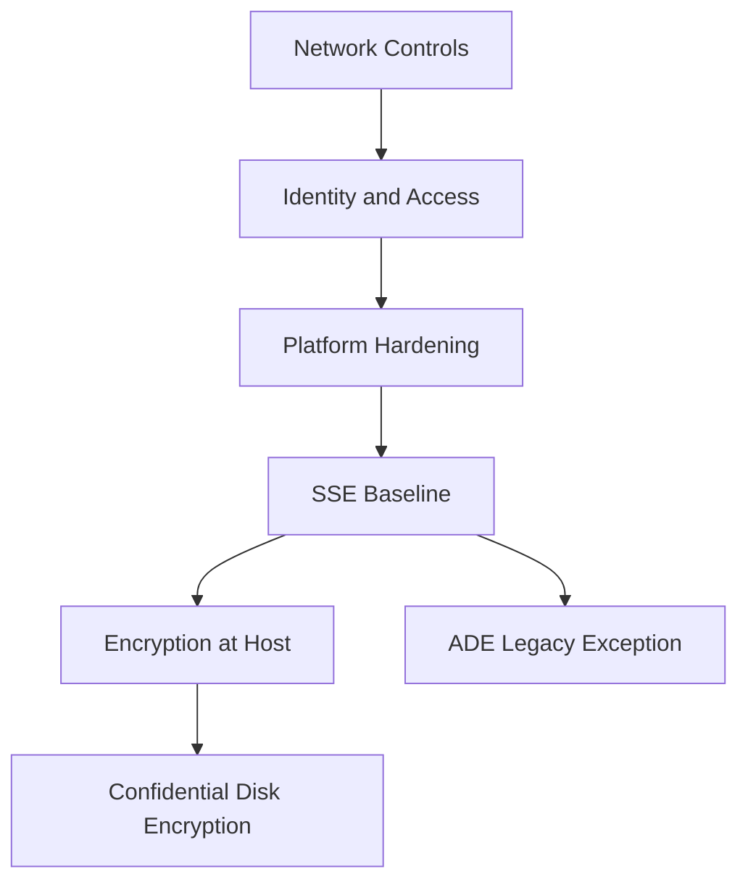
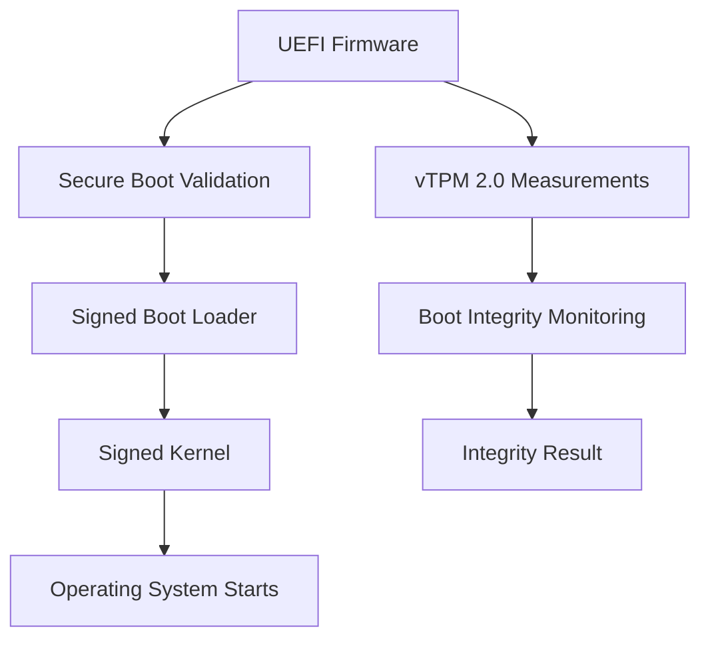

# Security Best Practices

Securing Azure Virtual Machines involves a multi-layered approach ranging from network access control to identity management and data encryption. These controls must be consistently applied to maintain a hardened environment.

| Security Control | Implementation | Azure Service |
| :--- | :--- | :--- |
| Network Access | Restrict ports and protocol access. | Network Security Group (NSG) |
| Identity Management | Eliminate the use of credentials in code. | Managed Identity |
| Adaptive Protection | Request access to VM ports only when needed. | Just-In-Time (JIT) VM Access |
| OS Hardening | Apply latest patches and security baseline. | Microsoft Defender for Cloud |
| Data at Rest | Use default encryption and add stronger controls as needed. | SSE / Encryption at Host / Confidential Disk Encryption |

## Recommended Encryption Hierarchy

1. **Server-Side Encryption (SSE)**
    - Always on for managed disks by default
    - Platform-managed keys by default, with optional customer-managed keys (CMK)
2. **Encryption at Host**
    - Adds encryption for temp disk data and host cache data
    - Recommended when you need comprehensive disk-path encryption
3. **Confidential Disk Encryption**
    - For highest-security workloads that require confidential computing protections
4. **Azure Disk Encryption (ADE)**
    - Legacy/guest-level option for specific compliance requirements

!!! warning
    Azure Disk Encryption (ADE) is being superseded for most new deployments. Prefer **SSE (with CMK when needed)** and/or **Encryption at Host** for new VM designs.

## Security Layers

Modern cloud security relies on defense-in-depth, protecting your data through several concentric circles of control.

## Platform Security Baselines

| Control | Best Practice | Why |
| :--- | :--- | :--- |
| Trusted Launch | Enable on supported Gen2 VMs | Strengthens boot integrity |
| Secure Boot | Keep enabled unless workload requires disabling | Helps prevent bootkit/rootkit attacks |
| vTPM | Enable with Trusted Launch | Supports measured boot and attestation workloads |
| Defender for Cloud | Monitor secure score and recommendations | Continuous posture improvement |

!!! tip
    Use Microsoft Defender for Cloud to get actionable security recommendations and a compliance score for your subscription.

## Trusted Launch

!!! tip "Recommended for all new supported Gen2 VMs"
    Trusted Launch is available at no extra cost and should be enabled for all new VM deployments where supported (Gen2 VMs with compatible images).

| Feature | Description | Benefit |
|---------|-------------|---------|
| Secure Boot | Ensures only signed OS loaders/kernels boot | Prevents rootkits |
| vTPM | Virtual Trusted Platform Module 2.0 | Enables BitLocker, measured boot |
| Boot Integrity Monitoring | Validates boot chain measurements | Detects tampering |

!!! tip "Related Pages"
    - [Identity and Access](../platform/identity-and-access.md)
    - [Connect to VM](../operations/connect-to-vm.md)

## Sources

- [Security best practices for Azure Virtual Machines](https://learn.microsoft.com/en-us/security/benchmark/azure/baselines/virtual-machines-linux-security-baseline)
- [Microsoft Defender for Cloud documentation](https://learn.microsoft.com/en-us/azure/defender-for-cloud/defender-for-cloud-introduction)
- [How to use managed identities for Azure resources on an Azure VM](https://learn.microsoft.com/en-us/azure/entra/identity/managed-identities-azure-resources/how-to-use-vm-token)
- [Trusted Launch for Azure virtual machines](https://learn.microsoft.com/en-us/azure/virtual-machines/trusted-launch)
