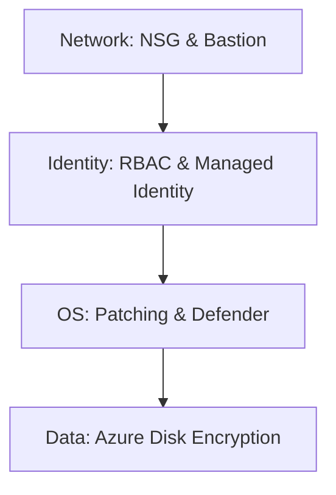

# Security Best Practices

Securing Azure Virtual Machines involves a multi-layered approach ranging from network access control to identity management and data encryption. These controls must be consistently applied to maintain a hardened environment.

| Security Control | Implementation | Azure Service |
| :--- | :--- | :--- |
| Network Access | Restrict ports and protocol access. | Network Security Group (NSG) |
| Identity Management | Eliminate the use of credentials in code. | Managed Identity |
| Adaptive Protection | Request access to VM ports only when needed. | Just-In-Time (JIT) VM Access |
| OS Hardening | Apply latest patches and security baseline. | Microsoft Defender for Cloud |
| Data at Rest | Encrypt VM disks with keys you manage. | Azure Disk Encryption |

## Security Layers

Modern cloud security relies on defense-in-depth, protecting your data through several concentric circles of control.

!!! tip
    Use Microsoft Defender for Cloud to get actionable security recommendations and a compliance score for your subscription.

## Sources

- [Security best practices for Azure Virtual Machines](https://learn.microsoft.com/en-us/azure/virtual-machines/security-recommendations)
- [Microsoft Defender for Cloud documentation](https://learn.microsoft.com/en-us/azure/defender-for-cloud/defender-for-cloud-introduction)
- [How to use managed identities for Azure resources on an Azure VM](https://learn.microsoft.com/en-us/azure/active-directory/managed-identities-azure-resources/how-to-use-vm-token)
