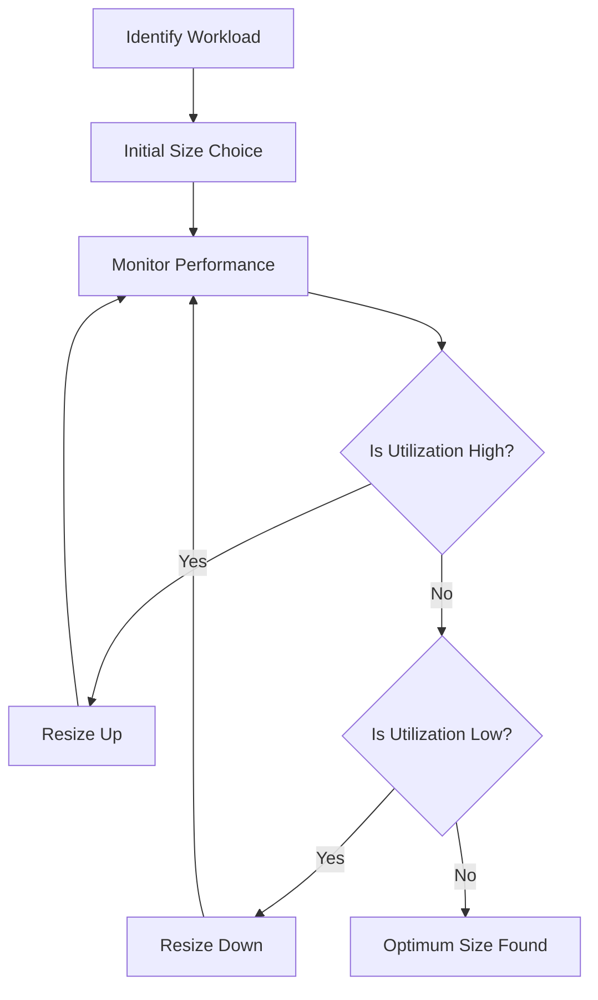

# Sizing and Image Selection

Choosing the right virtual machine size and image is critical for performance, compatibility, and cost-efficiency. A methodical approach ensures your workload has sufficient resources without over-provisioning.

| Image Source | Description | Best For |
| :--- | :--- | :--- |
| Azure Marketplace | Ready-to-use images provided by Microsoft and partners. | Rapid deployment of standard operating systems. |
| Custom Managed Image | A specialized image created from an existing VM. | Capturing a specific configuration for reuse. |
| Azure Compute Gallery | A service that helps build structure and organization around images. | Global sharing and version control for large-scale deployments. |

## Sizing Decision Flow

Proper right-sizing involves an iterative process of performance monitoring and resource adjustment.

!!! note
    Azure Hybrid Benefit allows you to use your existing on-premises Windows Server or SQL Server licenses on Azure, significantly reducing the hourly cost of your virtual machines.

## Sources

- [Virtual machine sizes in Azure](https://learn.microsoft.com/en-us/azure/virtual-machines/sizes)
- [Azure Compute Gallery overview](https://learn.microsoft.com/en-us/azure/virtual-machines/shared-image-galleries)
- [Azure Hybrid Benefit](https://learn.microsoft.com/en-us/azure/virtual-machines/windows/hybrid-use-benefit-licensing)
