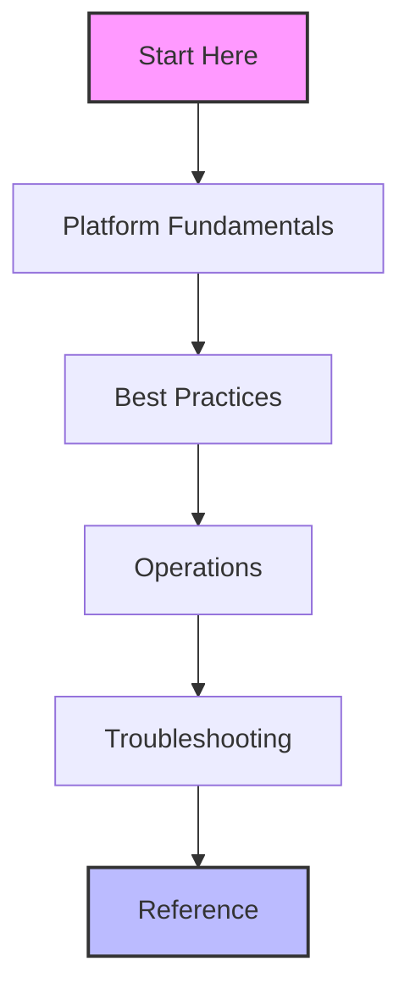

---
hide:
- toc
content_sources:
  diagrams:
  - id: index-guide-structure
    type: flowchart
    source: self-generated
    description: Guide Structure
    based_on:
    - https://learn.microsoft.com/en-us/azure/virtual-machines/overview
    - https://learn.microsoft.com/en-us/azure/virtual-network/virtual-networks-overview
    justification: Synthesized for this guide from the referenced Microsoft Learn
      documentation.
---

# Azure Virtual Machine Practical Guide

This practical guide covers Azure Virtual Machine platform internals, operational procedures, and troubleshooting techniques. It's designed for cloud engineers and architects who need to move beyond basic feature descriptions to real-world implementation and decision-making.

## Navigation Hub

| Section | Description |
|---------|-------------|
| [Start Here](start-here/index.md) | Introduction to Azure VMs, use cases, and recommended learning paths. |
| [Platform Fundamentals](platform/index.md) | Deep dive into how Azure VMs work, including compute, storage, and networking. |
| [Best Practices](best-practices/index.md) | Production-ready guidance for architecture, security, and resiliency. |
| [Operations](operations/index.md) | Practical guides for day-to-day management, monitoring, and maintenance. |
| [Troubleshooting](troubleshooting/index.md) | Symptom-based diagnostic workflows and common resolution steps. |
| [Reference](reference/index.md) | Quick-reference tables and direct links to Microsoft Learn sources. |

## Guide Structure

<!-- diagram-id: index-guide-structure -->

!!! tip "How to Use This Guide"
    If you're new to Azure, start with **[Start Here](start-here/index.md)** for an overview and learning paths, then move to **Platform Fundamentals** to understand the "Why" and "How". For those already running workloads, the **Troubleshooting** and **Operations** sections provide immediate value for maintenance.

## Quick Links
- [Virtual Machines Overview](https://learn.microsoft.com/en-us/azure/virtual-machines/overview)
- [VM Sizes and Types](https://learn.microsoft.com/en-us/azure/virtual-machines/sizes/overview)
- [Azure Backup for VMs](https://learn.microsoft.com/en-us/azure/backup/backup-azure-vms-introduction)

## See Also

- [Start Here](start-here/index.md)
- [Platform Fundamentals](platform/index.md)
- [Operations](operations/index.md)

## Sources
- [Azure Virtual Machines Documentation](https://learn.microsoft.com/en-us/azure/virtual-machines/overview)
- [Azure Virtual Network Overview](https://learn.microsoft.com/en-us/azure/virtual-network/virtual-networks-overview)
