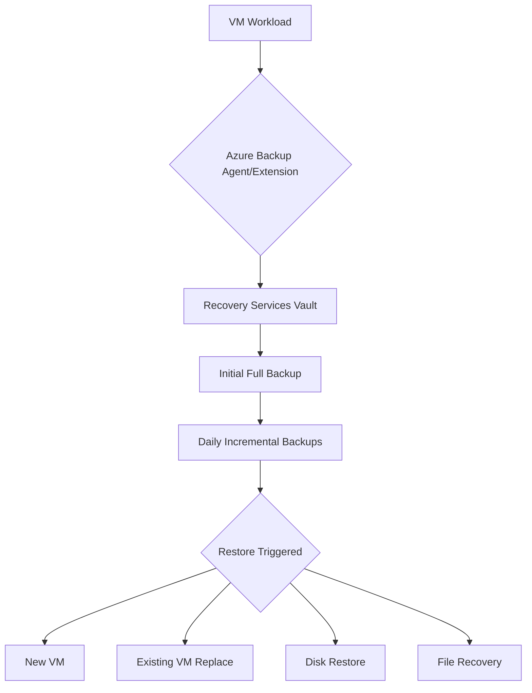

# Backup and Restore

Azure Backup provides a secure, reliable way to protect your Virtual Machines from data loss and corruption. It uses Recovery Services vaults to store recovery points and manage backup policies.

## Backup Workflow

## Restore Options Comparison

Azure Backup offers several ways to recover data depending on the failure scenario and recovery time objective.

| Restore Option | Speed | Use Case | Data Loss Risk |
| :--- | :--- | :--- | :--- |
| **Create New VM** | Fast | Complete VM failure or migration | Minimal (to last backup) |
| **Replace Existing** | Moderate | OS corruption or misconfiguration | Potential if not careful |
| **Restore Disks** | Fast | Advanced recovery, manual rebuild | Minimal (to last backup) |
| **File-level Recovery** | Very Fast | Accidental deletion of specific files | None (specific files only) |

## Backup Configuration

Azure Backup handles infrastructure management, allowing you to focus on protection policies and recovery.

!!! note
    Incremental backups only transfer changed blocks since the last backup, which minimizes storage costs and network usage.

!!! warning
    Deleting a Recovery Services vault requires you to first stop all backup items and delete the backup data.

!!! tip
    Use Cross Region Restore (CRR) to recover VMs in a secondary paired region for disaster recovery scenarios.

## Sources

- [About Azure VM backup](https://learn.microsoft.com/en-us/azure/backup/backup-azure-vms-introduction)
- [Restore Azure VMs](https://learn.microsoft.com/en-us/azure/backup/backup-azure-arm-restore-vms)
- [File-level recovery](https://learn.microsoft.com/en-us/azure/backup/backup-azure-restore-files-from-vm)
