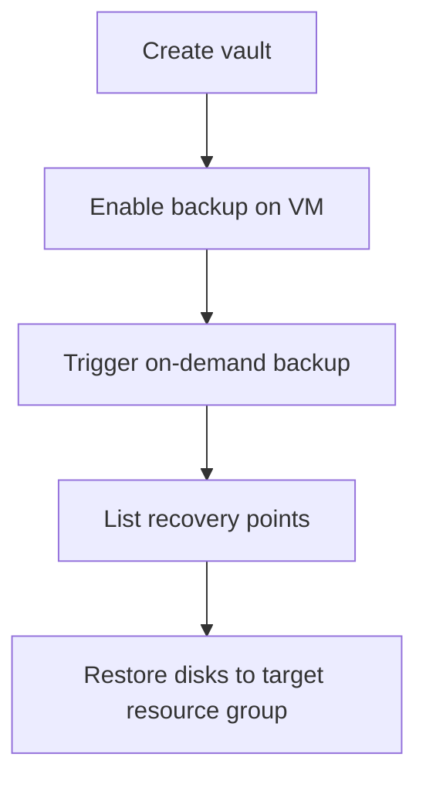

# Backup and Restore

This runbook enables Azure VM backup, forces an on-demand recovery point for change safety, and restores disks from a chosen recovery point when you need controlled recovery rather than an immediate in-place overwrite.

## Prerequisites

- Azure CLI installed and authenticated.
- Contributor access to the Recovery Services vault and the source VM.
- A staging storage account already created in the same region as the vault.
- Approval for restore targets so you know where recovered disks should land.

## When to Use

- You need protection enabled on a VM that is not yet backed up.
- You want a fresh recovery point before a risky maintenance window.
- You need to restore disks for a controlled rebuild or forensic comparison.

## Procedure

### Protect the VM and perform a disk restore

<!-- diagram-id: operations-backup-restore-backup-workflow -->

```mermaid
flowchart TD
    A[Create vault] --> B[Enable backup on VM]
    B --> C[Trigger on-demand backup]
    C --> D[List recovery points]
    D --> E[Restore disks to target resource group]
```

```bash
export VAULT_RG="rg-backup"
export VAULT_NAME="rsv-vm-ops"
export VM_ID="/subscriptions/<subscription-id>/resourceGroups/rg-vm-app/providers/Microsoft.Compute/virtualMachines/vm-app-01"
export CONTAINER_NAME="IaasVMContainer;iaasvmcontainerv2;rg-vm-app;vm-app-01"
export ITEM_NAME="VM;iaasvmcontainerv2;rg-vm-app;vm-app-01"
export STAGING_ACCOUNT="stvmrestoreops"
export RESTORE_RG="rg-vm-restore"
export RETAIN_UNTIL="24-08-2026"

az backup vault create --resource-group "$VAULT_RG" --name "$VAULT_NAME" --location eastus

az backup protection enable-for-vm --resource-group "$VAULT_RG" --vault-name "$VAULT_NAME" --policy-name DefaultPolicy --vm "$VM_ID"

az backup protection backup-now --resource-group "$VAULT_RG" --vault-name "$VAULT_NAME" --container-name "$CONTAINER_NAME" --item-name "$ITEM_NAME" --backup-management-type AzureIaasVM --retain-until "$RETAIN_UNTIL"

az backup recoverypoint list --resource-group "$VAULT_RG" --vault-name "$VAULT_NAME" --container-name "$CONTAINER_NAME" --item-name "$ITEM_NAME" --query "[0].name" --output tsv

az backup restore restore-disks --resource-group "$VAULT_RG" --vault-name "$VAULT_NAME" --container-name "$CONTAINER_NAME" --item-name "$ITEM_NAME" --rp-name <recovery-point-name> --storage-account "$STAGING_ACCOUNT" --target-resource-group "$RESTORE_RG"
```
| Command | Purpose |
| --- | --- |
| `az backup vault create` | Creates the Recovery Services vault. |
| `--resource-group` | Places the vault in the backup resource group. |
| `--name` | Sets the vault name. |
| `--location` | Sets the vault region. |
| `az backup protection enable-for-vm` | Turns on VM backup with the selected vault policy. |
| `--vault-name` | Selects the Recovery Services vault. |
| `--policy-name` | Uses the backup policy that controls schedule and retention. |
| `--vm` | Points backup protection at the source VM resource ID. |
| `az backup protection backup-now` | Creates an immediate recovery point. |
| `--container-name` | Selects the backup container for the VM. |
| `--item-name` | Selects the protected VM item in the vault. |
| `--backup-management-type` | Declares that this is an Azure IaaS VM backup item. |
| `--retain-until` | Sets the temporary retention date for the ad hoc recovery point. |
| `az backup recoverypoint list` | Lists recovery points so you can select the exact restore target. |
| `az backup restore restore-disks` | Restores the VM disks from the selected recovery point. |
| `--rp-name` | Specifies the recovery point to restore. |
| `--storage-account` | Provides the staging storage account used during disk restore. |
| `--target-resource-group` | Chooses the resource group that will receive restored disks. |

You should expect the on-demand backup to return a job payload and the recovery point list to return at least one recovery point name before you start the disk restore.

Example output:

```text
operation    status       start
-----------  -----------  -------------------------
Backup       Completed    2026-07-25T09:15:00Z
Restore      InProgress   2026-07-25T09:32:00Z
```

## Verification

Track the backup and restore jobs until they show successful completion.

```bash
az backup job list --resource-group "$VAULT_RG" --vault-name "$VAULT_NAME" --query "[0:5].{operation:operation,status:status,start:startTime}" --output table
```
| Command | Purpose |
| --- | --- |
| `az backup job list` | Lists recent backup and restore jobs for the vault. |
| `--query` | Returns the most recent operations with status and start time. |
| `--output` | Shows job health in a compact table. |

Do not treat the restore as finished until the job list shows the restore operation as `Completed` or `Succeeded`.

## Rollback / Troubleshooting

- If `enable-for-vm` fails, confirm the VM ID is valid and the vault and VM are in supported regions for the scenario.
- If the recovery point list is empty right after `backup-now`, wait for the backup job to finish before requerying.
- If a full VM restore is too risky, use restored disks to build a comparison VM instead of replacing the production machine in place.
- If the wrong recovery point was restored, leave the restored disks isolated in `$RESTORE_RG` and start a second restore from the correct point rather than overwriting evidence.

## See Also

- [Snapshots and Images](snapshots-and-images.md)
- [Backup Failures](../troubleshooting/playbooks/boot-disk/backup-failures.md)
- [Backup and DR Best Practices](../best-practices/backup-and-dr-best-practices.md)

## Sources

- [About Azure VM backup](https://learn.microsoft.com/en-us/azure/backup/backup-azure-vms-introduction)
- [Restore VMs by using the Azure portal using Azure Backup](https://learn.microsoft.com/en-us/azure/backup/backup-azure-arm-restore-vms)
