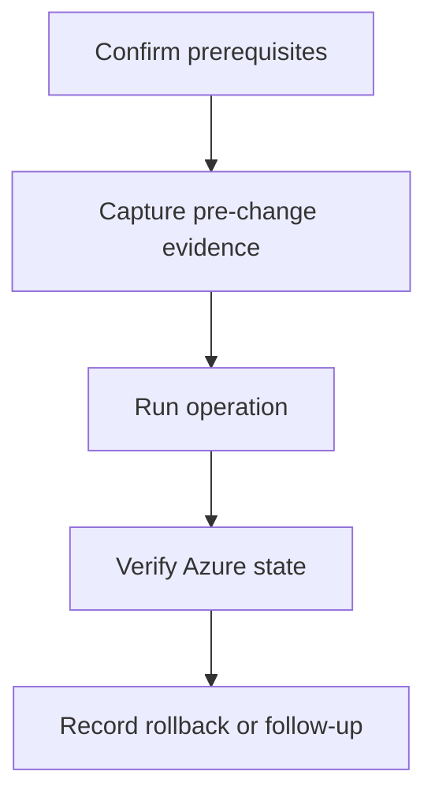

---
content_sources:
  diagrams:
  - id: operations-backup-restore-runbook-flow
    type: flowchart
    source: mslearn-adapted
    description: Runbook flow
    based_on:
    - https://learn.microsoft.com/en-us/azure/backup/backup-azure-vms-introduction
    - https://learn.microsoft.com/en-us/azure/backup/quick-backup-vm-cli
    - https://learn.microsoft.com/en-us/azure/backup/backup-azure-arm-restore-vms
content_validation:
  status: pending_review
  last_reviewed: '2026-05-22'
  reviewer: ai-agent
  core_claims:
  - claim: This document has source metadata and is queued for text-level Microsoft
      Learn verification.
    source: https://learn.microsoft.com/en-us/azure/backup/backup-azure-vms-introduction
    verified: false
  - claim: Core Azure VM guidance on this page should remain traceable to the listed
      sources before it is marked verified.
    source: https://learn.microsoft.com/en-us/azure/backup/backup-azure-vms-introduction
    verified: false
---

# Backup and Restore

Use this runbook to verify VM backup coverage and perform controlled restore testing.

## Prerequisites

- Azure CLI is installed and authenticated with the target subscription.
- Required variables are set before commands are run: `RG`, `VM_NAME`, and any resource-specific names in the command tables.
- The operator has permission to read and change the VM, disks, network interfaces, and monitoring resources involved in the procedure.
- A maintenance window and rollback owner are identified for production changes.

## When to Use

A service owner must prove a VM can be restored from Azure Backup before a production audit.

<!-- diagram-id: operations-backup-restore-runbook-flow -->

```mermaid
flowchart TD
    A[Confirm prerequisites] --> B[Capture pre-change evidence]
    B --> C[Run operation]
    C --> D[Verify Azure state]
    D --> E[Record rollback or follow-up]
```

## Procedure

1. Confirm the VM is protected by the expected Recovery Services vault and policy.
2. Review latest backup job status and retained restore points.
3. Test restore in an isolated resource group or alternate network when possible.
4. Record restore duration, selected restore point, and application validation result.

### Command sequence

```bash
az backup protection check-vm \
    --resource-group $RG \
    --vm $VM_NAME \
    --output json

az backup item list \
    --resource-group $RG \
    --vault-name $VAULT_NAME \
    --backup-management-type AzureIaasVM \
    --output table
```

| Element | Purpose |
|---|---|
| `$RG` | Resource group containing the VM resources. |
| `$VM_NAME` | Target virtual machine name. |
| `$VAULT_NAME` | Recovery Services vault used for VM backup. |
| `--resource-group` | Scopes the command to the intended resource group. |
| `--vm` | Azure CLI option used to scope or shape the operation. |
| `--output` | Controls the output format for logs, scripts, or human review. |
| `--vault-name` | Azure CLI option used to scope or shape the operation. |
| `--backup-management-type` | Azure CLI option used to scope or shape the operation. |
| Expected result | Command succeeds and returns the requested Azure resource state or operation result. |

## Verification

```bash
az backup job list \
    --resource-group $RG \
    --vault-name $VAULT_NAME \
    --status Completed \
    --output table
```

| Element | Purpose |
|---|---|
| `$RG` | Resource group containing the VM resources. |
| `$VAULT_NAME` | Recovery Services vault used for VM backup. |
| `--resource-group` | Scopes the command to the intended resource group. |
| `--vault-name` | Azure CLI option used to scope or shape the operation. |
| `--status` | Azure CLI option used to scope or shape the operation. |
| `--output` | Controls the output format for logs, scripts, or human review. |
| Expected result | Command succeeds and returns the requested Azure resource state or operation result. |

Confirm that the Azure output and guest/application checks match the intended post-change state.

## Rollback / Troubleshooting

- If the command fails, capture the error, Activity Log entry, and current resource state before retrying.
- If guest health is degraded after the change, revert to the documented previous size, disk setting, access rule, or restore point.
- Escalate when Azure reports regional capacity, unsupported SKU, policy denial, or backup/replication lock conflicts.

## See Also

- [Production Baseline](../best-practices/production-baseline.md)
- [Monitoring Best Practices](../best-practices/monitoring-best-practices.md)
- [Troubleshooting Playbooks](../troubleshooting/playbooks/index.md)

## Sources

- [Backup Azure Vms Introduction](https://learn.microsoft.com/en-us/azure/backup/backup-azure-vms-introduction)
- [Quick Backup Vm Cli](https://learn.microsoft.com/en-us/azure/backup/quick-backup-vm-cli)
- [Backup Azure Arm Restore Vms](https://learn.microsoft.com/en-us/azure/backup/backup-azure-arm-restore-vms)
