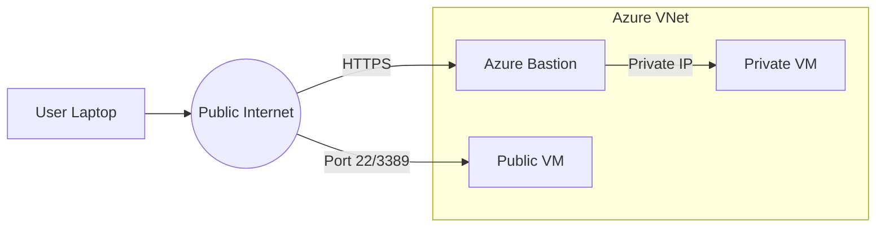

---
hide:
- toc
content_sources:
  diagrams:
  - id: operations-connect-to-vm-connection-path-architecture
    type: flowchart
    source: mslearn-adapted
    description: Connection Path Architecture
    based_on:
    - https://learn.microsoft.com/en-us/azure/virtual-machines/windows/connect-logon
    - https://learn.microsoft.com/en-us/azure/virtual-machines/linux/mac-create-ssh-keys
    - https://learn.microsoft.com/en-us/azure/bastion/bastion-connect-vm-rdp
---

# Connect to VM

Connecting to Azure virtual machines requires specific protocols depending on the operating system and security requirements. Use Azure Bastion for the most secure, browser-based access without public IP addresses.

## Connection Methods

| Method | Public IP Required | Security Level |
|--------|-------------------|----------------|
| Azure Bastion | No | High |
| VPN/ExpressRoute + Private IP | No | High |
| JIT VM Access + Public IP | Yes (temporary) | Medium |
| Direct Public IP | Yes | Low (not recommended) |

## Connection Path Architecture

<!-- diagram-id: operations-connect-to-vm-connection-path-architecture -->

!!! tip
    Always use SSH key pairs instead of passwords for Linux VMs to prevent brute-force attacks.

## Troubleshooting Quick Reference

| Symptom | Check | Action |
| :--- | :--- | :--- |
| Timeout | NSG + Route + Access Path | Verify Bastion/VPN path or inbound 22/3389 rule for approved source |
| Auth Failed | Credentials | Reset password/SSH key in Portal "Help" section |
| Port Closed | OS Firewall | Check 'ufw' or 'Windows Firewall' status |

## See Also

- [Identity and Access](../platform/identity-and-access.md)
- [Networking Best Practices](../best-practices/networking-best-practices.md)
- [DNS and Connectivity Issues](../troubleshooting/playbooks/connectivity/dns-and-connectivity-issues.md)

## Sources

- [Connect to a Windows VM using RDP](https://learn.microsoft.com/en-us/azure/virtual-machines/windows/connect-logon)
- [Connect to a Linux VM using SSH](https://learn.microsoft.com/en-us/azure/virtual-machines/linux/mac-create-ssh-keys)
- [Connect to a VM via Azure Bastion](https://learn.microsoft.com/en-us/azure/bastion/bastion-connect-vm-rdp)
