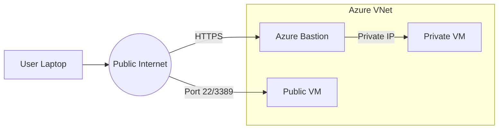

# Connect to VM

Connecting to Azure virtual machines requires specific protocols depending on the operating system and security requirements. Use Azure Bastion for the most secure, browser-based access without public IP addresses.

## Connection Method Comparison

| Method | Protocol/Port | Security | Requirements | Cost |
| :--- | :--- | :--- | :--- | :--- |
| **RDP** | TCP 3389 | Low (Public) | Windows, Public IP | Included |
| **SSH** | TCP 22 | Medium | Linux, Public IP, Keys | Included |
| **Bastion** | HTTPS 443 | High | Browser, Bastion Subnet | Hourly |

## Connection Path Architecture

!!! tip
    Always use SSH key pairs instead of passwords for Linux VMs to prevent brute-force attacks.

## Troubleshooting Quick Reference

| Symptom | Check | Action |
| :--- | :--- | :--- |
| Timeout | NSG Rules | Verify inbound port 22/3389 allows your IP |
| Auth Failed | Credentials | Reset password/SSH key in Portal "Help" section |
| Port Closed | OS Firewall | Check 'ufw' or 'Windows Firewall' status |

## Sources

* [Connect to a Windows VM using RDP](https://learn.microsoft.com/en-us/azure/virtual-machines/windows/connect-logon)
* [Connect to a Linux VM using SSH](https://learn.microsoft.com/en-us/azure/virtual-machines/linux/mac-create-ssh-keys)
* [Connect to a VM via Azure Bastion](https://learn.microsoft.com/en-us/azure/bastion/bastion-connect-vm-rdp)
