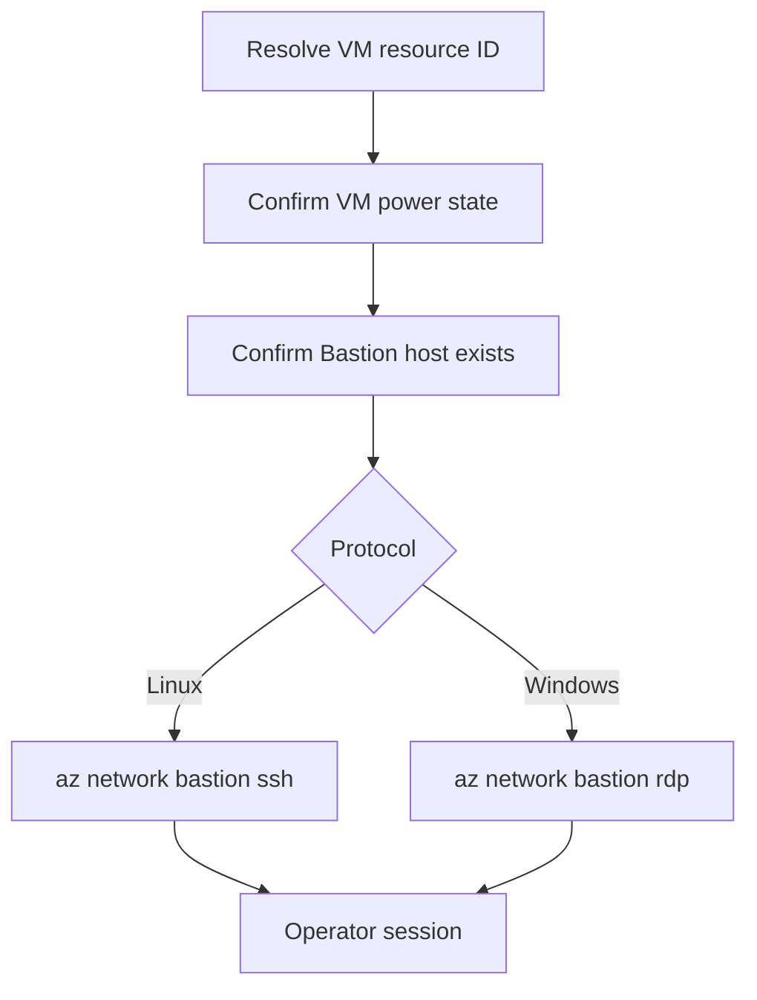

# Connect to VM

This runbook verifies the access path to a VM and then opens an operator session through Azure Bastion, which is the safest default when you want remote access without public RDP or SSH exposure.

## Prerequisites

- Azure CLI installed and authenticated.
- The Azure Bastion extension available to Azure CLI the first time you invoke Bastion commands.
- Reader access to the VM and Bastion resources, plus login rights on the guest OS.
- The target VM already deployed and running.

## When to Use

- You need an SSH or RDP session for maintenance, log inspection, or break-glass access.
- You want to confirm that Bastion is correctly attached before opening an admin session.
- You need to avoid directly exposing TCP 22 or 3389 on the public internet.

## Procedure

### Validate the target and open the management session

<!-- diagram-id: operations-connect-to-vm-connection-path-architecture -->

```mermaid
flowchart TD
    A[Resolve VM resource ID] --> B[Confirm VM power state]
    B --> C[Confirm Bastion host exists]
    C --> D{Protocol}
    D -->|Linux| E[az network bastion ssh]
    D -->|Windows| F[az network bastion rdp]
    E --> G[Operator session]
    F --> G
```

```bash
export RG="rg-vm-access"
export VM_NAME="vm-app-01"
export BASTION_NAME="bas-ops"
export ADMIN_USERNAME="azureuser"
export VM_ID=$(az vm show --resource-group "$RG" --name "$VM_NAME" --query id --output tsv)

az vm show --resource-group "$RG" --name "$VM_NAME" --show-details --query "{power:powerState,privateIp:privateIps,publicIp:publicIps}" --output yaml

az network bastion show --resource-group "$RG" --name "$BASTION_NAME" --query "{host:name,sku:sku.name,tunneling:enableTunneling}" --output yaml

az network bastion ssh --resource-group "$RG" --name "$BASTION_NAME" --target-resource-id "$VM_ID" --auth-type ssh-key --username "$ADMIN_USERNAME" --ssh-key "$HOME/.ssh/id_rsa"
```
| Command | Purpose |
| --- | --- |
| `az vm show` | Resolves the target VM and confirms its current reachability indicators. |
| `--resource-group` | Limits the VM lookup to the correct scope. |
| `--name` | Selects the exact VM to connect to. |
| `--show-details` | Includes live power state and IP information. |
| `--query` | Narrows output to the fields used during access validation. |
| `--output` | Formats the check as YAML. |
| `az network bastion show` | Confirms the Bastion host exists and shows whether tunneling is enabled. |
| `az network bastion ssh` | Starts an SSH tunnelled session through Azure Bastion. |
| `--target-resource-id` | Points Bastion at the VM resource to reach. |
| `--auth-type` | Chooses the authentication method for SSH. |
| `--username` | Supplies the guest OS login name. |
| `--ssh-key` | Supplies the private key used by the SSH client. |

What success looks like:

- The VM status returns `VM running`.
- The Bastion host query returns the expected Bastion name and SKU.
- The final command opens an SSH session on your workstation instead of timing out on a public management port.

Example output:

```yaml
power: VM running
privateIp: 10.20.1.4
publicIp: null
```

For Windows VMs, swap the final command for:

```bash
az network bastion rdp --resource-group "$RG" --name "$BASTION_NAME" --target-resource-id "$VM_ID"
```
| Command | Purpose |
| --- | --- |
| `az network bastion rdp` | Launches a Bastion-backed RDP session to a Windows VM. |
| `--resource-group` | Selects the Bastion resource group. |
| `--name` | Selects the Bastion host to use. |
| `--target-resource-id` | Selects the Windows VM to open through Bastion. |

Native RDP via Bastion should launch the local RDP client rather than asking you to open port 3389 directly on the VM.

## Verification

Validate that the VM NIC and effective NSG rules still support the intended management path.

```bash
export NIC_ID=$(az vm nic list --resource-group "$RG" --vm-name "$VM_NAME" --query "[0].id" --output tsv)

az network nic show-effective-nsg --ids "$NIC_ID" --query "[].effectiveSecurityRules[].{name:name,access:access,direction:direction,destination:destinationPortRange}" --output table
```
| Command | Purpose |
| --- | --- |
| `az vm nic list` | Retrieves the primary NIC attached to the VM. |
| `--resource-group` | Limits the NIC lookup to the VM resource group. |
| `--vm-name` | Ties the NIC lookup to the target VM. |
| `az network nic show-effective-nsg` | Shows the effective security rules after subnet and NIC rule evaluation. |
| `--ids` | Uses the resolved NIC resource ID directly. |
| `--query` | Extracts only rule details relevant to management access. |
| `--output` | Renders the rules as a readable table. |

If you are using Bastion-only access, you should not need a broad inbound allow rule from the internet for 22 or 3389.

## Rollback / Troubleshooting

- If Bastion commands fail because the extension is missing, let Azure CLI install the `bastion` extension and rerun the command.
- If `az network bastion ssh` hangs, confirm the Bastion host is in the same VNet or a peered VNet as the target VM.
- If RDP still requires public exposure, revisit your access design; Bastion is the preferred path for admin access, not opening `0.0.0.0/0` to port 3389.
- If the VM is stopped or deallocated, start it with `az vm start --resource-group "$RG" --name "$VM_NAME"` before retrying the session.

## See Also

- [Create and Configure VM](create-and-configure-vm.md)
- [DNS and Connectivity Issues](../troubleshooting/playbooks/connectivity/dns-and-connectivity-issues.md)
- [Identity and Access](../platform/identity-and-access.md)

## Sources

- [Connect using Remote Desktop to an Azure VM running Windows](https://learn.microsoft.com/en-us/azure/virtual-machines/windows/connect-rdp)
- [Connect to a Windows VM using RDP with Azure Bastion](https://learn.microsoft.com/en-us/azure/bastion/bastion-connect-vm-rdp-windows)
