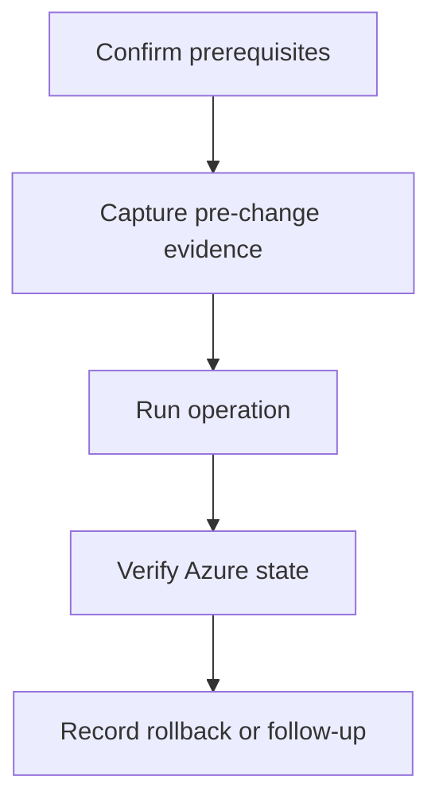

---
content_sources:
  diagrams:
  - id: operations-connect-to-vm-runbook-flow
    type: flowchart
    source: mslearn-adapted
    description: Runbook flow
    based_on:
    - https://learn.microsoft.com/en-us/azure/bastion/bastion-connect-vm-ssh-linux
    - https://learn.microsoft.com/en-us/azure/defender-for-cloud/just-in-time-access-usage
    - https://learn.microsoft.com/en-us/azure/virtual-network/network-security-group-how-it-works
content_validation:
  status: pending_review
  last_reviewed: '2026-05-22'
  reviewer: ai-agent
  core_claims:
  - claim: This document has source metadata and is queued for text-level Microsoft
      Learn verification.
    source: https://learn.microsoft.com/en-us/azure/bastion/bastion-connect-vm-ssh-linux
    verified: false
  - claim: Core Azure VM guidance on this page should remain traceable to the listed
      sources before it is marked verified.
    source: https://learn.microsoft.com/en-us/azure/bastion/bastion-connect-vm-ssh-linux
    verified: false
---

# Connect to VM

Use this runbook to choose and verify a secure administrative connection path to a VM.

## Prerequisites

- Azure CLI is installed and authenticated with the target subscription.
- Required variables are set before commands are run: `RG`, `VM_NAME`, and any resource-specific names in the command tables.
- The operator has permission to read and change the VM, disks, network interfaces, and monitoring resources involved in the procedure.
- A maintenance window and rollback owner are identified for production changes.

## When to Use

An operator needs SSH or RDP access without permanently opening management ports to the internet.

<!-- diagram-id: operations-connect-to-vm-runbook-flow -->

```mermaid
flowchart TD
    A[Confirm prerequisites] --> B[Capture pre-change evidence]
    B --> C[Run operation]
    C --> D[Verify Azure state]
    D --> E[Record rollback or follow-up]
```

## Procedure

1. Prefer Bastion, VPN, ExpressRoute, or a private jump host for administrative access.
2. Confirm the VM power state, private IP, effective NSG rules, and route path before testing access.
3. Use JIT access where Defender for Cloud governs temporary management access.
4. Close temporary access and keep command output in the incident or change record.

### Command sequence

```bash
az vm get-instance-view \
    --resource-group $RG \
    --name $VM_NAME \
    --query "{power:instanceView.statuses[?starts_with(code, 'PowerState/')].displayStatus|[0],agent:instanceView.vmAgent.statuses[0].displayStatus}" \
    --output json

az network nic list-effective-nsg \
    --resource-group $RG \
    --name $NIC_NAME \
    --output table
```

| Element | Purpose |
|---|---|
| `$RG` | Resource group containing the VM resources. |
| `$VM_NAME` | Target virtual machine name. |
| `$NIC_NAME` | Network interface attached to the VM. |
| `--resource-group` | Scopes the command to the intended resource group. |
| `--name` | Identifies the resource being created, read, updated, or deleted. |
| `--query` | Filters the response so operators capture only the needed evidence. |
| `--output` | Controls the output format for logs, scripts, or human review. |
| Expected result | Command succeeds and returns the requested Azure resource state or operation result. |

## Verification

```bash
az vm show \
    --resource-group $RG \
    --name $VM_NAME \
    --show-details \
    --query "{privateIps:privateIps,publicIps:publicIps,powerState:powerState}" \
    --output json
```

| Element | Purpose |
|---|---|
| `$RG` | Resource group containing the VM resources. |
| `$VM_NAME` | Target virtual machine name. |
| `--resource-group` | Scopes the command to the intended resource group. |
| `--name` | Identifies the resource being created, read, updated, or deleted. |
| `--show-details` | Azure CLI option used to scope or shape the operation. |
| `--query` | Filters the response so operators capture only the needed evidence. |
| `--output` | Controls the output format for logs, scripts, or human review. |
| Expected result | Command succeeds and returns the requested Azure resource state or operation result. |

Confirm that the Azure output and guest/application checks match the intended post-change state.

## Rollback / Troubleshooting

- If the command fails, capture the error, Activity Log entry, and current resource state before retrying.
- If guest health is degraded after the change, revert to the documented previous size, disk setting, access rule, or restore point.
- Escalate when Azure reports regional capacity, unsupported SKU, policy denial, or backup/replication lock conflicts.

## See Also

- [Production Baseline](../best-practices/production-baseline.md)
- [Monitoring Best Practices](../best-practices/monitoring-best-practices.md)
- [Troubleshooting Playbooks](../troubleshooting/playbooks/index.md)

## Sources

- [Bastion Connect Vm Ssh Linux](https://learn.microsoft.com/en-us/azure/bastion/bastion-connect-vm-ssh-linux)
- [Just In Time Access Usage](https://learn.microsoft.com/en-us/azure/defender-for-cloud/just-in-time-access-usage)
- [Network Security Group How It Works](https://learn.microsoft.com/en-us/azure/virtual-network/network-security-group-how-it-works)
