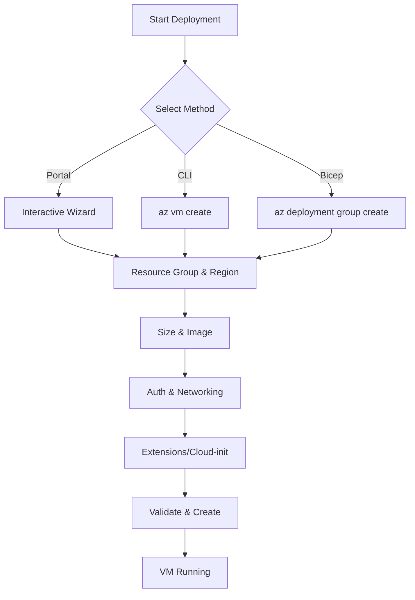

# Create and Configure VM

Azure virtual machines (VMs) provide on-demand, high-scale, secure, and virtualized computing resources. You can deploy VMs using various methods depending on your automation and management needs.

## Deployment Methods

| Method | Learning Curve | Speed | Repeatability | Best For |
| :--- | :--- | :--- | :--- | :--- |
| Azure Portal | Low | Slow | Manual | Testing, one-off configs |
| Azure CLI | Medium | Fast | Scriptable | Automation, rapid creation |
| IaC (Bicep/ARM) | High | Variable | High | Enterprise, CI/CD |

## Essential Parameters

* **Resource Group:** Logical container for VM resources.
* **Region:** Geographic location for data residency.
* **Image:** OS base (Ubuntu, Windows Server).
* **Size:** CPU, RAM, and disk throughput specs.

!!! note
    VM sizes affect pricing and available features like Premium Storage or Accelerated Networking.

## Deployment Workflow

## Sources

* [Azure Virtual Machines documentation](https://learn.microsoft.com/en-us/azure/virtual-machines/)
* [Create a Linux VM with Azure CLI](https://learn.microsoft.com/en-us/azure/virtual-machines/linux/quick-create-cli)
* [Create a Windows VM in the Azure portal](https://learn.microsoft.com/en-us/azure/virtual-machines/windows/quick-create-portal)
