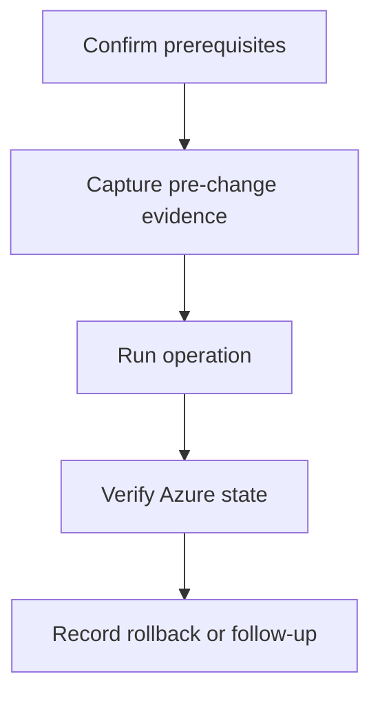

---
content_sources:
  diagrams:
  - id: operations-create-and-configure-vm-runbook-flow
    type: flowchart
    source: mslearn-adapted
    description: Runbook flow
    based_on:
    - https://learn.microsoft.com/en-us/azure/virtual-machines/linux/quick-create-cli
    - https://learn.microsoft.com/en-us/cli/azure/vm
    - https://learn.microsoft.com/en-us/azure/virtual-machines/managed-disks-overview
content_validation:
  status: pending_review
  last_reviewed: '2026-05-22'
  reviewer: ai-agent
  core_claims:
  - claim: This document has source metadata and is queued for text-level Microsoft
      Learn verification.
    source: https://learn.microsoft.com/en-us/azure/virtual-machines/linux/quick-create-cli
    verified: false
  - claim: Core Azure VM guidance on this page should remain traceable to the listed
      sources before it is marked verified.
    source: https://learn.microsoft.com/en-us/azure/virtual-machines/linux/quick-create-cli
    verified: false
---

# Create and Configure VM

Use this runbook to create a VM with an explicit network, disk, image, and security baseline.

## Prerequisites

- Azure CLI is installed and authenticated with the target subscription.
- Required variables are set before commands are run: `RG`, `VM_NAME`, and any resource-specific names in the command tables.
- The operator has permission to read and change the VM, disks, network interfaces, and monitoring resources involved in the procedure.
- A maintenance window and rollback owner are identified for production changes.

## When to Use

A workload owner needs a new Linux VM that can be reviewed and operated consistently after deployment.

<!-- diagram-id: operations-create-and-configure-vm-runbook-flow -->

```mermaid
flowchart TD
    A[Confirm prerequisites] --> B[Capture pre-change evidence]
    B --> C[Run operation]
    C --> D[Verify Azure state]
    D --> E[Record rollback or follow-up]
```

## Procedure

1. Create or select the resource group, virtual network, and subnet.
2. Create the VM with a supported image, production-appropriate size, Standard public IP only when required, and Premium storage for predictable latency.
3. Apply ownership, environment, and review tags immediately after creation.
4. Validate provisioning state, security profile, NIC, and disk configuration before handing over the VM.

### Command sequence

```bash
az group create \
    --name $RG \
    --location $LOCATION \
    --output json

az network vnet create \
    --resource-group $RG \
    --name $VNET_NAME \
    --address-prefixes 10.40.0.0/16 \
    --subnet-name $SUBNET_NAME \
    --subnet-prefixes 10.40.1.0/24 \
    --output json

az vm create \
    --resource-group $RG \
    --name $VM_NAME \
    --image Ubuntu2204 \
    --size Standard_D4s_v5 \
    --admin-username azureuser \
    --generate-ssh-keys \
    --vnet-name $VNET_NAME \
    --subnet $SUBNET_NAME \
    --public-ip-sku Standard \
    --storage-sku Premium_LRS \
    --output json
```

| Element | Purpose |
|---|---|
| `$RG` | Resource group containing the VM resources. |
| `$LOCATION` | Azure region for regional resource discovery or creation. |
| `$VNET_NAME` | Virtual network used by the VM workload. |
| `$SUBNET_NAME` | Subnet used by the VM workload. |
| `$VM_NAME` | Target virtual machine name. |
| `--name` | Identifies the resource being created, read, updated, or deleted. |
| `--location` | Selects the Azure region for regional resources or SKU lookup. |
| `--output` | Controls the output format for logs, scripts, or human review. |
| `--resource-group` | Scopes the command to the intended resource group. |
| `--address-prefixes` | Azure CLI option used to scope or shape the operation. |
| `--subnet-name` | Azure CLI option used to scope or shape the operation. |
| `--subnet-prefixes` | Azure CLI option used to scope or shape the operation. |
| `--image` | Selects the marketplace image for the VM OS. |
| Expected result | Command succeeds and returns the requested Azure resource state or operation result. |

## Verification

```bash
az vm show \
    --resource-group $RG \
    --name $VM_NAME \
    --query "{name:name,size:hardwareProfile.vmSize,provisioningState:provisioningState,storage:storageProfile.osDisk.managedDisk.storageAccountType}" \
    --output json
```

| Element | Purpose |
|---|---|
| `$RG` | Resource group containing the VM resources. |
| `$VM_NAME` | Target virtual machine name. |
| `--resource-group` | Scopes the command to the intended resource group. |
| `--name` | Identifies the resource being created, read, updated, or deleted. |
| `--query` | Filters the response so operators capture only the needed evidence. |
| `--output` | Controls the output format for logs, scripts, or human review. |
| Expected result | Command succeeds and returns the requested Azure resource state or operation result. |

Confirm that the Azure output and guest/application checks match the intended post-change state.

## Rollback / Troubleshooting

```bash
az vm delete \
    --resource-group $RG \
    --name $VM_NAME \
    --yes

az group delete \
    --name $RG \
    --yes \
    --no-wait
```

| Element | Purpose |
|---|---|
| `$RG` | Resource group containing the VM resources. |
| `$VM_NAME` | Target virtual machine name. |
| `--resource-group` | Scopes the command to the intended resource group. |
| `--name` | Identifies the resource being created, read, updated, or deleted. |
| `--yes` | Confirms a destructive command without an interactive prompt. |
| `--no-wait` | Starts the operation and returns before Azure completes it. |
| Expected result | Command succeeds and returns the requested Azure resource state or operation result. |

- If the command fails, capture the error, Activity Log entry, and current resource state before retrying.
- If guest health is degraded after the change, revert to the documented previous size, disk setting, access rule, or restore point.
- Escalate when Azure reports regional capacity, unsupported SKU, policy denial, or backup/replication lock conflicts.

## See Also

- [Production Baseline](../best-practices/production-baseline.md)
- [Monitoring Best Practices](../best-practices/monitoring-best-practices.md)
- [Troubleshooting Playbooks](../troubleshooting/playbooks/index.md)

## Sources

- [Quick Create Cli](https://learn.microsoft.com/en-us/azure/virtual-machines/linux/quick-create-cli)
- [Vm](https://learn.microsoft.com/en-us/cli/azure/vm)
- [Managed Disks Overview](https://learn.microsoft.com/en-us/azure/virtual-machines/managed-disks-overview)
