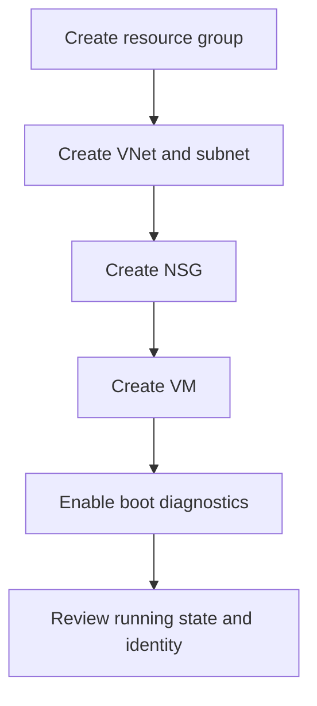

# Create and Configure VM

This runbook creates a Linux VM with explicit network placement, a standard public IP, a system-assigned managed identity, and boot diagnostics so the machine is ready for normal operations and later troubleshooting.

## Prerequisites

- Azure CLI installed locally or available in Azure Cloud Shell.
- Permission to create resources in the target subscription and resource group.
- An SSH key available locally, or permission for Azure CLI to generate one.
- A target location exported as `$LOCATION` and naming values chosen for the VM, VNet, and NSG.

## When to Use

- You need a new operator-managed VM rather than an auto-scaled instance.
- You want a repeatable build that includes managed identity and boot diagnostics from day one.
- You are replacing a failed VM and need a clean rebuild with explicit networking choices.

## Procedure

### Create the network boundary and the VM

<!-- diagram-id: operations-create-and-configure-vm-deployment-workflow -->

```mermaid
flowchart TD
    A[Create resource group] --> B[Create VNet and subnet]
    B --> C[Create NSG]
    C --> D[Create VM]
    D --> E[Enable boot diagnostics]
    E --> F[Review running state and identity]
```

```bash
export RG="rg-vm-build"
export LOCATION="eastus"
export VNET_NAME="vnet-vm-build"
export SUBNET_NAME="subnet-workload"
export NSG_NAME="nsg-vm-build"
export VM_NAME="vm-app-01"
export ADMIN_USERNAME="azureuser"
export IMAGE="Canonical:0001-com-ubuntu-server-jammy:22_04-lts:latest"

az group create --name "$RG" --location "$LOCATION"

az network vnet create --resource-group "$RG" --name "$VNET_NAME" --address-prefixes 10.20.0.0/16 --subnet-name "$SUBNET_NAME" --subnet-prefixes 10.20.1.0/24

az network nsg create --resource-group "$RG" --name "$NSG_NAME"

az network vnet subnet update --resource-group "$RG" --vnet-name "$VNET_NAME" --name "$SUBNET_NAME" --network-security-group "$NSG_NAME"

az vm create --resource-group "$RG" --name "$VM_NAME" --image "$IMAGE" --admin-username "$ADMIN_USERNAME" --generate-ssh-keys --assign-identity --public-ip-sku Standard --vnet-name "$VNET_NAME" --subnet "$SUBNET_NAME" --nsg "" --size Standard_D2s_v5

az vm boot-diagnostics enable --resource-group "$RG" --name "$VM_NAME"

az vm show --resource-group "$RG" --name "$VM_NAME" --show-details --query "{power:powerState,size:hardwareProfile.vmSize,publicIp:publicIps,identity:identity.type}" --output yaml
```
| Command | Purpose |
| --- | --- |
| `az group create` | Creates the resource group boundary for the VM and related resources. |
| `--name` | Sets the resource group name. |
| `--location` | Chooses the Azure region for deployment. |
| `az network vnet create` | Creates the VNet and workload subnet. |
| `--resource-group` | Places networking resources in the same resource group. |
| `--address-prefixes` | Defines the VNet address space. |
| `--subnet-name` | Names the first subnet. |
| `--subnet-prefixes` | Defines the subnet address range. |
| `az network nsg create` | Creates an empty NSG that you can harden later. |
| `az network vnet subnet update` | Attaches the NSG to the chosen subnet. |
| `--vnet-name` | Selects the VNet to update. |
| `--network-security-group` | Applies the NSG to the subnet. |
| `az vm create` | Builds the VM and its default NIC and public IP. |
| `--image` | Selects the marketplace OS image. |
| `--admin-username` | Defines the local admin account. |
| `--generate-ssh-keys` | Reuses or creates SSH keys for Linux access. |
| `--assign-identity` | Enables a system-assigned managed identity. |
| `--public-ip-sku` | Uses a Standard public IP for production-style networking. |
| `--vnet-name` | Places the NIC inside the VNet you created. |
| `--subnet` | Places the NIC in the workload subnet. |
| `--nsg` | Prevents `az vm create` from creating a second NSG because the subnet already has one. |
| `--size` | Sets the VM SKU. |
| `az vm boot-diagnostics enable` | Turns on boot diagnostics for later serial-console and screenshot troubleshooting. |
| `az vm show` | Confirms the machine is running and has the expected identity type. |
| `--show-details` | Includes power state and IP details. |
| `--query` | Narrows the output to the fields you need immediately after creation. |
| `--output` | Formats the confirmation as YAML. |

Successful creation should end with a VM state of `VM running`, a Standard public IP, and `SystemAssigned` identity in the final YAML output.

Example output:

```yaml
power: VM running
size: Standard_D2s_v5
publicIp: 52.x.x.x
identity: SystemAssigned
```

## Verification

Check the provisioning state, NIC placement, and identity before you hand the VM to an application owner.

```bash
az vm show --resource-group "$RG" --name "$VM_NAME" --query "{provisioning:provisioningState,vmId:vmId}" --output yaml

az vm nic list --resource-group "$RG" --vm-name "$VM_NAME" --query "[].{nic:id,primary:primary,privateIp:ipConfigurations[0].privateIPAddress}" --output table
```
| Command | Purpose |
| --- | --- |
| `az vm show` | Verifies that control-plane provisioning succeeded. |
| `--resource-group` | Selects the resource group that contains the VM. |
| `--name` | Selects the VM to verify. |
| `--query` | Returns only the provisioning state and VM identifier. |
| `az vm nic list` | Confirms the VM NIC exists and is attached to the expected private IP configuration. |
| `--resource-group` | Uses the same resource group when listing the VM NICs. |
| `--vm-name` | Targets the VM whose NIC inventory you need. |
| `--output` | Renders the NIC verification as a table. |

Proceed only when provisioning is `Succeeded` and at least one NIC is listed as primary.

## Rollback / Troubleshooting

- If `az vm create` fails because the size is unavailable, run `az vm list-skus --location "$LOCATION" --size Standard_D2s_v5 --all --output table` and choose a supported size.
- If the VM builds without the expected identity, run `az vm identity assign --resource-group "$RG" --name "$VM_NAME"` and re-run the verification command.
- If the VM never reaches `VM running`, use boot diagnostics and serial console before recreating it; deleting too early destroys the evidence you need.
- If this was a failed test deployment, remove the build cleanly with `az group delete --name "$RG" --yes --no-wait`.

## See Also

- [Connect to VM](connect-to-vm.md)
- [Monitoring and Alerting](monitoring-and-alerting.md)
- [How Azure VM Works](../platform/how-azure-vm-works.md)

## Sources

- [Overview of virtual machines in Azure](https://learn.microsoft.com/en-us/azure/virtual-machines/overview)
- [Quickstart: Use the Azure CLI to create a Linux virtual machine](https://learn.microsoft.com/en-us/azure/virtual-machines/linux/quick-create-cli)
