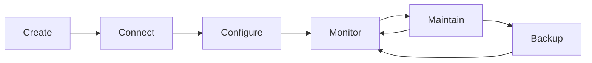

---
hide:
- toc
content_sources:
  diagrams:
  - id: operations-index-operations-lifecycle
    type: flowchart
    source: self-generated
    description: Operations Lifecycle
    based_on:
    - https://learn.microsoft.com/en-us/azure/virtual-machines/overview
    - https://learn.microsoft.com/en-us/azure/azure-monitor/vm/monitor-vm
    - https://learn.microsoft.com/en-us/azure/update-manager/overview
    justification: Synthesized for this guide from the referenced Microsoft Learn
      documentation.
---

# Operations

This section provides hands-on operational procedures and configuration guides for maintaining Azure Virtual Machines. It translates high-level concepts into the specific steps needed for day-to-day management.

## Section Contents

| Page | Description |
|------|-------------|
| [Create and Configure VM](create-and-configure-vm.md) | Key configuration points for Portal, CLI, and Infrastructure as Code (IaC). |
| [Connect to VM](connect-to-vm.md) | Accessing workloads via RDP/SSH, Bastion, and basic connectivity checks. |
| [Manage Disks](manage-disks.md) | Adding/detaching disks, expanding capacity, and managing filesystems. |
| [Resize and Redeploy](resize-and-redeploy.md) | Resizing constraints and when to use redeploy or reimage operations. |
| [Snapshots and Images](snapshots-and-images.md) | Working with snapshots and golden images for operational recovery. |
| [Backup and Restore](backup-restore.md) | Configuring Azure Backup, executing restores, and incident response. |
| [Patching](patching.md) | Patch orchestration and systematic management of OS updates. |
| [Monitoring and Alerting](monitoring-and-alerting.md) | Azure Monitor implementation, guest metrics, and alert design. |
| [VMSS Basics](vmss-basics.md) | When to utilize Virtual Machine Scale Sets and configuring autoscaling. |

## Operations Lifecycle

<!-- diagram-id: operations-index-operations-lifecycle -->

!!! note
    Regular monitoring of both platform metrics (Azure Monitor) and guest metrics is essential for proactive maintenance and performance tuning.

## See Also

- [Connect to VM](connect-to-vm.md)
- [Monitoring and Alerting](monitoring-and-alerting.md)
- [Patching](patching.md)

## Sources
- [Managing Azure Virtual Machines](https://learn.microsoft.com/en-us/azure/virtual-machines/overview)
- [How to Monitor Azure VMs](https://learn.microsoft.com/en-us/azure/azure-monitor/vm/monitor-vm)
- [Update Management in Azure](https://learn.microsoft.com/en-us/azure/update-manager/overview)
