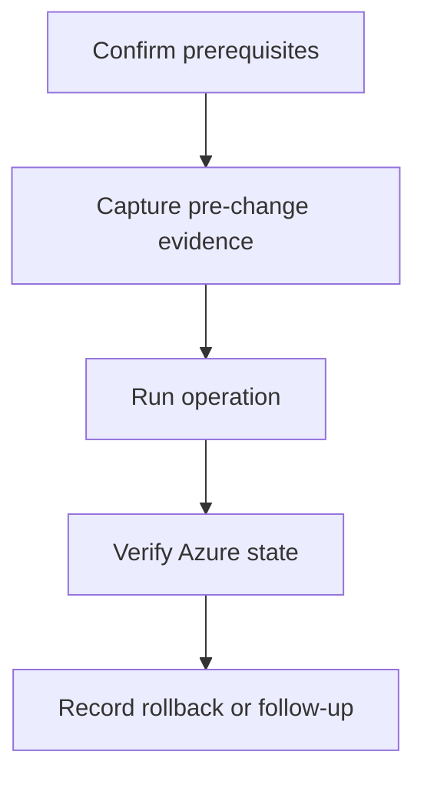

---
content_sources:
  diagrams:
  - id: operations-index-runbook-flow
    type: flowchart
    source: mslearn-adapted
    description: Runbook flow
    based_on:
    - https://learn.microsoft.com/en-us/azure/virtual-machines/overview
    - https://learn.microsoft.com/en-us/azure/virtual-machines/sizes
    - https://learn.microsoft.com/en-us/azure/virtual-machines/availability
content_validation:
  status: pending_review
  last_reviewed: '2026-05-22'
  reviewer: ai-agent
  core_claims:
  - claim: This document has source metadata and is queued for text-level Microsoft
      Learn verification.
    source: https://learn.microsoft.com/en-us/azure/virtual-machines/overview
    verified: false
  - claim: Core Azure VM guidance on this page should remain traceable to the listed
      sources before it is marked verified.
    source: https://learn.microsoft.com/en-us/azure/virtual-machines/overview
    verified: false
---

# Operations

Operations pages are day-2 runbooks for creating, connecting to, maintaining, protecting, and scaling Azure VMs.

## Prerequisites

- Azure CLI is installed and authenticated with the target subscription.
- Required variables are set before commands are run: `RG`, `VM_NAME`, and any resource-specific names in the command tables.
- The operator has permission to read and change the VM, disks, network interfaces, and monitoring resources involved in the procedure.
- A maintenance window and rollback owner are identified for production changes.

## When to Use

Use this index when deciding which VM runbook should own the next operational change.

<!-- diagram-id: operations-index-runbook-flow -->

```mermaid
flowchart TD
    A[Confirm prerequisites] --> B[Capture pre-change evidence]
    B --> C[Run operation]
    C --> D[Verify Azure state]
    D --> E[Record rollback or follow-up]
```

## Procedure

1. Identify whether the change affects compute, disk, network, access, patching, backup, monitoring, or scale.
2. Open the matching runbook and confirm prerequisites before changing resources.
3. Capture pre-change evidence, execute the procedure, then capture verification output.
4. Record rollback notes and update the workload runbook if the procedure exposed a gap.

## Verification

```bash
az vm list \
    --resource-group $RG \
    --query "[].{name:name,size:hardwareProfile.vmSize,power:powerState}" \
    --output table
```

| Element | Purpose |
|---|---|
| `$RG` | Resource group containing the VM resources. |
| `--resource-group` | Scopes the command to the intended resource group. |
| `--query` | Filters the response so operators capture only the needed evidence. |
| `--output` | Controls the output format for logs, scripts, or human review. |
| Expected result | Command succeeds and returns the requested Azure resource state or operation result. |

Confirm that the Azure output and guest/application checks match the intended post-change state.

## Rollback / Troubleshooting

- If the command fails, capture the error, Activity Log entry, and current resource state before retrying.
- If guest health is degraded after the change, revert to the documented previous size, disk setting, access rule, or restore point.
- Escalate when Azure reports regional capacity, unsupported SKU, policy denial, or backup/replication lock conflicts.

## See Also

- [Production Baseline](../best-practices/production-baseline.md)
- [Monitoring Best Practices](../best-practices/monitoring-best-practices.md)
- [Troubleshooting Playbooks](../troubleshooting/playbooks/index.md)

## Sources

- [Overview](https://learn.microsoft.com/en-us/azure/virtual-machines/overview)
- [Sizes](https://learn.microsoft.com/en-us/azure/virtual-machines/sizes)
- [Availability](https://learn.microsoft.com/en-us/azure/virtual-machines/availability)
