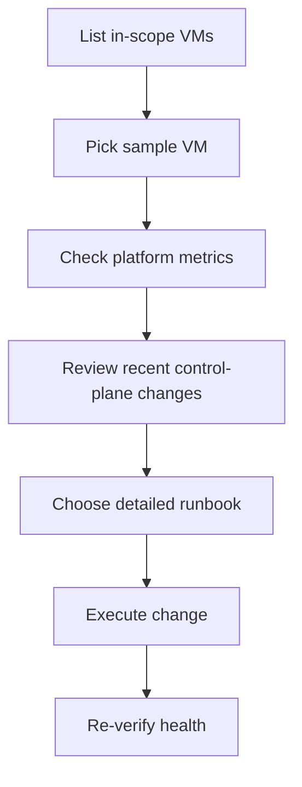

# Operations

Use this page as the first day-2 runbook when you need to inventory a VM fleet, confirm current health, and decide which deeper operations procedure to execute next.

## Prerequisites

- Azure CLI installed and authenticated with `az login`.
- Reader or higher access to the subscription that contains the VMs.
- A target resource group already chosen for the current shift, exported as `$RG`.
- At least one VM in scope so that `$VM_NAME` can point at a concrete machine for the quick health sample.

## When to Use

- At the start of an operations shift when you need a fast fleet baseline.
- Before patching, resizing, backup work, or incident response so you know the current power state and recent control-plane changes.
- When you inherit a VM estate and need to route work to the right detailed runbook in this section.

## Procedure

### Build the day-2 inventory snapshot

<!-- diagram-id: operations-index-operations-lifecycle -->

```mermaid
flowchart TD
    A[List in-scope VMs] --> B[Pick sample VM]
    B --> C[Check platform metrics]
    C --> D[Review recent control-plane changes]
    D --> E[Choose detailed runbook]
    E --> F[Execute change]
    F --> G[Re-verify health]
```

```bash
export RG="rg-vm-ops"
export VM_NAME="vm-app-01"
export VM_ID=$(az vm show --resource-group "$RG" --name "$VM_NAME" --query id --output tsv)

az vm list --resource-group "$RG" --show-details --query "[].{name:name,power:powerState,privateIp:privateIps,publicIp:publicIps,size:hardwareProfile.vmSize}" --output table

az monitor metrics list --resource "$VM_ID" --metric "Percentage CPU" --interval PT1H --aggregation Average --query "value[0].timeseries[0].data[-5:].{time:timeStamp,avg:average}" --output table

az monitor activity-log list --resource-group "$RG" --offset 1d --status Succeeded --query "[].{event:eventName.value,resource:resourceGroupName,caller:caller,time:eventTimestamp}" --output table
```
| Command | Purpose |
| --- | --- |
| `az vm show` | Resolves the VM resource ID used by later metric queries. |
| `--resource-group` | Limits the lookup to the operations scope. |
| `--name` | Selects the sample VM for metric inspection. |
| `--query` | Returns only the resource ID. |
| `--output` | Emits plain text that can be stored in `$VM_ID`. |
| `az vm list` | Produces the initial fleet inventory for the resource group. |
| `--show-details` | Adds power state and IP details to the VM inventory output. |
| `az monitor metrics list` | Pulls recent platform metric data for the sample VM. |
| `--resource` | Points the metric query at the VM resource ID. |
| `--metric` | Requests CPU as the quick health signal. |
| `--interval` | Narrows the chart to the last hour. |
| `--aggregation` | Uses average CPU so you can spot sustained load. |
| `az monitor activity-log list` | Shows recent successful control-plane operations in the same resource group. |
| `--offset` | Restricts the activity log query to the last day. |
| `--status` | Filters to completed operations. |

Expected result:

- The VM inventory table shows the machines currently in scope and whether they are running, stopped, or deallocated.
- The CPU query returns timestamped averages that tell you whether the selected VM is already under load.
- The activity log identifies recent operator or automation actions before you touch the estate again.

Example output:

```text
Name       PowerState   PrivateIp   PublicIp   Size
---------  -----------  ----------  ---------  ---------------
vm-app-01  VM running   10.20.1.4   52.x.x.x   Standard_D2s_v5
```

### Route to the specific runbook

Use the command output to decide the next page:

- New build or baseline drift -> [Create and Configure VM](create-and-configure-vm.md)
- Access path or admin login issue -> [Connect to VM](connect-to-vm.md)
- Capacity or storage pressure -> [Manage Disks](manage-disks.md)
- Compute pressure or host fault suspicion -> [Resize and Redeploy](resize-and-redeploy.md)
- Golden image, snapshot, or rollback preparation -> [Snapshots and Images](snapshots-and-images.md)
- Recovery point or restore request -> [Backup and Restore](backup-restore.md)
- Monthly patch cycle or emergency patching -> [Patching](patching.md)
- Alert tuning or observability onboarding -> [Monitoring and Alerting](monitoring-and-alerting.md)
- Horizontal scaling or autoscale work -> [VMSS Basics](vmss-basics.md)

## Verification

Run one final check before moving on to a narrower runbook.

```bash
az vm list --resource-group "$RG" --show-details --query "[].{name:name,power:powerState,provisioning:provisioningState}" --output table
```
| Command | Purpose |
| --- | --- |
| `az vm list` | Reconfirms the VM fleet status before you begin a change. |
| `--resource-group` | Uses the same operations scope as the inventory step. |
| `--show-details` | Includes live power state information. |
| `--query` | Returns only the fields needed for a go or no-go decision. |
| `--output` | Formats the verification output as a readable table. |

Healthy verification looks like the expected VMs appearing with valid provisioning states such as `Succeeded`; if a VM is unexpectedly `stopped` or `failed`, switch to the detailed runbook that matches the problem before making unrelated changes.

## Rollback / Troubleshooting

- If `az vm list` returns nothing, confirm the correct subscription with `az account show --output table` and reset scope with `az account set --subscription <subscription-id>`.
- If the metrics command returns no samples, the VM may be deallocated or you may be querying the wrong resource ID. Re-run `az vm show` and confirm the VM is running.
- If the activity log is noisy, narrow the query to one VM by using `--resource-id "$VM_ID"` instead of the whole resource group.
- If this page reveals a fault but not the fix, stop here and move to the specific runbook listed above rather than continuing with unrelated maintenance.

## See Also

- [Create and Configure VM](create-and-configure-vm.md)
- [Monitoring and Alerting](monitoring-and-alerting.md)
- [Patching](patching.md)

## Sources

- [Overview of virtual machines in Azure](https://learn.microsoft.com/en-us/azure/virtual-machines/overview)
- [Monitor virtual machines in Azure](https://learn.microsoft.com/en-us/azure/azure-monitor/vm/monitor-vm)
