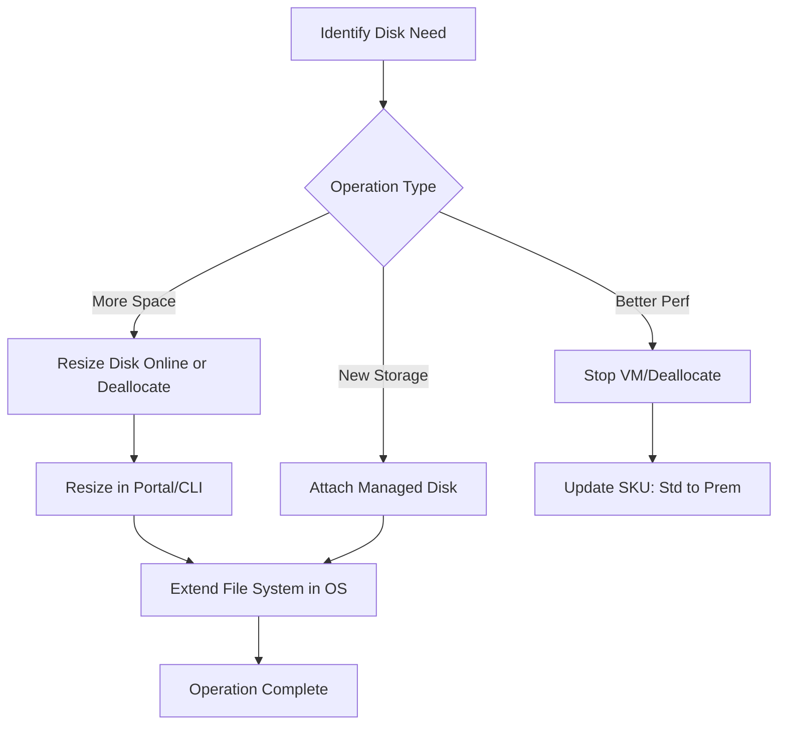

---
content_sources:
  diagrams:
  - id: operations-manage-disks-disk-management-workflow
    type: flowchart
    source: mslearn-adapted
    description: Disk Management Workflow
    based_on:
    - https://learn.microsoft.com/en-us/azure/virtual-machines/windows/attach-managed-disk-portal
    - https://learn.microsoft.com/en-us/azure/virtual-machines/linux/expand-disks
    - https://learn.microsoft.com/en-us/azure/virtual-machines/disks-change-performance
    - https://learn.microsoft.com/en-us/azure/virtual-machines/disks-enable-host-based-encryption-portal
---

# Manage Disks

Managing disks in Azure allows you to expand storage capacity or improve performance throughput. These operations can often be performed on running VMs with minimal disruption.

## Disk Operation Matrix

| Operation | Downtime Required | CLI Command Example |
| :--- | :--- | :--- |
| **Attach Data Disk** | No | `az vm disk attach` |
| **Detach Data Disk** | Recommended | `az vm disk detach` |
| **Expand Size** | Usually no (online resize supported for most managed disks) | `az disk update --size-gb 1024` |
| **Change Tier** | Yes (Stop/Deallocate) | `az disk update --sku Premium_LRS` |

## Disk Management Workflow

<!-- diagram-id: operations-manage-disks-disk-management-workflow -->

!!! warning
    Decreasing the size of an Azure disk is NOT supported. You must create a new smaller disk and migrate data.

!!! note
    Enable Encryption at Host to encrypt temp disk and disk caches.

## See Also

- [Managed Disk Types](../reference/managed-disk-types.md)
- [Snapshots and Images](snapshots-and-images.md)
- [Disk and Storage Best Practices](../best-practices/disk-and-storage-best-practices.md)

## Sources

- [Attach a data disk to a Windows VM](https://learn.microsoft.com/en-us/azure/virtual-machines/windows/attach-managed-disk-portal)
- [Expand virtual hard disks on a Linux VM](https://learn.microsoft.com/en-us/azure/virtual-machines/linux/expand-disks)
- [Change the tier of a managed disk](https://learn.microsoft.com/en-us/azure/virtual-machines/disks-change-performance)
- [Enable host-based encryption for disks](https://learn.microsoft.com/en-us/azure/virtual-machines/disks-enable-host-based-encryption-portal)
