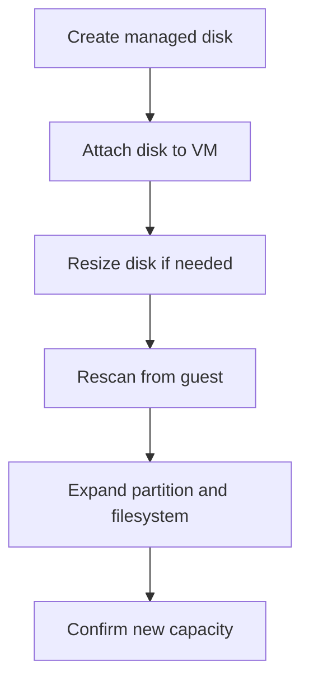

# Manage Disks

This runbook covers the two most common day-2 storage tasks on a VM: attaching a new managed data disk and expanding an existing disk so the guest operating system can use more space.

## Prerequisites

- Azure CLI installed and authenticated.
- Contributor or higher rights for the VM and managed disks.
- A Linux VM already running so you can validate device visibility after the platform change.
- A mount plan that tells you whether the disk is new storage or a capacity increase for an existing filesystem.

## When to Use

- Application data needs its own managed disk.
- A data volume is nearing full capacity and must be expanded.
- You need to confirm that Azure-side disk changes are visible inside the guest before handing the VM back to an application team.

## Procedure

### Attach and grow storage intentionally

<!-- diagram-id: operations-manage-disks-disk-management-workflow -->

```mermaid
flowchart TD
    A[Create managed disk] --> B[Attach disk to VM]
    B --> C[Resize disk if needed]
    C --> D[Rescan from guest]
    D --> E[Expand partition and filesystem]
    E --> F[Confirm new capacity]
```

```bash
export RG="rg-vm-storage"
export VM_NAME="vm-db-01"
export DISK_NAME="disk-db-data-01"

az disk create --resource-group "$RG" --name "$DISK_NAME" --size-gb 128 --sku Premium_LRS

az vm disk attach --resource-group "$RG" --vm-name "$VM_NAME" --name "$DISK_NAME"

az disk update --resource-group "$RG" --name "$DISK_NAME" --size-gb 256

az vm run-command invoke --resource-group "$RG" --name "$VM_NAME" --command-id RunShellScript --scripts "sudo lsblk; echo 1 | sudo tee /sys/class/block/sdc/device/rescan; sudo lsblk"

az disk show --resource-group "$RG" --name "$DISK_NAME" --query "{disk:name,sizeGb:diskSizeGb,sku:sku.name,state:diskState}" --output yaml
```
| Command | Purpose |
| --- | --- |
| `az disk create` | Creates the managed data disk. |
| `--resource-group` | Places the disk in the correct resource group. |
| `--name` | Sets the managed disk name. |
| `--size-gb` | Sets the initial disk capacity. |
| `--sku` | Selects the managed disk performance tier. |
| `az vm disk attach` | Attaches the disk to the VM without rebuilding the machine. |
| `--vm-name` | Selects the VM that receives the disk. |
| `az disk update` | Expands the managed disk capacity in Azure. |
| `az vm run-command invoke` | Runs guest commands to detect the resized block device from the platform side. |
| `--command-id` | Uses the built-in shell runner on the VM agent. |
| `--scripts` | Supplies the rescan and verification commands that run inside the guest. |
| `az disk show` | Confirms the Azure disk object reports the new size and attachment state. |
| `--query` | Limits the response to operationally useful disk properties. |
| `--output` | Formats the disk confirmation as YAML. |

Operational notes:

- Replace `/sys/class/block/sdc/device/rescan` with the correct device path if your disk enumerates differently.
- For a new filesystem, create the partition and mount point after the disk appears.
- For an existing ext4 or XFS filesystem, expand the partition and then run the matching filesystem tool (`resize2fs` or `xfs_growfs`) inside the guest.

Example output:

```yaml
disk: disk-db-data-01
sizeGb: 256
sku: Premium_LRS
state: Attached
```

## Verification

Verify both Azure attachment state and the VM storage profile.

```bash
az vm show --resource-group "$RG" --name "$VM_NAME" --query "storageProfile.dataDisks[].{name:name,lun:lun,caching:caching,createOption:createOption}" --output table
```
| Command | Purpose |
| --- | --- |
| `az vm show` | Reads the VM storage profile after the change. |
| `--resource-group` | Selects the resource group that contains the VM. |
| `--name` | Selects the VM whose storage profile you are verifying. |
| `--query` | Extracts the attached data disks with their LUNs and caching modes. |
| `--output` | Displays the storage profile as a table for quick review. |

The verification is complete when the disk appears in the VM storage profile with the expected LUN and the guest rescan step shows the device.

## Rollback / Troubleshooting

- If the disk is attached in Azure but missing in the guest, rerun the rescan and verify the Azure VM agent is healthy.
- If the resize succeeds in Azure but the filesystem does not grow, stop and check the partition layout before forcing `growpart` or `resize2fs`.
- If you attached the wrong disk, detach it with `az vm disk detach --resource-group "$RG" --vm-name "$VM_NAME" --name "$DISK_NAME"` before the application writes data.
- If you need a recovery point before invasive filesystem work, create a snapshot of the disk first and continue with [Snapshots and Images](snapshots-and-images.md).

## See Also

- [Resize and Redeploy](resize-and-redeploy.md)
- [Snapshots and Images](snapshots-and-images.md)
- [Disk and Storage Best Practices](../best-practices/disk-and-storage-best-practices.md)

## Sources

- [Attach a managed data disk to a Windows VM](https://learn.microsoft.com/en-us/azure/virtual-machines/windows/attach-managed-disk-portal)
- [Expand virtual hard disks on a Linux VM](https://learn.microsoft.com/en-us/azure/virtual-machines/linux/expand-disks)
