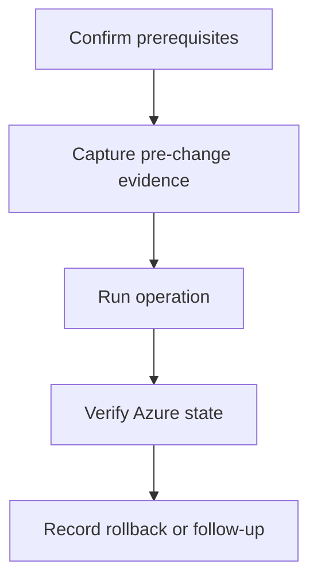

---
content_sources:
  diagrams:
  - id: operations-manage-disks-runbook-flow
    type: flowchart
    source: mslearn-adapted
    description: Runbook flow
    based_on:
    - https://learn.microsoft.com/en-us/azure/virtual-machines/managed-disks-overview
    - https://learn.microsoft.com/en-us/azure/virtual-machines/disks-types
    - https://learn.microsoft.com/en-us/cli/azure/disk
content_validation:
  status: pending_review
  last_reviewed: '2026-05-22'
  reviewer: ai-agent
  core_claims:
  - claim: This document has source metadata and is queued for text-level Microsoft
      Learn verification.
    source: https://learn.microsoft.com/en-us/azure/virtual-machines/managed-disks-overview
    verified: false
  - claim: Core Azure VM guidance on this page should remain traceable to the listed
      sources before it is marked verified.
    source: https://learn.microsoft.com/en-us/azure/virtual-machines/managed-disks-overview
    verified: false
---

# Manage Disks

Use this runbook to inspect, attach, resize, snapshot, or tune managed disks safely.

## Prerequisites

- Azure CLI is installed and authenticated with the target subscription.
- Required variables are set before commands are run: `RG`, `VM_NAME`, and any resource-specific names in the command tables.
- The operator has permission to read and change the VM, disks, network interfaces, and monitoring resources involved in the procedure.
- A maintenance window and rollback owner are identified for production changes.

## When to Use

A VM needs more data capacity or throughput, and the operator must avoid changing the wrong disk or exceeding VM limits.

<!-- diagram-id: operations-manage-disks-runbook-flow -->

```mermaid
flowchart TD
    A[Confirm prerequisites] --> B[Capture pre-change evidence]
    B --> C[Run operation]
    C --> D[Verify Azure state]
    D --> E[Record rollback or follow-up]
```

## Procedure

1. Map OS and data disks before making changes.
2. Check VM size throughput limits and disk SKU limits together.
3. Snapshot important disks before risky resizing or caching changes.
4. Validate guest OS disk visibility and application health after the Azure-side change.

### Command sequence

```bash
az vm show \
    --resource-group $RG \
    --name $VM_NAME \
    --query "storageProfile.dataDisks[].{name:name,lun:lun,size:diskSizeGb,caching:caching,sku:managedDisk.storageAccountType}" \
    --output table

az disk show \
    --resource-group $RG \
    --name $DISK_NAME \
    --query "{name:name,size:diskSizeGB,sku:sku.name,provisioningState:provisioningState}" \
    --output json
```

| Element | Purpose |
|---|---|
| `$RG` | Resource group containing the VM resources. |
| `$VM_NAME` | Target virtual machine name. |
| `$DISK_NAME` | Managed disk being inspected or changed. |
| `--resource-group` | Scopes the command to the intended resource group. |
| `--name` | Identifies the resource being created, read, updated, or deleted. |
| `--query` | Filters the response so operators capture only the needed evidence. |
| `--output` | Controls the output format for logs, scripts, or human review. |
| Expected result | Command succeeds and returns the requested Azure resource state or operation result. |

## Verification

```bash
az monitor metrics list \
    --resource $DISK_NAME \
    --metric "Disk Read Operations/Sec" \
    --interval PT5M \
    --aggregation Average \
    --output table
```

| Element | Purpose |
|---|---|
| `$DISK_NAME` | Managed disk being inspected or changed. |
| `--resource` | Azure CLI option used to scope or shape the operation. |
| `--metric` | Selects the Azure Monitor metric being queried. |
| `--interval` | Sets metric aggregation interval. |
| `--aggregation` | Sets metric aggregation function. |
| `--output` | Controls the output format for logs, scripts, or human review. |
| Expected result | Command succeeds and returns the requested Azure resource state or operation result. |

Confirm that the Azure output and guest/application checks match the intended post-change state.

## Rollback / Troubleshooting

- If the command fails, capture the error, Activity Log entry, and current resource state before retrying.
- If guest health is degraded after the change, revert to the documented previous size, disk setting, access rule, or restore point.
- Escalate when Azure reports regional capacity, unsupported SKU, policy denial, or backup/replication lock conflicts.

## See Also

- [Production Baseline](../best-practices/production-baseline.md)
- [Monitoring Best Practices](../best-practices/monitoring-best-practices.md)
- [Troubleshooting Playbooks](../troubleshooting/playbooks/index.md)

## Sources

- [Managed Disks Overview](https://learn.microsoft.com/en-us/azure/virtual-machines/managed-disks-overview)
- [Disks Types](https://learn.microsoft.com/en-us/azure/virtual-machines/disks-types)
- [Disk](https://learn.microsoft.com/en-us/cli/azure/disk)
