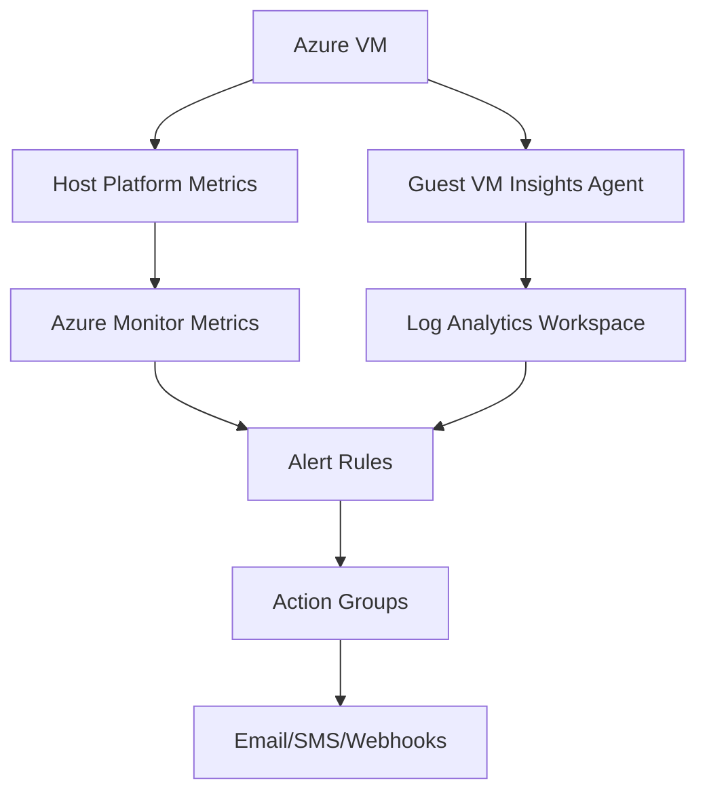

# Monitoring and Alerting

Azure Monitor provides visibility into the performance, health, and availability of Virtual Machines. It collects metrics and logs from the platform host and the guest operating system.

## Monitoring Architecture

## Metric Types and Sources

Collection methods vary based on the depth of visibility required for the workload.

| Metric Type | Source | Example Metrics | Collection Method |
| :--- | :--- | :--- | :--- |
| **Platform Metrics** | Azure Host | CPU Percentage, Disk IOPS | Default (Host level) |
| **Guest Metrics** | OS Agent | Memory used, Disk free space | Azure Monitor Agent |
| **Log Analytics** | OS Logs | Event Viewer, Syslog | Log Analytics Workspace |
| **Dependency Map** | VM Insights | Network connections, ports | Dependency Agent |

## Alert Configuration

Alerts proactively notify you when metric thresholds are met or specific events occur.

!!! note
    Metric alerts are near-real-time and cost less than log-search alerts.

!!! warning
    Action Groups are shared resources. Modifying an action group affects all alerts that use it.

!!! tip
    Enable VM Insights to get visual maps of network dependencies between your virtual machines.

## Sources

- [Azure Monitor overview](https://learn.microsoft.com/en-us/azure/azure-monitor/fundamentals/overview)
- [Monitor virtual machines](https://learn.microsoft.com/en-us/azure/azure-monitor/vm/monitor-vm)
- [VM Insights overview](https://learn.microsoft.com/en-us/azure/azure-monitor/vm/monitor-vm)
