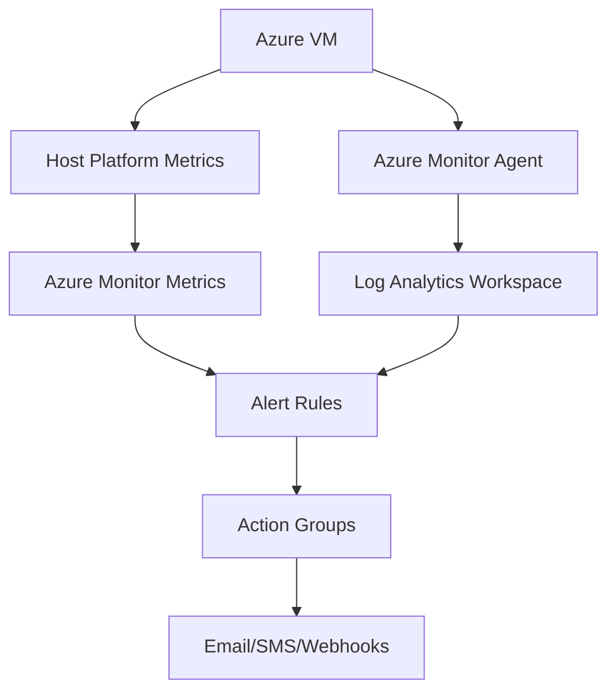

---
hide:
- toc
content_sources:
  diagrams:
  - id: operations-monitoring-and-alerting-monitoring-architecture
    type: flowchart
    source: mslearn-adapted
    description: Monitoring Architecture
    based_on:
    - https://learn.microsoft.com/en-us/azure/azure-monitor/fundamentals/overview
    - https://learn.microsoft.com/en-us/azure/azure-monitor/vm/monitor-vm
---

# Monitoring and Alerting

Azure Monitor provides visibility into the performance, health, and availability of Virtual Machines. It collects metrics and logs from the platform host and the guest operating system.

## Monitoring Architecture

<!-- diagram-id: operations-monitoring-and-alerting-monitoring-architecture -->

## Metric Types and Sources

Collection methods vary based on the depth of visibility required for the workload.

| Metric Type | Source | Example Metrics | Collection Method |
| :--- | :--- | :--- | :--- |
| **Platform Metrics** | Azure Host | CPU Percentage, Disk IOPS | Default (Host level) |
| **Guest Metrics** | Azure Monitor Agent (AMA) | Memory used, Disk free space | Azure Monitor Agent |
| **Log Analytics** | OS Logs | Event Viewer, Syslog | Log Analytics Workspace |

## Alert Configuration

Alerts proactively notify you when metric thresholds are met or specific events occur.

!!! note
    Metric alerts are near-real-time and cost less than log-search alerts.

!!! warning
    Action Groups are shared resources. Modifying an action group affects all alerts that use it.

!!! tip
    Enable VM insights to collect guest metrics and logs via Azure Monitor Agent.

## See Also

- [Monitoring Signals](../reference/monitoring-signals.md)
- [Production Baseline](../best-practices/production-baseline.md)
- [Slow Performance](../troubleshooting/playbooks/performance/slow-performance.md)

## Sources

- [Azure Monitor overview](https://learn.microsoft.com/en-us/azure/azure-monitor/fundamentals/overview)
- [Monitor virtual machines with Azure Monitor](https://learn.microsoft.com/en-us/azure/azure-monitor/vm/monitor-vm)
