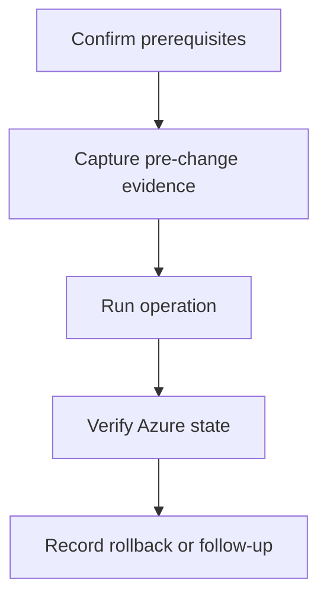

---
content_sources:
  diagrams:
  - id: operations-monitoring-and-alerting-runbook-flow
    type: flowchart
    source: mslearn-adapted
    description: Runbook flow
    based_on:
    - https://learn.microsoft.com/en-us/azure/virtual-machines/monitor-vm
    - https://learn.microsoft.com/en-us/azure/azure-monitor/vm/vminsights-overview
    - https://learn.microsoft.com/en-us/azure/azure-monitor/alerts/alerts-overview
content_validation:
  status: pending_review
  last_reviewed: '2026-05-22'
  reviewer: ai-agent
  core_claims:
  - claim: This document has source metadata and is queued for text-level Microsoft
      Learn verification.
    source: https://learn.microsoft.com/en-us/azure/virtual-machines/monitor-vm
    verified: false
  - claim: Core Azure VM guidance on this page should remain traceable to the listed
      sources before it is marked verified.
    source: https://learn.microsoft.com/en-us/azure/virtual-machines/monitor-vm
    verified: false
---

# Monitoring and Alerting

Use this runbook to confirm VM telemetry, dashboards, and alerts are collecting useful incident evidence.

## Prerequisites

- Azure CLI is installed and authenticated with the target subscription.
- Required variables are set before commands are run: `RG`, `VM_NAME`, and any resource-specific names in the command tables.
- The operator has permission to read and change the VM, disks, network interfaces, and monitoring resources involved in the procedure.
- A maintenance window and rollback owner are identified for production changes.

## When to Use

A VM must emit platform and guest telemetry before it becomes part of an on-call rotation.

<!-- diagram-id: operations-monitoring-and-alerting-runbook-flow -->

```mermaid
flowchart TD
    A[Confirm prerequisites] --> B[Capture pre-change evidence]
    B --> C[Run operation]
    C --> D[Verify Azure state]
    D --> E[Record rollback or follow-up]
```

## Procedure

1. Confirm Azure Monitor Agent or VM insights is enabled where guest telemetry is required.
2. Collect key platform metrics for CPU, disk, network, and availability.
3. Create alert rules with owner, severity, action group, and response runbook.
4. Validate that alerts fire in a controlled test or that metric history meets the threshold logic.

### Command sequence

```bash
az monitor metrics list \
    --resource $VM_NAME \
    --metric "Percentage CPU" \
    --interval PT5M \
    --aggregation Average \
    --output table

az monitor activity-log list \
    --resource-group $RG \
    --offset 2h \
    --output table
```

| Element | Purpose |
|---|---|
| `$VM_NAME` | Target virtual machine name. |
| `$RG` | Resource group containing the VM resources. |
| `--resource` | Azure CLI option used to scope or shape the operation. |
| `--metric` | Selects the Azure Monitor metric being queried. |
| `--interval` | Sets metric aggregation interval. |
| `--aggregation` | Sets metric aggregation function. |
| `--output` | Controls the output format for logs, scripts, or human review. |
| `--resource-group` | Scopes the command to the intended resource group. |
| `--offset` | Controls the activity log lookback window. |
| Expected result | Command succeeds and returns the requested Azure resource state or operation result. |

## Verification

```bash
az vm get-instance-view \
    --resource-group $RG \
    --name $VM_NAME \
    --query "instanceView.statuses[].displayStatus" \
    --output table
```

| Element | Purpose |
|---|---|
| `$RG` | Resource group containing the VM resources. |
| `$VM_NAME` | Target virtual machine name. |
| `--resource-group` | Scopes the command to the intended resource group. |
| `--name` | Identifies the resource being created, read, updated, or deleted. |
| `--query` | Filters the response so operators capture only the needed evidence. |
| `--output` | Controls the output format for logs, scripts, or human review. |
| Expected result | Command succeeds and returns the requested Azure resource state or operation result. |

Confirm that the Azure output and guest/application checks match the intended post-change state.

## Rollback / Troubleshooting

- If the command fails, capture the error, Activity Log entry, and current resource state before retrying.
- If guest health is degraded after the change, revert to the documented previous size, disk setting, access rule, or restore point.
- Escalate when Azure reports regional capacity, unsupported SKU, policy denial, or backup/replication lock conflicts.

## See Also

- [Production Baseline](../best-practices/production-baseline.md)
- [Monitoring Best Practices](../best-practices/monitoring-best-practices.md)
- [Troubleshooting Playbooks](../troubleshooting/playbooks/index.md)

## Sources

- [Monitor Vm](https://learn.microsoft.com/en-us/azure/virtual-machines/monitor-vm)
- [Vminsights Overview](https://learn.microsoft.com/en-us/azure/azure-monitor/vm/vminsights-overview)
- [Alerts Overview](https://learn.microsoft.com/en-us/azure/azure-monitor/alerts/alerts-overview)
