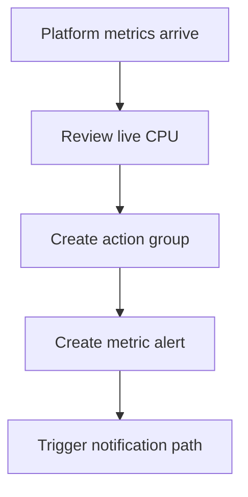

# Monitoring and Alerting

This runbook establishes a minimal but useful VM monitoring baseline: read platform telemetry, create an action group, and deploy a CPU alert that can wake up an operator before the workload becomes visibly unhealthy.

## Prerequisites

- Azure CLI installed and authenticated.
- A VM already running so it can emit platform metrics.
- An operator email address for alert delivery.
- Permission to create Azure Monitor resources in the target resource group.

## When to Use

- A VM has no meaningful alerting baseline yet.
- You are onboarding a new production or preproduction VM to Azure Monitor.
- You want a quick signal for sustained compute pressure before building more advanced guest telemetry.

## Procedure

### Create the first actionable monitor

<!-- diagram-id: operations-monitoring-and-alerting-monitoring-architecture -->

```mermaid
flowchart TD
    A[Platform metrics arrive] --> B[Review live CPU]
    B --> C[Create action group]
    C --> D[Create metric alert]
    D --> E[Trigger notification path]
```

```bash
export RG="rg-vm-monitor"
export VM_NAME="vm-app-01"
export ALERT_EMAIL="ops@example.com"
export ACTION_GROUP_NAME="ag-vm-ops"
export ALERT_NAME="cpu-high-vm-app-01"
export VM_ID=$(az vm show --resource-group "$RG" --name "$VM_NAME" --query id --output tsv)

az monitor metrics list --resource "$VM_ID" --metric "Percentage CPU" --interval PT30M --aggregation Average --query "value[0].timeseries[0].data[-5:].{time:timeStamp,avg:average}" --output table

az monitor action-group create --resource-group "$RG" --name "$ACTION_GROUP_NAME" --short-name vmops --action email primary "$ALERT_EMAIL"

az monitor metrics alert create --resource-group "$RG" --name "$ALERT_NAME" --scopes "$VM_ID" --condition "avg Percentage CPU > 90" --window-size 5m --evaluation-frequency 1m --severity 2 --action "$ACTION_GROUP_NAME" --description "Sustained CPU saturation on vm-app-01"
```
| Command | Purpose |
| --- | --- |
| `az vm show` | Resolves the VM resource ID used by Azure Monitor commands. |
| `--query` | Extracts only the resource ID. |
| `az monitor metrics list` | Reviews recent platform metric samples before setting a threshold. |
| `--resource` | Points the metric query at the VM. |
| `--metric` | Requests CPU percentage. |
| `--interval` | Limits the sample to the last 30 minutes. |
| `--aggregation` | Uses average CPU for alert-tuning context. |
| `az monitor action-group create` | Creates the notification target for alerts. |
| `--short-name` | Sets the compact name used by notifications. |
| `--action` | Adds an email receiver to the action group. |
| `az monitor metrics alert create` | Creates the CPU metric alert rule. |
| `--scopes` | Attaches the alert to the VM resource. |
| `--condition` | Defines the threshold logic for the alert. |
| `--window-size` | Sets the aggregation window for the alert. |
| `--evaluation-frequency` | Sets how often Azure evaluates the rule. |
| `--severity` | Sets the alert severity level. |
| `--action` | Connects the rule to the action group you created. |
| `--description` | Documents the operator intent for the alert. |

Expected output pattern:

- The metrics table returns recent CPU samples.
- The action group is created once and can be reused by later alerts.
- The metric alert command returns an alert rule resource instead of a validation error.

Example output:

```text
time                         avg
---------------------------  -----
2026-07-25T09:25:00+00:00   18.4
2026-07-25T09:30:00+00:00   22.1
```

## Verification

Confirm that the alert rule is enabled and still scoped to the correct VM.

```bash
az monitor metrics alert show --resource-group "$RG" --name "$ALERT_NAME" --query "{enabled:enabled,severity:severity,scopes:scopes}" --output yaml
```
| Command | Purpose |
| --- | --- |
| `az monitor metrics alert show` | Reads the created alert rule for a final validation pass. |
| `--resource-group` | Targets the resource group that stores the alert rule. |
| `--name` | Selects the alert to inspect. |
| `--query` | Returns the minimum set of fields needed to validate the rule. |
| `--output` | Formats the alert state as YAML. |

The rule is ready when `enabled` is true and the `scopes` array contains the intended VM resource ID.

## Rollback / Troubleshooting

- If the action group command fails, confirm the email receiver format and ensure the action group name is unique in the resource group.
- If `metrics alert create` rejects the condition, use `az monitor metrics list-definitions --resource "$VM_ID" --output table` to confirm the exact metric name.
- If you are missing guest metrics such as memory, remember that only host metrics are automatic; enhanced monitoring must be onboarded separately.
- If the alert is too noisy, raise the threshold or lengthen the window before muting notifications entirely.

## See Also

- [Operations](index.md)
- [Slow Performance](../troubleshooting/playbooks/performance/slow-performance.md)
- [Monitoring Signals](../reference/monitoring-signals.md)

## Sources

- [Azure Monitor overview](https://learn.microsoft.com/en-us/azure/azure-monitor/fundamentals/overview)
- [Monitor virtual machines in Azure](https://learn.microsoft.com/en-us/azure/azure-monitor/vm/monitor-vm)
