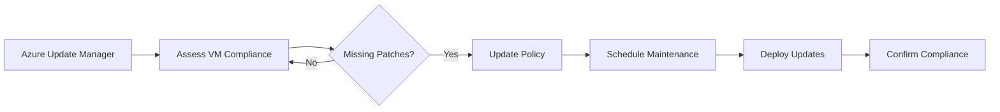

# Patching

Azure Update Manager centralizes compliance tracking and deployment of operating system updates. It handles security, critical, and other patch categories across both Linux and Windows environments.

## Update Management Flow

## Patch Orchestration Modes

Orchestration modes define how Azure manages the timing and execution of update installations.

| Orchestration Mode | Control Level | Description | Use Case |
| :--- | :--- | :--- | :--- |
| **Automatic by OS** | Low | OS handles scheduling autonomously | Dev/Test or simple VMs |
| **Automatic by Platform** | High | Azure schedules based on policy | Critical production workloads |
| **Manual** | Full | Admin triggers updates via API/Portal | Complex cluster environments |

## Update Policies

Maintenance configurations allow you to group multiple VMs and apply updates during predefined time windows.

!!! note
    Azure Update Manager does not store update data itself. It uses the native OS update mechanisms like Windows Update or APT/YUM.

!!! warning
    Some updates require a system reboot. Configure maintenance windows to include enough time for post-patch restarts.

!!! tip
    Use "Assess Now" to get immediate visibility into any new vulnerabilities released since the last scheduled assessment.

## See Also

- [Patching and Maintenance Best Practices](../best-practices/patching-and-maintenance-best-practices.md)
- [Snapshots and Images](snapshots-and-images.md)
- [Backup and Restore](backup-restore.md)

## Sources

- [Azure Update Manager overview](https://learn.microsoft.com/en-us/azure/update-manager/overview)
- [Update orchestration options](https://learn.microsoft.com/en-us/azure/virtual-machines/automatic-vm-guest-patching)
- [Maintenance configurations](https://learn.microsoft.com/en-us/azure/update-manager/manage-updates-for-azure-vms)
