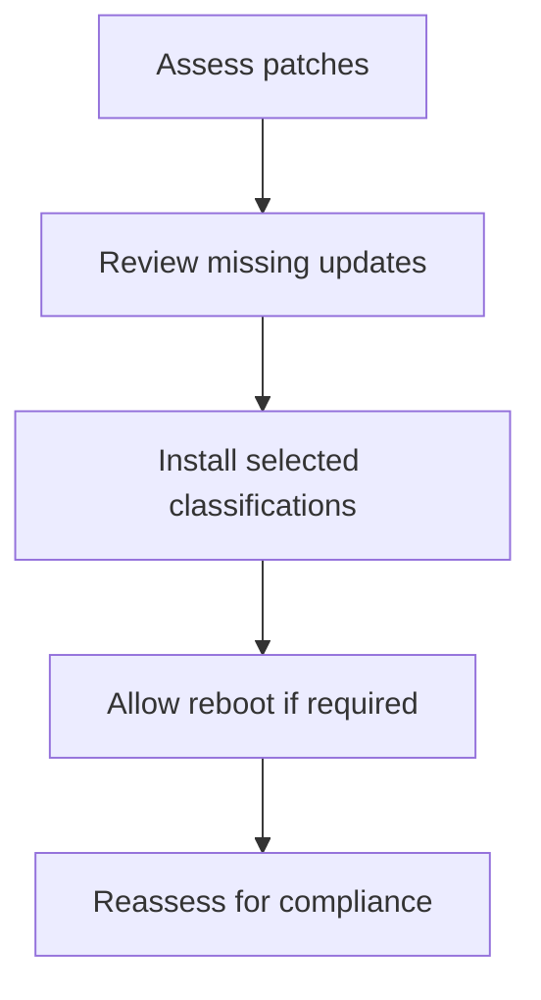

# Patching

This runbook uses Azure VM patch assessment and on-demand installation so you can inspect missing updates first and then apply a controlled patch wave during a maintenance window.

## Prerequisites

- Azure CLI installed and authenticated.
- A supported Azure VM image if you plan to use platform patch orchestration features.
- A maintenance window that allows for restart if patch installation requires it.
- Guest access or out-of-band monitoring available so you can confirm the workload comes back healthy.

## When to Use

- Monthly patch windows for a small number of VMs.
- Emergency patch deployment for security-critical updates.
- Situations where you want to assess and install from the CLI instead of waiting for scheduled automation.

## Procedure

### Assess first, then install the exact patch classes you intend

<!-- diagram-id: operations-patching-update-management-flow -->

```mermaid
flowchart TD
    A[Assess patches] --> B[Review missing updates]
    B --> C[Install selected classifications]
    C --> D[Allow reboot if required]
    D --> E[Reassess for compliance]
```

```bash
export RG="rg-vm-patch"
export VM_NAME="vm-app-01"

az vm assess-patches --resource-group "$RG" --name "$VM_NAME"

az vm install-patches --resource-group "$RG" --name "$VM_NAME" --maximum-duration PT2H --reboot-setting IfRequired --classifications-to-include-linux Critical Security

az vm get-instance-view --resource-group "$RG" --name "$VM_NAME" --query "instanceView.patchStatus" --output yaml
```
| Command | Purpose |
| --- | --- |
| `az vm assess-patches` | Triggers an immediate patch assessment for the VM. |
| `--resource-group` | Selects the resource group that contains the VM. |
| `--name` | Selects the VM to patch. |
| `az vm install-patches` | Starts the on-demand patch installation. |
| `--maximum-duration` | Caps the patching window. |
| `--reboot-setting` | Defines whether Azure can reboot the VM during patching. |
| `--classifications-to-include-linux` | Limits the install to Linux Critical and Security patches. |
| `az vm get-instance-view` | Reads the VM instance view, including patch status. |
| `--query` | Extracts only the patch-status section. |
| `--output` | Formats patch status as YAML for review. |

If you are patching Windows instead of Linux, replace the installation command with:

```bash
az vm install-patches --resource-group "$RG" --name "$VM_NAME" --maximum-duration PT2H --reboot-setting IfRequired --classifications-to-include-win Critical Security --exclude-kbs-requiring-reboot false
```
| Command | Purpose |
| --- | --- |
| `az vm install-patches` | Starts the Windows patch installation workflow. |
| `--resource-group` | Targets the correct Windows VM resource group. |
| `--name` | Targets the correct Windows VM. |
| `--maximum-duration` | Limits the patch job runtime. |
| `--reboot-setting` | Allows reboot when a patch requires it. |
| `--classifications-to-include-win` | Restricts the install set to Critical and Security updates. |
| `--exclude-kbs-requiring-reboot` | Controls whether reboot-requiring KBs are excluded. |

Example output:

```yaml
availablePatchSummary:
  criticalAndSecurityPatchCount: 0
  otherPatchCount: 2
```

## Verification

Run a second assessment after the maintenance window and confirm the patch summary changed as expected.

```bash
az vm assess-patches --resource-group "$RG" --name "$VM_NAME"

az vm get-instance-view --resource-group "$RG" --name "$VM_NAME" --query "instanceView.patchStatus.availablePatchSummary" --output yaml
```
| Command | Purpose |
| --- | --- |
| `az vm assess-patches` | Reassesses the machine after installation. |
| `az vm get-instance-view` | Reads the latest patch summary from the instance view. |
| `--query` | Returns only the available patch counters. |
| `--output` | Formats the compliance summary as YAML. |

Verification passes when the post-install summary shows the intended critical and security patch counts reduced to zero or to the residual level you expected from excluded packages.

## Rollback / Troubleshooting

- If assessment fails, confirm the VM agent is healthy and the image is supported for on-demand patch operations.
- If installation returns quickly without changing counts, inspect package-source configuration inside the guest; Azure orchestrates the action but the OS repositories still matter.
- If the VM fails to return after a reboot, use boot diagnostics and [Backup and Restore](backup-restore.md) or [Snapshots and Images](snapshots-and-images.md) for recovery.
- If you need a narrower blast radius next time, patch one VM first, validate the application, and then widen the wave.

## See Also

- [Monitoring and Alerting](monitoring-and-alerting.md)
- [Snapshots and Images](snapshots-and-images.md)
- [Patching and Maintenance Best Practices](../best-practices/patching-and-maintenance-best-practices.md)

## Sources

- [Azure Update Manager Overview](https://learn.microsoft.com/en-us/azure/update-manager/overview)
- [Automatic guest patching for Azure virtual machines and scale sets](https://learn.microsoft.com/en-us/azure/virtual-machines/automatic-vm-guest-patching)
