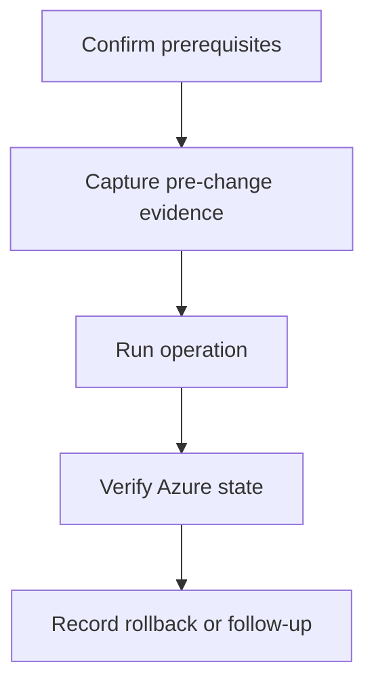

---
content_sources:
  diagrams:
  - id: operations-patching-runbook-flow
    type: flowchart
    source: mslearn-adapted
    description: Runbook flow
    based_on:
    - https://learn.microsoft.com/en-us/azure/update-manager/overview
    - https://learn.microsoft.com/en-us/azure/virtual-machines/automatic-vm-guest-patching
    - https://learn.microsoft.com/en-us/cli/azure/vm
content_validation:
  status: pending_review
  last_reviewed: '2026-05-22'
  reviewer: ai-agent
  core_claims:
  - claim: This document has source metadata and is queued for text-level Microsoft
      Learn verification.
    source: https://learn.microsoft.com/en-us/azure/update-manager/overview
    verified: false
  - claim: Core Azure VM guidance on this page should remain traceable to the listed
      sources before it is marked verified.
    source: https://learn.microsoft.com/en-us/azure/update-manager/overview
    verified: false
---

# Patching

Use this runbook to assess and apply guest OS patches with controlled maintenance evidence.

## Prerequisites

- Azure CLI is installed and authenticated with the target subscription.
- Required variables are set before commands are run: `RG`, `VM_NAME`, and any resource-specific names in the command tables.
- The operator has permission to read and change the VM, disks, network interfaces, and monitoring resources involved in the procedure.
- A maintenance window and rollback owner are identified for production changes.

## When to Use

A VM fleet must receive security updates while avoiding unplanned reboot impact.

<!-- diagram-id: operations-patching-runbook-flow -->

```mermaid
flowchart TD
    A[Confirm prerequisites] --> B[Capture pre-change evidence]
    B --> C[Run operation]
    C --> D[Verify Azure state]
    D --> E[Record rollback or follow-up]
```

## Procedure

1. Confirm patch ownership and maintenance window for the VM.
2. Run assessment before installing updates and review pending reboot state.
3. Patch a canary or non-production VM before production waves.
4. Validate application health and Azure Monitor signals after reboot.

### Command sequence

```bash
az vm assess-patches \
    --resource-group $RG \
    --name $VM_NAME \
    --output json

az vm install-patches \
    --resource-group $RG \
    --name $VM_NAME \
    --maximum-duration PT2H \
    --reboot-setting IfRequired \
    --output json
```

| Element | Purpose |
|---|---|
| `$RG` | Resource group containing the VM resources. |
| `$VM_NAME` | Target virtual machine name. |
| `--resource-group` | Scopes the command to the intended resource group. |
| `--name` | Identifies the resource being created, read, updated, or deleted. |
| `--output` | Controls the output format for logs, scripts, or human review. |
| `--maximum-duration` | Azure CLI option used to scope or shape the operation. |
| `--reboot-setting` | Azure CLI option used to scope or shape the operation. |
| Expected result | Command succeeds and returns the requested Azure resource state or operation result. |

## Verification

```bash
az vm get-instance-view \
    --resource-group $RG \
    --name $VM_NAME \
    --output json
```

| Element | Purpose |
|---|---|
| `$RG` | Resource group containing the VM resources. |
| `$VM_NAME` | Target virtual machine name. |
| `--resource-group` | Scopes the command to the intended resource group. |
| `--name` | Identifies the resource being created, read, updated, or deleted. |
| `--output` | Controls the output format for logs, scripts, or human review. |
| Expected result | Command succeeds and returns the requested Azure resource state or operation result. |

Confirm that the Azure output and guest/application checks match the intended post-change state.

## Rollback / Troubleshooting

- If the command fails, capture the error, Activity Log entry, and current resource state before retrying.
- If guest health is degraded after the change, revert to the documented previous size, disk setting, access rule, or restore point.
- Escalate when Azure reports regional capacity, unsupported SKU, policy denial, or backup/replication lock conflicts.

## See Also

- [Production Baseline](../best-practices/production-baseline.md)
- [Monitoring Best Practices](../best-practices/monitoring-best-practices.md)
- [Troubleshooting Playbooks](../troubleshooting/playbooks/index.md)

## Sources

- [Overview](https://learn.microsoft.com/en-us/azure/update-manager/overview)
- [Automatic Vm Guest Patching](https://learn.microsoft.com/en-us/azure/virtual-machines/automatic-vm-guest-patching)
- [Vm](https://learn.microsoft.com/en-us/cli/azure/vm)
