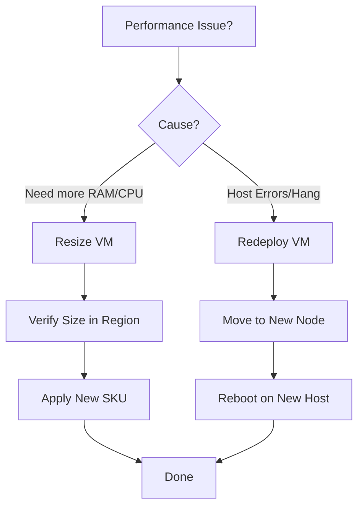

# Resize and Redeploy

Resizing and redeploying allow you to resolve performance bottlenecks or host-level issues. Both operations trigger a VM reboot but serve different operational purposes.

## Resize vs. Redeploy Matrix

| Feature | Resize | Redeploy |
| :--- | :--- | :--- |
| **Primary Goal** | Change CPU/RAM/IOPS | Move to new hardware |
| **Downtime** | Yes (Reboot) | Yes (Move + Reboot) |
| **Data Impact** | Temp Disk Data Lost | Temp Disk Data Lost |
| **Target** | New Size SKU | New Host Machine |

## Operation Decision Tree

!!! note
    When resizing, if the current host does not support the new SKU, the VM must be Deallocated (Stopped) first to release hardware resources.

## Sources

* [Resize a Windows VM](https://learn.microsoft.com/en-us/azure/virtual-machines/windows/resize-vm)
* [Redeploy virtual machine to new Azure node](https://learn.microsoft.com/en-us/azure/virtual-machines/redeploy-to-new-node)
* [Resize a Linux VM with Azure CLI](https://learn.microsoft.com/en-us/azure/virtual-machines/linux/resize-vm)
