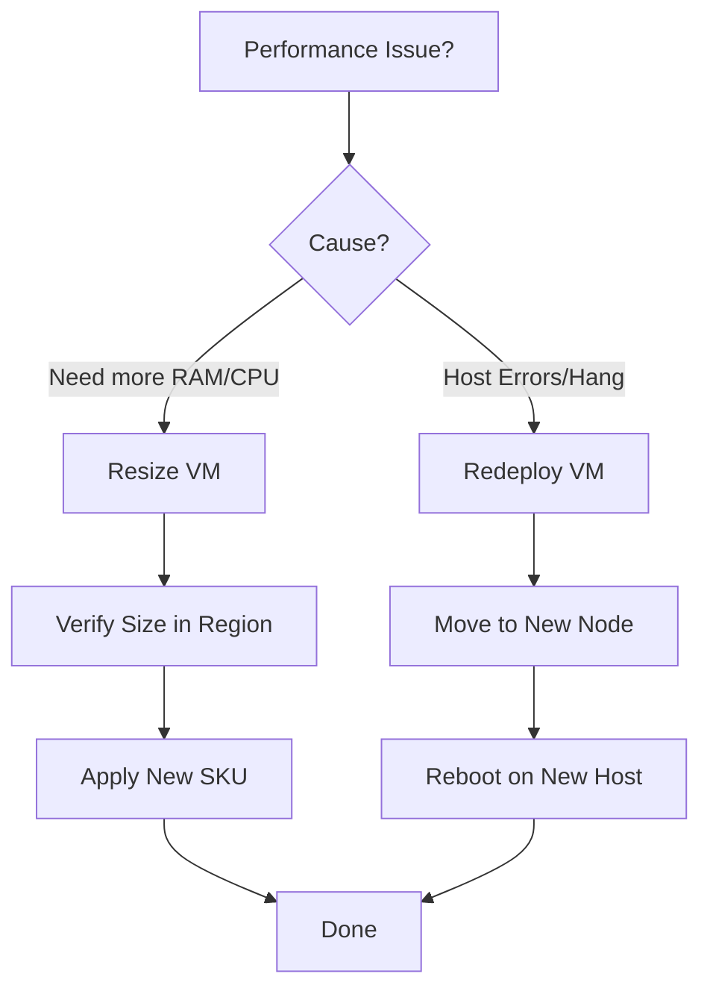

---
content_sources:
  diagrams:
  - id: operations-resize-and-redeploy-operation-decision-tree
    type: flowchart
    source: mslearn-adapted
    description: Operation Decision Tree
    based_on:
    - https://learn.microsoft.com/en-us/azure/virtual-machines/sizes/resize-vm
    - https://learn.microsoft.com/en-us/troubleshoot/azure/virtual-machines/windows/redeploy-to-new-node-windows
    - https://learn.microsoft.com/en-us/troubleshoot/azure/virtual-machines/linux/redeploy-to-new-node-linux
---

# Resize and Redeploy

Resizing and redeploying allow you to resolve performance bottlenecks or host-level issues. Both operations trigger a VM reboot but serve different operational purposes.

## Resize vs. Redeploy Matrix

| Feature | Resize | Redeploy |
| :--- | :--- | :--- |
| **Primary Goal** | Change CPU/RAM/IOPS | Move to new hardware |
| **Downtime** | Yes (Reboot) | Yes (Move + Reboot) |
| **Data Impact** | Temp Disk Data Lost | Temp Disk Data Lost |
| **Target** | New Size SKU | New Host Machine |

## Operation Decision Tree

<!-- diagram-id: operations-resize-and-redeploy-operation-decision-tree -->

!!! note
    When resizing, if the current host does not support the new SKU, the VM must be Deallocated (Stopped) first to release hardware resources.

## See Also

- [VM Lifecycle](../platform/vm-lifecycle.md)
- [Slow Performance](../troubleshooting/playbooks/performance/slow-performance.md)
- [Sizing and Image Selection](../best-practices/sizing-and-image-selection.md)

## Sources

- [Resize a Windows VM](https://learn.microsoft.com/en-us/azure/virtual-machines/sizes/resize-vm)
- [Redeploy Windows virtual machine to new Azure node](https://learn.microsoft.com/en-us/troubleshoot/azure/virtual-machines/windows/redeploy-to-new-node-windows)
- [Redeploy Linux virtual machine to new Azure node](https://learn.microsoft.com/en-us/troubleshoot/azure/virtual-machines/linux/redeploy-to-new-node-linux)
- [Resize a Linux VM with Azure CLI](https://learn.microsoft.com/en-us/azure/virtual-machines/sizes/resize-vm)
