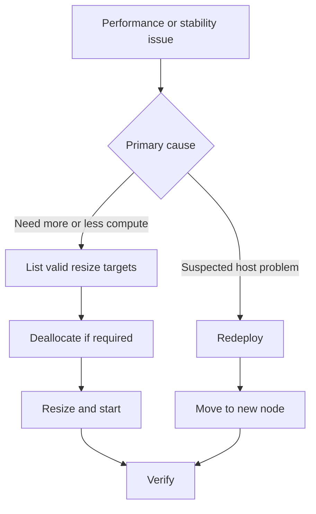

# Resize and Redeploy

Use this runbook when a VM needs more or less compute capacity, or when symptoms point to host-level corruption and moving the VM to a new Azure node is the safer recovery step.

## Prerequisites

- Azure CLI installed and authenticated.
- Maintenance approval for a disruptive action because both resize and redeploy can restart the VM.
- Current VM size, desired target size, and a known-good maintenance window.
- Awareness that temporary disk contents and dynamic public IP behavior must be considered before a redeploy.

## When to Use

- CPU or memory pressure shows the VM is undersized.
- The desired SKU is different because licensing, premium storage, or throughput needs changed.
- Guest symptoms suggest a host issue and normal reboot did not clear the fault.

## Procedure

### Decide whether the fix is capacity or host placement

<!-- diagram-id: operations-resize-and-redeploy-operation-decision-tree -->

```mermaid
flowchart TD
    A[Performance or stability issue] --> B{Primary cause}
    B -->|Need more or less compute| C[List valid resize targets]
    B -->|Suspected host problem| D[Redeploy]
    C --> E[Deallocate if required]
    E --> F[Resize and start]
    D --> G[Move to new node]
    F --> H[Verify]
    G --> H
```

```bash
export RG="rg-vm-compute"
export VM_NAME="vm-app-01"
export TARGET_SIZE="Standard_D4s_v5"

az vm list-vm-resize-options --resource-group "$RG" --name "$VM_NAME" --query "[].name" --output table

az vm deallocate --resource-group "$RG" --name "$VM_NAME"

az vm resize --resource-group "$RG" --name "$VM_NAME" --size "$TARGET_SIZE"

az vm start --resource-group "$RG" --name "$VM_NAME"
```
| Command | Purpose |
| --- | --- |
| `az vm list-vm-resize-options` | Lists the sizes that the current deployment can move to. |
| `--resource-group` | Targets the right VM resource group. |
| `--name` | Selects the VM to inspect. |
| `--query` | Returns only the available size names. |
| `--output` | Displays candidate sizes as a table. |
| `az vm deallocate` | Releases the VM from its current host when the new size requires deallocation. |
| `az vm resize` | Changes the configured VM SKU. |
| `--size` | Selects the destination compute size. |
| `az vm start` | Powers the resized VM back on. |

Resize example output:

```yaml
power: VM running
size: Standard_D4s_v5
```

If the problem is host placement rather than capacity, use a separate redeploy step instead of the resize path above.

```bash
az vm redeploy --resource-group "$RG" --name "$VM_NAME"

az vm show --resource-group "$RG" --name "$VM_NAME" --show-details --query "{power:powerState,size:hardwareProfile.vmSize}" --output yaml
```
| Command | Purpose |
| --- | --- |
| `az vm redeploy` | Moves the VM to a new Azure node if host health is the suspected issue. |
| `--resource-group` | Targets the VM that should move hosts. |
| `--name` | Selects the VM to redeploy. |
| `az vm show` | Confirms the final size and running state after redeploy. |
| `--show-details` | Includes live power state information. |
| `--query` | Returns only the fields needed for the post-redeploy check. |
| `--output` | Formats the verification as YAML. |

Redeploy example output:

```yaml
power: VM running
size: Standard_D2s_v5
```

## Verification

Run a post-change inspection that proves Azure applied the intended size.

```bash
az vm show --resource-group "$RG" --name "$VM_NAME" --query "{provisioning:provisioningState,size:hardwareProfile.vmSize}" --output yaml
```
| Command | Purpose |
| --- | --- |
| `az vm show` | Reads the final VM model after the operation. |
| `--query` | Returns only the provisioning state and size for the acceptance check. |
| `--output` | Emits a compact YAML result. |

Accept the change only when the VM reports `Succeeded` and the reported `size` matches `$TARGET_SIZE` for resize work.

## Rollback / Troubleshooting

- If the desired size does not appear in `az vm list-vm-resize-options`, stop and choose a supported size instead of forcing the change.
- If the resize fails, the VM model may show the requested size even while the workload is still running on the previous size; verify with the final `az vm show` output before closing the task.
- If redeploy succeeds but the application still fails, the root cause is probably inside the guest or application stack rather than the Azure host.
- If you lose data that was stored on the temporary disk after redeploy, that is expected behavior; restore only persistent data from managed disks or backups.

## See Also

- [Manage Disks](manage-disks.md)
- [Slow Performance](../troubleshooting/playbooks/performance/slow-performance.md)
- [VM Lifecycle](../platform/vm-lifecycle.md)

## Sources

- [Resize a virtual machine](https://learn.microsoft.com/en-us/azure/virtual-machines/sizes/resize-vm)
- [Redeploy Linux virtual machines in Azure](https://learn.microsoft.com/en-us/troubleshoot/azure/virtual-machines/linux/redeploy-to-new-node-linux)
