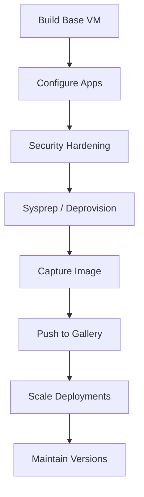

---
hide:
- toc
content_sources:
  diagrams:
  - id: operations-snapshots-and-images-golden-image-workflow
    type: flowchart
    source: mslearn-adapted
    description: Golden Image Workflow
    based_on:
    - https://learn.microsoft.com/en-us/azure/virtual-machines/windows/snapshot-copy-managed-disk
    - https://learn.microsoft.com/en-us/azure/virtual-machines/azure-compute-gallery
    - https://learn.microsoft.com/en-us/azure/virtual-machines/windows/capture-image-resource
---

# Snapshots and Images

Capturing snapshots and managed images enables backup and rapid deployment workflows. Azure Compute Gallery provides a scalable way to share images across subscriptions.

## Snapshot vs. Image vs. Gallery Comparison

| Feature | Snapshot | Managed Image | Compute Gallery |
| :--- | :--- | :--- | :--- |
| **Use Case** | Backup/Restore | Single VM Capture | Enterprise Distro |
| **Scope** | One Resource Group | One Region | Multi-Region |
| **Versioning** | None | Limited | Full Support |
| **Replication** | Regional | Regional | Global |

## Golden Image Workflow

<!-- diagram-id: operations-snapshots-and-images-golden-image-workflow -->

!!! tip
    Use incremental snapshots to reduce storage costs while maintaining frequent point-in-time recovery points.

## See Also

- [Backup and Restore](backup-restore.md)
- [Sizing and Image Selection](../best-practices/sizing-and-image-selection.md)
- [Patching and Maintenance Best Practices](../best-practices/patching-and-maintenance-best-practices.md)

## Sources

- [Create a snapshot of a virtual hard disk](https://learn.microsoft.com/en-us/azure/virtual-machines/windows/snapshot-copy-managed-disk)
- [Azure Compute Gallery overview](https://learn.microsoft.com/en-us/azure/virtual-machines/azure-compute-gallery)
- [Capture a managed image of a generalized VM](https://learn.microsoft.com/en-us/azure/virtual-machines/windows/capture-image-resource)
