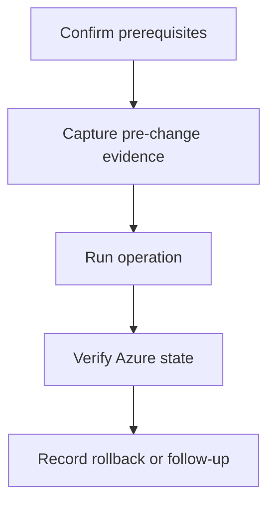

---
content_sources:
  diagrams:
  - id: operations-snapshots-and-images-runbook-flow
    type: flowchart
    source: mslearn-adapted
    description: Runbook flow
    based_on:
    - https://learn.microsoft.com/en-us/azure/virtual-machines/snapshot-copy-managed-disk
    - https://learn.microsoft.com/en-us/azure/virtual-machines/capture-image-portal
    - https://learn.microsoft.com/en-us/azure/virtual-machines/shared-image-galleries
content_validation:
  status: pending_review
  last_reviewed: '2026-05-22'
  reviewer: ai-agent
  core_claims:
  - claim: This document has source metadata and is queued for text-level Microsoft
      Learn verification.
    source: https://learn.microsoft.com/en-us/azure/virtual-machines/snapshot-copy-managed-disk
    verified: false
  - claim: Core Azure VM guidance on this page should remain traceable to the listed
      sources before it is marked verified.
    source: https://learn.microsoft.com/en-us/azure/virtual-machines/snapshot-copy-managed-disk
    verified: false
---

# Snapshots and Images

Use this runbook to create short-lived disk snapshots or reusable VM images with clear recovery intent.

## Prerequisites

- Azure CLI is installed and authenticated with the target subscription.
- Required variables are set before commands are run: `RG`, `VM_NAME`, and any resource-specific names in the command tables.
- The operator has permission to read and change the VM, disks, network interfaces, and monitoring resources involved in the procedure.
- A maintenance window and rollback owner are identified for production changes.

## When to Use

A maintenance window requires a point-in-time disk checkpoint before a risky application upgrade.

<!-- diagram-id: operations-snapshots-and-images-runbook-flow -->

```mermaid
flowchart TD
    A[Confirm prerequisites] --> B[Capture pre-change evidence]
    B --> C[Run operation]
    C --> D[Verify Azure state]
    D --> E[Record rollback or follow-up]
```

## Procedure

1. Use snapshots for disk-level checkpoints and images for repeatable VM builds.
2. Stop or quiesce the workload if application consistency is required.
3. Name snapshots with source disk, date, and retention intent.
4. Delete temporary snapshots after validation or move durable recovery needs into backup policy.

### Command sequence

```bash
az snapshot create \
    --resource-group $RG \
    --name $SNAPSHOT_NAME \
    --source $DISK_NAME \
    --output json

az snapshot show \
    --resource-group $RG \
    --name $SNAPSHOT_NAME \
    --query "{name:name,source:creationData.sourceResourceId,provisioningState:provisioningState}" \
    --output json
```

| Element | Purpose |
|---|---|
| `$RG` | Resource group containing the VM resources. |
| `$SNAPSHOT_NAME` | Snapshot name created from a managed disk. |
| `$DISK_NAME` | Managed disk being inspected or changed. |
| `--resource-group` | Scopes the command to the intended resource group. |
| `--name` | Identifies the resource being created, read, updated, or deleted. |
| `--source` | Azure CLI option used to scope or shape the operation. |
| `--output` | Controls the output format for logs, scripts, or human review. |
| `--query` | Filters the response so operators capture only the needed evidence. |
| Expected result | Command succeeds and returns the requested Azure resource state or operation result. |

## Verification

```bash
az snapshot list \
    --resource-group $RG \
    --query "[].{name:name,time:timeCreated,sku:sku.name}" \
    --output table
```

| Element | Purpose |
|---|---|
| `$RG` | Resource group containing the VM resources. |
| `--resource-group` | Scopes the command to the intended resource group. |
| `--query` | Filters the response so operators capture only the needed evidence. |
| `--output` | Controls the output format for logs, scripts, or human review. |
| Expected result | Command succeeds and returns the requested Azure resource state or operation result. |

Confirm that the Azure output and guest/application checks match the intended post-change state.

## Rollback / Troubleshooting

- If the command fails, capture the error, Activity Log entry, and current resource state before retrying.
- If guest health is degraded after the change, revert to the documented previous size, disk setting, access rule, or restore point.
- Escalate when Azure reports regional capacity, unsupported SKU, policy denial, or backup/replication lock conflicts.

## See Also

- [Production Baseline](../best-practices/production-baseline.md)
- [Monitoring Best Practices](../best-practices/monitoring-best-practices.md)
- [Troubleshooting Playbooks](../troubleshooting/playbooks/index.md)

## Sources

- [Snapshot Copy Managed Disk](https://learn.microsoft.com/en-us/azure/virtual-machines/snapshot-copy-managed-disk)
- [Capture Image Portal](https://learn.microsoft.com/en-us/azure/virtual-machines/capture-image-portal)
- [Shared Image Galleries](https://learn.microsoft.com/en-us/azure/virtual-machines/shared-image-galleries)
