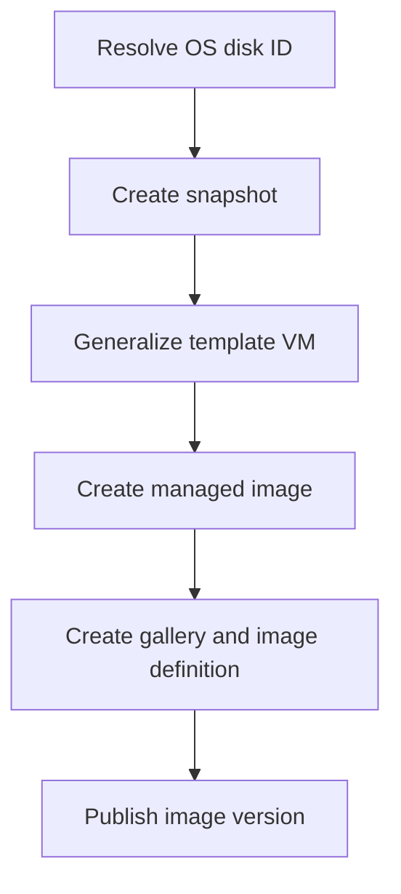

# Snapshots and Images

This runbook uses snapshots for immediate rollback insurance and Azure Compute Gallery for controlled image publishing when you need consistent VM rebuilds at scale.

## Prerequisites

- Azure CLI installed and authenticated.
- Contributor or higher permissions for disks, images, and gallery resources.
- A source VM that you can safely generalize if you intend to capture a reusable managed image.
- An image versioning convention, for example `1.0.0`.

## When to Use

- Before risky maintenance, when you need a point-in-time rollback artifact.
- When you want to convert a hardened template VM into a reusable image.
- When multiple regions or teams need the same base image through a governed distribution path.

## Procedure

### Capture a snapshot and publish the golden image

<!-- diagram-id: operations-snapshots-and-images-golden-image-workflow -->

```mermaid
flowchart TD
    A[Resolve OS disk ID] --> B[Create snapshot]
    B --> C[Generalize template VM]
    C --> D[Create managed image]
    D --> E[Create gallery and image definition]
    E --> F[Publish image version]
```

```bash
export RG="rg-vm-image"
export LOCATION="eastus"
export TEMPLATE_VM_NAME="vm-template-ubuntu"
export SNAPSHOT_NAME="snap-template-os-20260725"
export IMAGE_NAME="img-template-ubuntu"
export GALLERY_NAME="sigplatform"
export IMAGE_DEFINITION_NAME="ubuntu-base"
export IMAGE_VERSION="1.0.0"
export OS_DISK_ID=$(az vm show --resource-group "$RG" --name "$TEMPLATE_VM_NAME" --query "storageProfile.osDisk.managedDisk.id" --output tsv)

az snapshot create --resource-group "$RG" --name "$SNAPSHOT_NAME" --source "$OS_DISK_ID" --sku Standard_LRS

az vm deallocate --resource-group "$RG" --name "$TEMPLATE_VM_NAME"

az vm generalize --resource-group "$RG" --name "$TEMPLATE_VM_NAME"

az image create --resource-group "$RG" --name "$IMAGE_NAME" --source "$TEMPLATE_VM_NAME"

az sig create --resource-group "$RG" --gallery-name "$GALLERY_NAME" --location "$LOCATION"

az sig image-definition create --resource-group "$RG" --gallery-name "$GALLERY_NAME" --gallery-image-definition "$IMAGE_DEFINITION_NAME" --publisher Contoso --offer UbuntuBase --sku Ops --os-type Linux --os-state Generalized --hyper-v-generation V2

az sig image-version create --resource-group "$RG" --gallery-name "$GALLERY_NAME" --gallery-image-definition "$IMAGE_DEFINITION_NAME" --gallery-image-version "$IMAGE_VERSION" --managed-image "$IMAGE_NAME" --target-regions "$LOCATION"=1=Standard_LRS
```
| Command | Purpose |
| --- | --- |
| `az vm show` | Resolves the OS disk ID from the template VM. |
| `--resource-group` | Selects the resource group that contains the template VM and image artifacts. |
| `--name` | Selects the specific VM, snapshot, or managed image resource for each command in the flow. |
| `--query` | Extracts only the managed OS disk identifier. |
| `--output` | Emits the disk ID as plain text for reuse in later commands. |
| `az snapshot create` | Creates a read-only point-in-time snapshot of the OS disk. |
| `--source` | Points the snapshot at the managed disk to protect. |
| `--sku` | Chooses the snapshot storage tier. |
| `az vm deallocate` | Stops and deallocates the template VM before generalization. |
| `az vm generalize` | Marks the VM as generalized so it can become a reusable image source. |
| `az image create` | Creates a managed image from the generalized VM. |
| `az sig create` | Creates the Azure Compute Gallery container. |
| `--gallery-name` | Sets the gallery name. |
| `--location` | Selects the Azure region that hosts the gallery. |
| `az sig image-definition create` | Creates the image definition that groups all future versions. |
| `--gallery-image-definition` | Names the image definition. |
| `--publisher` | Sets the publisher metadata shown to consumers. |
| `--offer` | Sets the image offer metadata. |
| `--sku` | Sets the image SKU metadata. |
| `--os-type` | Declares Linux or Windows for the image definition. |
| `--os-state` | Marks the definition as generalized. |
| `--hyper-v-generation` | Matches the template VM generation. |
| `az sig image-version create` | Publishes a versioned gallery image from the managed image. |
| `--gallery-image-version` | Sets the semantic image version number. |
| `--managed-image` | Uses the managed image as the source payload. |
| `--target-regions` | Replicates the image version to the listed region and replica count. |

Expected outcome:

- The snapshot exists immediately as a rollback artifact.
- The template VM becomes generalized and cannot be restarted as a normal workload.
- A versioned image appears in Azure Compute Gallery for repeatable redeployment.

Example output:

```text
Version    TargetRegions
---------  -----------------------------
1.0.0      [{name: eastus, regionalReplicaCount: 1}]
```

## Verification

Confirm that both the snapshot and the published gallery version are available.

```bash
az snapshot show --resource-group "$RG" --name "$SNAPSHOT_NAME" --query "{name:name,provisioning:provisioningState,timeCreated:timeCreated}" --output yaml

az sig image-version show --resource-group "$RG" --gallery-name "$GALLERY_NAME" --gallery-image-definition "$IMAGE_DEFINITION_NAME" --gallery-image-version "$IMAGE_VERSION" --query "{version:name,replication:publishingProfile.targetRegions}" --output yaml
```
| Command | Purpose |
| --- | --- |
| `az snapshot show` | Confirms the snapshot is present and provisioned. |
| `--resource-group` | Selects the resource group that contains the snapshot and gallery resources. |
| `--name` | Selects the snapshot to inspect. |
| `az sig image-version show` | Confirms the gallery image version exists and shows target-region replication metadata. |
| `--gallery-name` | Selects the right gallery. |
| `--gallery-image-definition` | Selects the right image family. |
| `--gallery-image-version` | Selects the exact published version. |
| `--query` | Returns only the snapshot and replication fields needed for validation. |
| `--output` | Formats the verification results as YAML. |

Do not delete the source snapshot until the gallery version is fully usable and you have tested at least one deployment from it.

## Rollback / Troubleshooting

- If you only need rollback and not a reusable image, stop after `az snapshot create`; generalizing a VM is irreversible for normal in-place use.
- If `az image create` fails, verify the VM is fully deallocated and generalized.
- If image replication is still in progress, wait before using the version in another region.
- If you accidentally generalized the wrong VM, recover by creating a new managed disk from the snapshot and rebuilding a replacement VM from that disk.

## See Also

- [Backup and Restore](backup-restore.md)
- [Create and Configure VM](create-and-configure-vm.md)
- [Sizing and Image Selection](../best-practices/sizing-and-image-selection.md)

## Sources

- [Create an Azure snapshot of a virtual hard disk](https://learn.microsoft.com/en-us/azure/virtual-machines/snapshot-copy-managed-disk)
- [Overview of Azure Compute Gallery](https://learn.microsoft.com/en-us/azure/virtual-machines/azure-compute-gallery)
