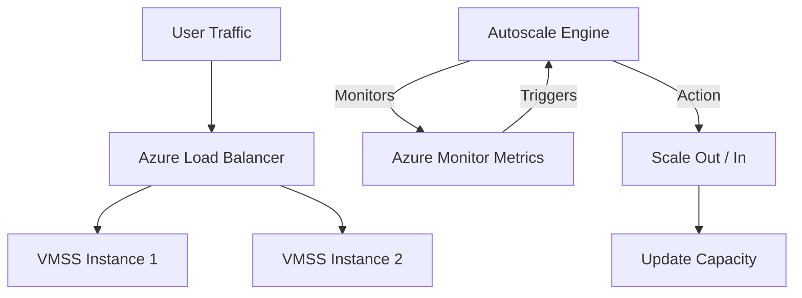

# VMSS Basics

Virtual Machine Scale Sets (VMSS) allow you to create and manage a group of load-balanced VMs. The number of VM instances can automatically increase or decrease in response to demand or a defined schedule.

## Autoscale Architecture

## Scaling Modes Comparison

VMSS provides two distinct orchestration modes to balance consistency with flexibility.

| Feature | Uniform Mode | Flexible Mode |
| :--- | :--- | :--- |
| **VM Consistency** | Identical (Image-based) | Mix of images, sizes, and spot |
| **Instance Count** | Up to 1,000 | Up to 1,000 |
| **Fault Domain** | Managed by scale set | Managed by Azure platform |
| **Use Case** | Stateless web farms | Large scale distributed workloads |

## Scaling Rules

Autoscale rules determine how the environment adapts to changes in workload or time.

!!! note
    Uniform mode is best for workloads where every node performs exactly the same task.

!!! warning
    Autoscale rules should have a "cool-down" period to prevent "flapping" (repeated scaling actions in a short time).

!!! tip
    Use Flexible mode to combine Spot and Pay-As-You-Go instances in the same scale set to optimize costs.

## Sources

- [What are Virtual Machine Scale Sets?](https://learn.microsoft.com/en-us/azure/virtual-machine-scale-sets/overview)
- [Orchestration modes](https://learn.microsoft.com/en-us/azure/virtual-machine-scale-sets/virtual-machine-scale-sets-orchestration-modes)
- [Autoscale overview](https://learn.microsoft.com/en-us/azure/virtual-machine-scale-sets/virtual-machine-scale-sets-autoscale-overview)
